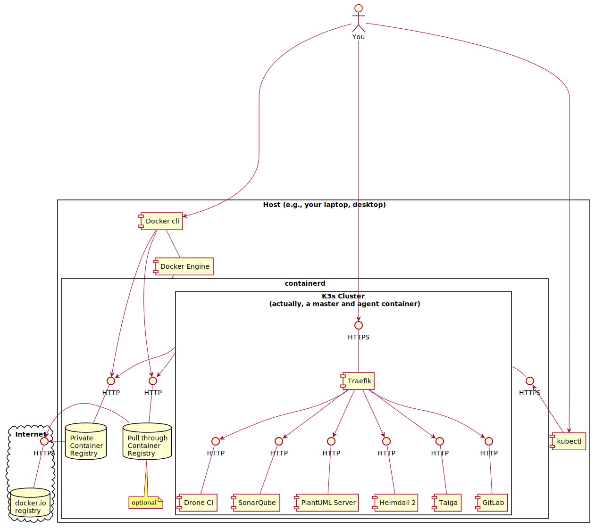

[](./LICENSE)
[](https://github.com/nemonik/hands-on-DevOps-gen2/network/members)
[](https://github.com/nemonik/hands-on-DevOps-gen2/stargazers)
[](https://twitter.com/intent/tweet?text=I%27ve%20found%20a%20nifty%20hands-on%20DevOps%20course%20developed%20by%20%40nemonik%20at%20https%3A%2F%2Fgithub.com%2Fnemonik%2Fhands-on-DevOps-gen2)

# 1. Preface

This is the second edition of my hands-on DevOps course building upon [nemonik/hands-on-DevOps](https://github.com/nemonik/hands-on-DevOps).

The content of this course is actively under development whereas the prior is not.

This newest version of my Hands-on DevOps class is a re-platforming of sorts -- A sort of rewrite if you will. The prior version relied on multiple Vagrants (i.e., virtual machines) and was a beast to maintain. Several Vagrants were created through automation to run a multi-node [Kubernetes](https://kubernetes.io/docs/concepts/overview/what-is-kubernetes/) cluster as well asa development VM. The approach modeled how I pre-flighted my work on my laptop vice using [minikube](https://github.com/kubernetes/minikube). The [Kubernetes](https://kubernetes.io/docs/concepts/overview/what-is-kubernetes/) cluster my class used made use of was [k3s](https://github.com/k3s-io/k3s) and as it matured [k3d](https://github.com/rancher/k3d/) was introduced. [K3d](https://github.com/rancher/k3d/) is a lightweight wrapper to run [k3s](https://github.com/k3s-io/k3s) in [Docker](https://docker.io) and provides a rather elegant solution to create and manage a single or multi-node [k3s](https://github.com/k3s-io/k3s) cluster for development vice standing up multi-VMs and the burden they impose on the host (in my case my laptop). Around this same time I was considering using [k3d](https://github.com/rancher/k3d/) I also gave [Docker Desktop's](https://www.docker.com/products/docker-desktop) means of providing a [Kubernetes](https://kubernetes.io/docs/concepts/overview/what-is-kubernetes/) cluster a try but I found it lacking, so I stuck with [k3d](https://github.com/rancher/k3d/). Around this same time I also moved fully off my MacBook for personal development moving to [Arch Linux](https://archlinux.org/) where I used [Docker](https://docker.io). This new version of my class infrastructure-as-code automation focuses instead of directly configuring the host or if need be a single Vagrant for the purpose of development.

# 2. DevOps

A hands-on DevOps course covering the culture, methods and repeated practices of modern software development involving Vagrant, VirtualBox, [Ansible](https://github.com/ansible/ansible), [Kubernetes](https://kubernetes.io/docs/concepts/overview/what-is-kubernetes/), [k3s](https://github.com/k3s-io/k3s), [k3d](https://github.com/rancher/k3d/), [Traefik](https://github.com/traefik/traefik), [Docker](https://docker.io), [Taiga](https://www.taiga.io/), [GitLab](https://gitlab.com/rluna-gitlab/gitlab-ce), [Drone CI](https://github.com/drone/drone), [SonarQube](https://github.com/SonarSource/sonarqube/), [Selenium](https://github.com/SeleniumHQ/selenium), [InSpec](https://github.com/inspec/inspec), [Heimdall 2](https://github.com/mitre/heimdall2), [Arch Linux](https://archlinux.org/)...

A reveal.js presentation written to accompany this course can found at [https://nemonik.github.io/hands-on-DevOps/](https://nemonik.github.io/hands-on-DevOps/).

This course will

1. Discuss DevOps,
2. Have you spin up a DevOps toolchain and development environment, and then
3. Author two applications and their accompanying pipelines, the first a continuous integration (CI) and the second a continuous delivery (CD) pipeline.

After this course, you will

1. Be able to describe and have hands-on experience DevOps methods and repeated practices (e.g., use of Agile methods, configuration management, build automation, test automation and deployment automation orchestrated under a CICD orchestrator), and why it matters;
2. Address challenges transitioning to DevOps methods and repeated practices;
3. Have had hands-on experience infrastructure-as-code to provision and configure an entire DevOps Factory (i.e. a toolchain and development environment) including Docker Registry, a [Kubernetes](https://kubernetes.io/docs/concepts/overview/what-is-kubernetes/) cluster, [Taiga](https://www.taiga.io/), [GitLab](https://gitlab.com/rluna-gitlab/gitlab-ce), [Drone CI](https://github.com/drone/drone), [SonarQube](https://github.com/SonarSource/sonarqube/), [Heimdall 2](https://github.com/mitre/heimdall2);
4. Have had hands-on experience authoring code to include authoring and running automated tests in a CICD pipeline all under Configuration Management to ensure an application follows style, adheres to good coding practices, builds, identify security issues, and functions as expected;
5. Have had hands-on experience with
   1. using Infrastructure as Code (IaC) in Vagrant and [Ansible](https://github.com/ansible/ansible);
   2. creating and using Kanban board in [Taiga](https://www.taiga.io/);
   3. code configuration in git and [GitLab](https://gitlab.com/rluna-gitlab/gitlab-ce);
   4. authoring code in Go;
   5. using style checkers and linters;
   6. authoring a [Makefile](https://en.wikipedia.org/wiki/Make_(software)#Makefile);
   7. various commands in [Docker](https://docker.io) (e.g., building a container image, pushing a container into a registry, creating and running a container);
   8. authoring a pipeline for [Drone CI](https://github.com/drone/drone);
   9. using Sonar Scanner CLI to perform static analysis;
   10. authoring security test in [InSpec](https://github.com/inspec/inspec);
   11. author an automated functional test in [Selenium](https://github.com/SeleniumHQ/selenium);
   12. authoring a dynamic security test in OWASP Zap; and
   13. using container platform to author and scale services;
6. Have had hands-on experience authoring code to include authoring and running automated tests in a CICD pipeline all under Configuration Management to ensure an application follows style, adheres to good coding practices, builds, identify security issues, and functions as expected.

We will be spending most of the course hands-on working with the tools and in the [Unix](https://en.wikipedia.org/wiki/Unix) command line making methods and repeated practices of DevOps happen, so as to grow an understanding of how DevOps actually works. Although, not necessary I would encourage you to pick up a free PDF of [The Linux Command Line by William Shotts](http://linuxcommand.org/tlcl.php) if you are no familiar wit the Linux command line.

Don't fixate on the tools used, nor the apps we develop in the course of learning how and why. How and why is far more important. This course like DevOps is not about tools although we'll be using them. You'll spend far more time writing code. (Or at the very least cutting-and-pasting code.)

# 3. Author

- Michael Joseph Walsh [nemonik@mitre.org](mailto:nemonik@mitre.org), [walsh@nemonik.com](mailto:walsh@nemonik.com)

# 4. Copyright and license

See the [License file](./LICENCE) at the root of this project.

# 5. What you should bring

The following skills would be useful in following along but aren't strictly necessary.

What you should bring:

- Managing Linux or Unix-like systems would be tremendously helpful, but not necessary, as we will be living largely within the terminal.
- A basic understanding of Vagrant, [Docker](https://docker.io), and [Ansible](https://github.com/ansible/ansible) would also be helpful, but not necessary.

# 6. Table of Contents

<!-- TOC -->

- [1. Preface](#1-preface)
- [2. DevOps](#2-devops)
- [3. Author](#3-author)
- [4. Copyright and license](#4-copyright-and-license)
- [5. What you should bring](#5-what-you-should-bring)
- [6. Table of Contents](#6-table-of-contents)
- [7. DevOps unpacked](#7-devops-unpacked)
    - [7.1. What is DevOps?](#71-what-is-devops)
    - [7.2. What DevOps is not](#72-what-devops-is-not)
    - [7.3. The tool exist to](#73-the-tool-exist-to)
    - [7.4. To succeed at DevOps you must](#74-to-succeed-at-devops-you-must)
    - [7.5. If your effort doesn't](#75-if-your-effort-doesnt)
    - [7.6. Conway's Law states](#76-conways-law-states)
    - [7.7. DevOps is really about](#77-devops-is-really-about)
    - [7.8. What is DevOps culture?](#78-what-is-devops-culture)
        - [7.8.1. We were taught the requisite skills as children](#781-we-were-taught-the-requisite-skills-as-children)
        - [7.8.2. Maintaining relationships is your most important skill](#782-maintaining-relationships-is-your-most-important-skill)
        - [7.8.3. Be quick... Be slow to...](#783-be-quick-be-slow-to)
        - [7.8.4. The pressures of social media](#784-the-pressures-of-social-media)
    - [7.9. How is DevOps related to the Agile?](#79-how-is-devops-related-to-the-agile)
    - [7.10. How do they differ?](#710-how-do-they-differ)
    - [7.11. Why?](#711-why)
    - [7.12. What are the principles of DevOps?](#712-what-are-the-principles-of-devops)
    - [7.13. Much of this is achieved](#713-much-of-this-is-achieved)
    - [7.14. What is Continuous Integration (CI)?](#714-what-is-continuous-integration-ci)
    - [7.15. How?](#715-how)
    - [7.16. CI best practices](#716-ci-best-practices)
        - [7.16.1. Utilize a Configuration Management System](#7161-utilize-a-configuration-management-system)
        - [7.16.2. Automate the build](#7162-automate-the-build)
        - [7.16.3. Employ one or more CI services/orchestrators](#7163-employ-one-or-more-ci-servicesorchestrators)
        - [7.16.4. Make builds self-testing](#7164-make-builds-self-testing)
        - [7.16.5. Never commit broken](#7165-never-commit-broken)
        - [7.16.6. Stakeholders are expected to pre-flight new code](#7166-stakeholders-are-expected-to-pre-flight-new-code)
        - [7.16.7. The CI service/orchestrator provides feedback](#7167-the-ci-serviceorchestrator-provides-feedback)
    - [7.17. What is Continuous Delivery?](#717-what-is-continuous-delivery)
        - [7.17.1. Extending Continuous Integration (CI)](#7171-extending-continuous-integration-ci)
        - [7.17.2. Consistency](#7172-consistency)
    - [7.18. But wait. What's a pipeline?](#718-but-wait-whats-a-pipeline)
    - [7.19. How is a pipeline manifested?](#719-how-is-a-pipeline-manifested)
    - [7.20. What underlines all of this?](#720-what-underlines-all-of-this)
    - [7.21. But really why do we automate err. code?](#721-but-really-why-do-we-automate-err-code)
        - [7.21.1. Why do I mention Larry Wall?](#7211-why-do-i-mention-larry-wall)
        - [7.21.2. Laziness](#7212-laziness)
        - [7.21.3. Impatience](#7213-impatience)
        - [7.21.4. Hubris](#7214-hubris)
        - [7.21.5. We automate for](#7215-we-automate-for)
    - [7.22. Monitoring](#722-monitoring)
        - [7.22.1. The _primary_ metric](#7221-the-_primary_-metric)
        - [7.22.2. An understanding of performance](#7222-an-understanding-of-performance)
        - [7.22.3. Establish a baseline performance](#7223-establish-a-baseline-performance)
        - [7.22.4. Set reaction thresholds](#7224-set-reaction-thresholds)
        - [7.22.5. Reacting](#7225-reacting)
        - [7.22.6. Gaps in CICD](#7226-gaps-in-cicd)
        - [7.22.7. Eliminating waste](#7227-eliminating-waste)
    - [7.23. Crawl, walk, run](#723-crawl-walk-run)
        - [7.23.1. Ultimately, DevOps is Goal](#7231-ultimately-devops-is-goal)
- [8. Reading list](#8-reading-list)
- [9. Prerequisites](#9-prerequisites)
    - [9.1. Manual inspection](#91-manual-inspection)
    - [9.2. Shell configuration](#92-shell-configuration)
    - [9.3. Installing upfront dependencies](#93-installing-upfront-dependencies)
    - [9.4. On OS X or Windows 11, install Docker Desktop](#94-on-os-x-or-windows-11-install-docker-desktop)
            - [9.4.0.1. On OSX, install Docker Desktop](#9401-on-osx-install-docker-desktop)
            - [9.4.0.2. On Windows, install Docker Desktop](#9402-on-windows-install-docker-desktop)
        - [9.4.1. On Arch Linux, installing Docker](#941-on-arch-linux-installing-docker)
    - [9.5. On OSX, install iTerm2](#95-on-osx-install-iterm2)
- [10. Installing the software factory](#10-installing-the-software-factory)
    - [10.1. Ansible](#101-ansible)
        - [10.1.1. Installing Ansible](#1011-installing-ansible)
        - [10.1.2. On OSX, install the Xcode Command Line tools](#1012-on-osx-install-the-xcode-command-line-tools)
        - [10.1.3. On OSX, install HomeBrew](#1013-on-osx-install-homebrew)
        - [10.1.4. On Arch Linux, ensure Python3 and pip are installed](#1014-on-arch-linux-ensure-python3-and-pip-are-installed)
        - [10.1.5. Install Ansible](#1015-install-ansible)
    - [10.2. Run the Ansible playbook](#102-run-the-ansible-playbook)
        - [10.2.1. Reviewing the Ansible playbooks](#1021-reviewing-the-ansible-playbooks)
        - [10.2.2. Install dependencies](#1022-install-dependencies)
        - [10.2.3. On OSX, enable nerd fonts in XTerm2](#1023-on-osx-enable-nerd-fonts-in-xterm2)
        - [10.2.4. On Arch Linux, enable nerd fonts in the Gnome Terminal](#1024-on-arch-linux-enable-nerd-fonts-in-the-gnome-terminal)
        - [10.2.5. Change your shell to fish](#1025-change-your-shell-to-fish)
        - [10.2.6. Finish conifiguring fish](#1026-finish-conifiguring-fish)
        - [10.2.7. Finish configuring neovim](#1027-finish-configuring-neovim)
    - [10.3. Spin up the Factory](#103-spin-up-the-factory)
        - [10.3.1. The `Makefile`](#1031-the-makefile)
        - [10.3.2. Pull through registry](#1032-pull-through-registry)
        - [10.3.3. Starting a container registry, the K3s cluster and patching CoreDNS](#1033-starting-a-container-registry-the-k3s-cluster-and-patching-coredns)
        - [10.3.4. Verifying the cluster is up and running](#1034-verifying-the-cluster-is-up-and-running)
        - [10.3.5. Starting the factory tools](#1035-starting-the-factory-tools)
    - [10.4. The long-running tools](#104-the-long-running-tools)
        - [10.4.1. Taiga, an example of Agile project management software](#1041-taiga-an-example-of-agile-project-management-software)
            - [10.4.1.1. Documentation, source, container image](#10411-documentation-source-container-image)
            - [10.4.1.2. URL, username and password](#10412-url-username-and-password)
        - [10.4.2. GitLab CE, an example of configuration management software](#1042-gitlab-ce-an-example-of-configuration-management-software)
            - [10.4.2.1. Documentation, source, container image](#10421-documentation-source-container-image)
            - [10.4.2.2. URL, username and password](#10422-url-username-and-password)
        - [10.4.3. Drone CI, an example of CICD orchestrator](#1043-drone-ci-an-example-of-cicd-orchestrator)
            - [10.4.3.1. Documentation, source, container image](#10431-documentation-source-container-image)
            - [10.4.3.2. URL, username and password](#10432-url-username-and-password)
        - [10.4.4. SonarQube, an example of a platform for the inspection of code quality](#1044-sonarqube-an-example-of-a-platform-for-the-inspection-of-code-quality)
            - [10.4.4.1. Documentation, source, container image](#10441-documentation-source-container-image)
            - [10.4.4.2. URL, username and password](#10442-url-username-and-password)
        - [10.4.5. PlantUML Server, an example of light-weight documentation](#1045-plantuml-server-an-example-of-light-weight-documentation)
            - [10.4.5.1. Documentation, source, container image](#10451-documentation-source-container-image)
            - [10.4.5.2. URL](#10452-url)
        - [10.4.6. Heimdall 2](#1046-heimdall-2)
            - [10.4.6.1. Documentation, source, container image](#10461-documentation-source-container-image)
            - [10.4.6.2. URL, username and password](#10462-url-username-and-password)
- [11. Golang `helloworld` project](#11-golang-helloworld-project)
    - [11.1. Create the project's backlog](#111-create-the-projects-backlog)
    - [11.2. Create the project in GitLab](#112-create-the-project-in-gitlab)
    - [11.3. Setup the project](#113-setup-the-project)
    - [11.4. Author the application](#114-author-the-application)
    - [11.5. Align source code with Go coding standards](#115-align-source-code-with-go-coding-standards)
    - [11.6. Lint your code](#116-lint-your-code)
    - [11.7. Build the application](#117-build-the-application)
    - [11.8. Run your application](#118-run-your-application)
    - [11.9. Author the unit tests](#119-author-the-unit-tests)
    - [11.10. Automate the build (i.e., write the `Makefile`)](#1110-automate-the-build-ie-write-the-makefile)
    - [11.11. Author Drone-based Continuous Integration](#1111-author-drone-based-continuous-integration)
        - [11.11.1. Configure Drone to execute your pipeline](#11111-configure-drone-to-execute-your-pipeline)
        - [11.11.2. Trigger the build](#11112-trigger-the-build)
    - [11.12. The completed source for `helloworld`](#1112-the-completed-source-for-helloworld)
- [12. Golang `helloworld-web` project](#12-golang-helloworld-web-project)
    - [12.1. Create the project's backlog](#121-create-the-projects-backlog)
    - [12.2. Create the project in GitLab](#122-create-the-project-in-gitlab)
    - [12.3. Setup the project](#123-setup-the-project)
    - [12.4. Author the `helloworld-web` application](#124-author-the-helloworld-web-application)
    - [12.5. Build and run the `helloworld-web` application](#125-build-and-run-the-helloworld-web-application)
    - [12.6. Run golangci-lint on the `helloworld-web` application](#126-run-golangci-lint-on-the-helloworld-web-application)
        - [12.6.1. Fixing the problem](#1261-fixing-the-problem)
    - [12.7. Author the unit tests](#127-author-the-unit-tests)
    - [12.8. Perform static analysis (i.e., sonar-scanner) on the command line](#128-perform-static-analysis-ie-sonar-scanner-on-the-command-line)
        - [12.8.1. Perform static analysis on the command line](#1281-perform-static-analysis-on-the-command-line)
    - [12.9. Automate the build (i.e., write the Makefile)](#129-automate-the-build-ie-write-the-makefile)
    - [12.10. Containerize the application](#1210-containerize-the-application)
    - [12.11. Run the container](#1211-run-the-container)
        - [12.11.1. Option 1](#12111-option-1)
        - [12.11.2. Option 2](#12112-option-2)
    - [12.12. Push the container image to the private registry](#1212-push-the-container-image-to-the-private-registry)
    - [12.13. Configure Drone to execute your CICD pipeline](#1213-configure-drone-to-execute-your-cicd-pipeline)
    - [12.14. Add Static Analysis (`sonar`) step to your CICD pipeline](#1214-add-static-analysis-sonar-step-to-your-cicd-pipeline)
    - [12.15. Add the `build` step to the pipeline](#1215-add-the-build-step-to-the-pipeline)
    - [12.16. Add the `nemonik\helloworld-web:latest` container image `publish` step to pipeline](#1216-add-the-nemonik\helloworld-weblatest-container-image-publish-step-to-pipeline)
    - [12.17. Deploy `helloworld-web` application to the Kubernetes cluster](#1217-deploy-helloworld-web-application-to-the-kubernetes-cluster)
    - [12.18. Add a `deploy` rule to the Makefile](#1218-add-a-deploy-rule-to-the-makefile)
    - [12.19. Add a `deploy` step to the pipeline](#1219-add-a-deploy-step-to-the-pipeline)
        - [12.19.1. Add a Kubernetes service account for the automation](#12191-add-a-kubernetes-service-account-for-the-automation)
        - [12.19.2. Add secrets to our `helloworld-web` Drone CI repistory](#12192-add-secrets-to-our-helloworld-web-drone-ci-repistory)
        - [12.19.3. Build, tag and push our `deploy` step container](#12193-build-tag-and-push-our-deploy-step-container)
        - [12.19.4. Add the `deploy` step to our pipeline](#12194-add-the-deploy-step-to-our-pipeline)
    - [12.20. Add compliance-as-code (`inspec`) test to the pipeline](#1220-add-compliance-as-code-inspec-test-to-the-pipeline)
        - [12.20.1. Author our InSpec tests](#12201-author-our-inspec-tests)
        - [12.20.2. Execute the InSpec tests on your `helloworld-web` deployment](#12202-execute-the-inspec-tests-on-your-helloworld-web-deployment)
        - [12.20.3. Add an `inspec` rule to the Makefile](#12203-add-an-inspec-rule-to-the-makefile)
        - [12.20.4. Add a `inspec` step to the pipeline](#12204-add-a-inspec-step-to-the-pipeline)
            - [12.20.4.1. Build, tag, and push our `inspec` step container](#122041-build-tag-and-push-our-inspec-step-container)
            - [12.20.4.2. Add the compliance-as-code (`inspec`) step to the pipeline](#122042-add-the-compliance-as-code-inspec-step-to-the-pipeline)
        - [12.20.5. Viewing the `inspec` results in Heimdall 2 Lite](#12205-viewing-the-inspec-results-in-heimdall-2-lite)
            - [12.20.5.1. Supplemental InSpec output for viewing in Heimdall 2 Lite](#122051-supplemental-inspec-output-for-viewing-in-heimdall-2-lite)
        - [12.20.6. Add an automated functional test (`selenium`) step to the pipeline](#12206-add-an-automated-functional-test-selenium-step-to-the-pipeline)
            - [12.20.6.1. Pull and run the Selenium Chrome Standalone browser](#122061-pull-and-run-the-selenium-chrome-standalone-browser)
            - [12.20.6.2. Create our functional test automation](#122062-create-our-functional-test-automation)
            - [12.20.6.3. Build, tag, and push the `selenium` step container](#122063-build-tag-and-push-the-selenium-step-container)
            - [12.20.6.4. Add the `selenium` step to the pipeline](#122064-add-the-selenium-step-to-the-pipeline)
    - [12.21. Add the DAST (`owasp-zap`) step to the pipeline](#1221-add-the-dast-owasp-zap-step-to-the-pipeline)
    - [12.22. All the source for `helloworld-web`](#1222-all-the-source-for-helloworld-web)
- [13. Additional best practices to consider around securing containerized applications](#13-additional-best-practices-to-consider-around-securing-containerized-applications)

<!-- /TOC -->

# 7. DevOps unpacked

## 7.1. What is DevOps?

DevOps (a clipped compound of the words _development_ and _operations_) is a software development methodology with an emphasis on a reliable release pipeline, automation, and stronger collaboration across all stakeholders with the goal of delivery of value in close alignment with business objectives into the hands of users (i.e., production) more efficiently and effectively.

_Ops_ in DevOps gathers up every IT operation stakeholders (i.e., cybersecurity, testing, DB admin, infrastructure and operations practitioners -- essentially, any stakeholder not commonly thought of as directly part of the development team in the system development life cycle).

Yeah, that's the formal definition.

In the opening sentences of _Security Engineering: : A Guide to Building Dependable Distributed Systems — Third Edition_, author Ross Anderson defines what a security engineer is

> Security engineering is about building systems to remain dependable in the face of malice, error, or mischance. As a discipline, it focuses on the tools, processes, and methods needed to design, implement, and test complete systems, and to adapt existing systems as their environment evolve.

The words _security engineering_ could be replaced in the opening sentence with each one of the various stakeholders (e.g., development, quality assurance, technology operations).

The point I'm after is everyone is in it to collectively deliver dependable software.

Also, there is no need to overload the _DevOps_ term -- To _Dev wildcard (i.e., \*) Ops_ to include your pet interest(s), such as, _security_, _test_, _whatever_... to form _DevSecOps_, _DevTestOps_, _DevWhateverOps_... _DevOps_ has you covered.

## 7.2. What DevOps is not

About the tools or deploying faster.


<sub>There are countless vendors out there, who want to sell you their crummy tool.</sub>

## 7.3. The tool exist to

Facilitate collaboration between the stakeholders.

## 7.4. To succeed at DevOps you must

**Combine software development and information technology operations in the systems development life cycle** with **a focus on collaboration across the life cycle to deliver features, fixes, and updates frequently in close alignment with business objectives**.

If the effort cannot combine both Dev and Ops in collaboration with this focus the effort will most certainly fail.

## 7.5. If your effort doesn't

**grok (i.e, Understand intuitively) what DevOps is in practice** and have performed the **necessary analysis of the existing culture and a strategy for how to affect a change** the effort again will likely fail.

I say this because the culture is the largest influencer over the success of both Agile and DevOps and ultimately the path taken (i.e., plans made.)

## 7.6. Conway's Law states

> Any organization that designs a system (defined broadly) will produce a design whose structure is a copy of the organization's communication structure.

From ["How Do Committees Invent?"](http://www.melconway.com/Home/Conways_Law.html)

Followed with

> Ways must be found to reward design managers for keeping their organizations lean and flexible.

This was written over 50 years ago.

If your communication structure is broke, so shall your systems be.

## 7.7. DevOps is really about

Providing the culture, methods and repeated practices to permit stakeholders to collaborate.

## 7.8. What is DevOps culture?

> **culture** noun \ _ˈkəl-chər_ \
> the set of shared attitudes, values, goals, and practices that characterizes an institution or organization

I love when a word means precisely what you need it to mean.

With the stakeholders sharing the same attitudes, values, goals, using the same tools, methods and repeated practices for their particular discipline you have **_DevOps Culture_**.

### 7.8.1. We were taught the requisite skills as children


### 7.8.2. Maintaining relationships is your most important skill


### 7.8.3. Be quick... Be slow to...


### 7.8.4. The pressures of social media


## 7.9. How is DevOps related to the Agile?

Agile Software Development is an umbrella term for a set of methods and practices based on the [values](http://www.agilealliance.org/agile101/the-agile-manifesto/) and [principles](http://www.agilealliance.org/agile101/12-principles-behind-the-agile-manifesto/) expressed in the Agile Manifesto.

For Agile, solutions evolve through collaboration between self-organizing, cross-functional teams utilizing the appropriate practices for their context.

DevOps builds on this.

## 7.10. How do they differ?

While DevOps extends Agile methods and practices by adding communication and collaboration between

- development,
- security,
- quality assurance, and
- technology operations

functionaries as stakeholders into the broader effort to ensure software systems are delivered in a reliable, low-risk manner.

## 7.11. Why?

In Agile Software Development, there is rarely an integration of these individuals outside the immediate application development team with members of technology operations (e.g., network engineers, administrators, testers, security engineers.)

## 7.12. What are the principles of DevOps?

As DevOps matures, several principles have emerged, namely the necessity for product teams to:

- Apply holistic thinking to solve problems,
- Develop and test against production-like environments,
- Deploy with repeatable and reliable processes,
- Remove the drudgery and uncertainty through automation,
- Validate and monitor operational quality, and
- Provide rapid, automated feedback to the stakeholders

## 7.13. Much of this is achieved

Through the repeated practices of Continuous Integration (CI) and Continuous Delivery (CD) often conflated into simply "CI/CD" or "CICD".

WARNING: After tools, CICD is the next (**albeit mistakenly**) thing thought to be the totality of DevOps.

## 7.14. What is Continuous Integration (CI)?

It is a repeated Agile software development practice lifted specifically from Extreme programming, where members of a development team frequently integrate their work to detect integration issues as quickly as possible thereby shifting discovery of issues "left" (i.e., early) in the software release.

## 7.15. How?

Each integration is orchestrated through a CI service/orchestrator (e.g., [Jenkins](https://github.com/jenkinsci/jenkins), [Drone CI](https://github.com/drone/drone), GitLab Runners, Concourse CI) that essentially assembles a build, runs unit and integration tests every time a predetermined trigger has been met; and then reports with immediate feedback.

## 7.16. CI best practices

### 7.16.1. Utilize a Configuration Management System

For the software's source code, where the mainline (i.e., master branch) is the most recent working version, past releases held in branches, and new features not yet merged into the mainline branch worked in their own branches.

### 7.16.2. Automate the build

By accompanying build automation (e.g., Gradle, Apache Maven, [Make](https://www.gnu.org/software/make/)) alongside the source code.

### 7.16.3. Employ one or more CI services/orchestrators

To perform source code analysis via automating formal code inspection and assessment.

### 7.16.4. Make builds self-testing

In other words, ingrain testing by including unit and integration tests (e.g., Spock, JUnit, Mockito, SOAPUI, go package _Testing_) with the source code to be executed by the build automation to be executed by the CI service.

### 7.16.5. Never commit broken

Or untested source code to the CMS mainline or otherwise risk breaking a build.

### 7.16.6. Stakeholders are expected to pre-flight new code

Prior to committing source code in their own workspace.

### 7.16.7. The CI service/orchestrator provides feedback

On the success or fail of a build integration to all its stakeholders.

## 7.17. What is Continuous Delivery?

It is a repeated software development practice of providing a rapid, reliable, low-risk product delivery achieved through automating all facets of building, testing, and deploying software.

### 7.17.1. Extending Continuous Integration (CI)

With additional stages/steps aimed to provide ongoing validation that a newly assembled software build meets all desired requirements and thereby is releasable.

### 7.17.2. Consistency

Is achieved through delivering applications into production via individual repeatable pipelines of ingrained system configuration management and testing

## 7.18. But wait. What's a pipeline?

A pipeline automates the various stages/steps (e.g., Static Application Security Testing (SAST), build, unit testing, Dynamic Application Security Testing (DAST), secure configuration acceptance compliance, integration, function and non-functional testing, delivery, and deployment) to enforce quality conformance.

## 7.19. How is a pipeline manifested?

Each delivery pipeline is manifested as **Pipeline as Code** (i.e., software automation) accompanying the application's source code in its version control repository.

## 7.20. What underlines all of this?

I and the community of practice argue DevOps will struggle without ubiquitous access to shared pools of software configurable system resources and higher-level services that can be rapidly provisioned (i.e., cloud).

Although, it is actually possible to [DevOps on mainframes](https://www.youtube.com/watch?v=eMS97X5ZTGc) The video is in the contect of continuous delivery, but read between the lines.

## 7.21. But really why do we automate err. code?

In 2001, I think Larry Wall in his 1st edition of _Programming Perl_ book put it best with "We will encourage you to develop the three great virtues of a programmer:

laziness,

impatience, and

hubris."

The second edition of the same book provided definitions for these terms

### 7.21.1. Why do I mention Larry Wall?

Well...

Let me explain.

### 7.21.2. Laziness

> The quality that makes you go to great effort to reduce overall energy expenditure. It makes you write labor-saving programs that other people will find useful, and document what you wrote so you don't have to answer so many questions about it. Hence, the first great virtue of a programmer.\_ (p.609)

### 7.21.3. Impatience

> The anger you feel when the computer is being lazy. This makes you write programs that don't just react to your needs, but actually anticipate them. Or at least pretend to. Hence, the second great virtue of a programmer.\_ (p.608)

### 7.21.4. Hubris

> Excessive pride, the sort of thing Zeus zaps you for. Also, the quality that makes you write (and maintain) programs that other people won't want to say bad things about. Hence, the third great virtue of a programmer.\_ (p.607)

### 7.21.5. We automate for

- Faster, coordinated, repeatable, and therefore more reliable deployments.
- Discover bugs sooner. Shifting their discovery left in the process.
- To accelerates the feedback loop between Dev and Ops (Again, Ops is everyone not typically considered part of the development team.)
- Reduce tribal knowledge, where one group or person holds the keys to how things get done. Yep, this is about making us all replaceable.
- Reduce shadow IT (i.e., hardware or software within an enterprise that is not supported by IT. Just waiting for its day to explode.)

## 7.22. Monitoring

Once deployed, the work is done, right?

So, that improvements can be gauged and anomalies detected.A development team's work is not complete once a product leaves CICD and enters production; especially, under DevOps where the development team includes members of ops (e.g., security and technology operations).

### 7.22.1. The _primary_ metric

Is working software, but this is not the only, measurement. The key to successful DevOps is knowing how well the methodology and the software it produces are performing. Is the software truely dependable?

### 7.22.2. An understanding of performance

Is achieved by collecting and analyzing data produced by environments used for CICD and production.

### 7.22.3. Establish a baseline performance

So, that improvements can be gauged and anomalies detected.

### 7.22.4. Set reaction thresholds

To formulate and prioritize reactions weighting factors, such as, the frequency at which an anomaly arises and who is impacted.

### 7.22.5. Reacting

Could be as simple as operations instructing users through training to not do something that triggers the anomaly, or more ideally, result in an issue being entered into the product's backlog culminating in the development team delivering a fix into production.

### 7.22.6. Gaps in CICD

Are surfaces through monitoring resulting in for example additional testing for an issue discovered in prodcuction.

Yep. News flash. DevOps will not entirely stop all bugs or vulnerabilities from making it into production, but this was never the point.

### 7.22.7. Eliminating waste

Through re-scoping of requirements, re-prioritizing of a backlog, or the deprecation of unused features. Again, all surfaced through monitoring.

## 7.23. Crawl, walk, run

### 7.23.1. Ultimately, DevOps is Goal

- With DevOps one does not simply hit the ground running.
- One must first crawl, walk and then ultimately run as you embrace the necessary culture change, methods, and repeated practices.
- Collaboration and automation are expected to continually improve so to achieve more frequent and more reliable releases.

# 8. Reading list

**AntiPatterns: Refactoring Software, Architectures, and Projects in Crisis**
William J. Brown, Raphael C. Malveau, Hays W. "Skip" McCormick, and Thomas J. Mowbray
ISBN: 978-0-471-19713-3
Apr 1998

**Continuous Delivery: Reliable Software Releases through Build, Test, and Deployment Automation (Addison-Wesley Signature Series (Fowler))**
David Farley and Jez Humble
ISBN-13: 978-0321601919
August 2010

**The DevOps Handbook: How to Create World-Class Agility, Reliability, and Security in Technology Organizations**
Gene Kim Jez Humble, Patrick Debois, and John Willis
ISBN-13: 978-1942788003
October 2016

**Accelerate: The Science of Lean Software and DevOps: Building and Scaling High Performing Technology Organizations**
Nicole Forsgren PhD, Jez Humble, and Gene Kim
ISBN-13: 978-1942788331
March 27, 2018

**Site Reliability Engineering: How Google Runs Production Systems 1st Edition**
Betsy Beyer, Chris Jones, Jennifer Petoff, and Niall Richard Murphy
ISBN-13: 978-1491929124
April 16, 2016
Also, available online at https://landing.google.com/sre/book/index.html

**Release It!: Design and Deploy Production-Ready Software 2nd Edition**
Michael T. Nygard
ISBN-13: 978-1680502398
January 18, 2018

**The SPEED of TRUST: The One Thing That Changes Everything**
Stephen M .R. Covey
ISBN-13: 978-1416549000
February 5, 2008
The gist of the book can be found at SlideShare https://www.slideshare.net/nileshchamoli/the-speed-of-trust-13205957

**RELATIONSHIP TRUST: The 13 Behaviors of High-Trust Leaders Mini Session**
Franklin Covey Co.
https://archive.franklincovey.com/facilitator/minisessions/handouts/13_Behaviors_MiniSession_Handout.pdf

**How to Deal With Difficult People**
Ujjwal Sinha
Oct 25, 2014
The SlideShare can be found here https://www.slideshare.net/abhiujjwal/how-2-deal-wid-diiclt-ppl

**Leadership Secrets of the Rouge Warrior: A Commando's Guide to Success**
Richard Marcinko w/ John Weisman
ISBN-13: 978-0671545154
June 1, 1996

**Security Engineering: A Guide To Building Dependable Distributed Systems**
Ross Anderson
ISBN-13: 978-0470068526
April 14, 2008
The second edition of this book can be downloaded in whole from https://www.cl.cam.ac.uk/~rja14/book.html and Mr Anderson has released chapters from his 3rd edition under development.

**How Do Committees Invent?**
Melvin E. Conway
Copyright 1968, F. D. Thompson Publications, Inc.
http://www.melconway.com/Home/Conways_Law.html

**The Pragmatic Programmer: Your Journey To Mastery, 20th Anniversary Edition (2nd Edition)**
David Thomas and Andrew Hunt
ISBN-13: 978-0135957059
September 23, 2019

# 9. Prerequisites

The supported host operating systems for this class are OSX, Windows 11 and [Arch Linux](https://archlinux.org/). By "host operating system", I mean the computer you will use to work the class.

## 9.1. Manual inspection

It's a good idea to inspect the install scripts from projects you don't yet know. You can do that now by tromping around the project on GitHub. The project makes use of a [Makefile](<https://en.wikipedia.org/wiki/Make_(software)#Makefile>), several [Bash](https://www.gnu.org/software/bash/) scripts, [Vagrant](https://en.wikipedia.org/wiki/Vagrant_%28software%29) and [Ansible](<https://en.wikipedia.org/wiki/Ansible_(software)>) code. Looking through everything before you run it. If you dork up your host this was never my intention nor can I be held responsible as per the [License](./License), but I've made every effort to prevent this from happening. If read anything beyond this README please read the [License](./License) file.

## 9.2. Shell configuration

The class automation will configure [Bash](https://www.gnu.org/software/bash/), [Zsh](https://www.zsh.org/) and [fish](https://fishshell.com/) [shell](<https://en.wikipedia.org/wiki/Shell_(computing)>)s, as well as [neovim](https://github.com/neovim/neovim) (nvim). A [Unix](https://en.wikipedia.org/wiki/Unix) shell is a command-line iterpreter, a command-line interface for the Unix or Unix-like operating systems, such as [Linux](https://en.wikipedia.org/wiki/Linux). The shell exists in a [terminal emulator](https://en.wikipedia.org/wiki/Terminal_emulator). In this course we will either be [iTerm2](https://iterm2.com/) for OSX or [Arch Linux](https://archlinux.org/)' [Gnome Terminal](https://en.wikipedia.org/wiki/GNOME_Terminal).

**NOTE**

- This class will link to an application, tool, library, etc's canonical git repository whenever possible, Wikipedia or its landing page.
- This class makes use of **NOTE** sections like this to call out things that are important to know or to drop a few tidbits. Reading these notes may save you some aggravation.

If you are on OSX and already have iTerm2 installed open a terminal window or use OSX built-in Terminal application by searching for "terminal" by clicking the Spotlight Search icon (if shown) in the Apple menu bar that runs along the top of the screen on your Mac beginning with an Apple icon. The Spotlight Search icon is a magnifying glass. Optionally, you can press `Command`-`Space bar` to open Spotlight Search.

If you have spent considerable time configuring your chosen shell, [neovim](https://github.com/neovim/neovim) editor, etc it is advisable to back up your configuration by performing the following in the shell:

```bash
cp ~/.bash_profile ~/.bash_profile.back
cp ~.profile ~.profile.back
cp ~/.zshrc ~/.zshrc.back
cp ~/.zshenv ~/.zshenv.back
cp ~/.zprofile ~/.zprofile.back
cp ~/.zlogin ~/.zlogin.back
cp ~/.config/fish/config.fish ~/.config/fish/config.fish.back
cp ~/.config/nvim/init.vim ~/.config/nvim/init.vim.back
cp ~/.config/nvim/coc-settings.json ~/.config/nvim/coc-settings.json.back
```

**NOTE**

- When cutting-and-pasting from GitHub click on the clipboard icon in the uppper right-section of the code block.
- On or more of the above commands may fail if you don't have the file on your host. If you are sure you typed the command correctly you can ignore the error message.
- Use these backup files to recover your prior shell configuration. Just reverse the direction of the copy.

Now, we're going to to reset our configuration by performing the following

```bash
rm ~/.bash_profile ~/.zshrc ~/.zshenv ~/.zprofile ~/.zlogin ~/.config/fish/config.fish ~/.config/nvim/init.vim ~/.config/nvim/coc-settings.json
touch ~/.bash_profile ~/.zshrc
```

## 9.3. Installing upfront dependencies

You will need to install a number of upfront dependencies.

## 9.4. On OS X or Windows 11, install Docker Desktop

If your host (e.g., your laptop, personal computer) is running Windows 10 or OSX you will need to install [Docker Desktop](https://www.docker.com/products/docker-desktop). If you're using [Arch Linux](https://archlinux.org/), the [Ansible](https://github.com/ansible/ansible) automation will take care of installing [Docker](https://docker.io) for you and you can skip ahead to installing [Ansible](https://github.com/ansible/ansible). If you are using a version of Linux other than Arch then what's wrong with you? I'm kidding. You can use the Vagrant to execute the factory. Subsequent versions of this class will be updated to support [Ubuntu](https://ubuntu.com/), [Rocky Lunux](https://rockylinux.org/), etc.

This class will use [Docker](https://docker.io) and so [Docker Desktop](https://www.docker.com/products/docker-desktop) must be installed and configured.

#### 9.4.0.1. On OSX, install Docker Desktop

If you're on an OSX host perform the following:

1. Download <https://www.docker.com/products/docker-desktop>
2. Drag the Docker app to your Application folder.
3. Find the Docker app in your applications folder and click to start the application.
4. You will need to verify that you want to trust the application by clicking `Open`.
5. The Docker Engine, actually a virtual machine (VM), will take sometime to start. You will then be asked to deny or accept `com.docker.backend` from accepting incoming network connections. Click `Allow`.
6. Find the Docker icon on the right side of your Apple menu bar and click and then select `preferences` from the menu.
7. In the `docker` window that opens, select the gear icon in the upper-right portion of the window.
8. Under `General` make sure `Start Docker Desktop when you log in` is checked off otherwise you will need to start docker everytime you restart your host.
9. Then select `Resources` on the left-hand side of the window.
10. As [Docker](https://docker.io) runs its containers in a virtual machine (VM), you will need to give this VM more processing power and host memory to run heavier container load. What you give the Docker Desktop](https://www.docker.com/products/docker-desktop) VM is dependent on two factors the resources your host can spare and the load the class containers will place on your host. I'd advise trying 8 CPUs and 12 GBs of memory and scale as you see fit.
11. Click `Apply and Restart` to restart the Docker Desktop VM. The VM will take some amount of time to restart. The containers on the back of the whale icon (Moby Dock) will cycle the Apple menu bar will cycle until Docker is ready.

#### 9.4.0.2. On Windows, install Docker Desktop

TODO: Complete this section. I have plans to add this within a few weeks.

### 9.4.1. On Arch Linux, installing Docker

[Docker](https://docker.io) will be installed for you via the [Ansible](https://github.com/ansible/ansible) automation. [Ansible](https://github.com/ansible/ansible) will be discussed later.

## 9.5. On OSX, install iTerm2

If your using an OSX host, you can use Apple's default Terminal app for command line terminal, but I'd advise you to install the superior iTerm2.

Perform the following tasks:

1. Download the latest release from

   <https://iterm2.com/downloads/stable/latest>

2. Find the iTerm2 release zip file in your Downloads folder and double click.
3. Drag the iTerm2 app to your Application folder to install.
4. You will need to verify that you want to trust the application by clicking `Open`.
5. Use iTerm2 to perform the remaining command line tasks for this class.

# 10. Installing the software factory

This class uses a software factory hosted on a [Kubernetes (K8s)](https://kubernetes.io/docs/concepts/overview/what-is-kubernetes/) cluster. K8s is an abbreviation of Kubernetes ("K" followed by 8 letters "ubernete" followed by "s"). (What a [Kubernetes](https://kubernetes.io/docs/concepts/overview/what-is-kubernetes/) cluster is will be covered later.) To spin up the K8s cluster you will need to perform the following tasks in your shell.

## 10.1. Ansible

The class uses [Ansible](https://github.com/ansible/ansible) to install operating systems dependencies necessary for the class.

[Ansible](https://github.com/ansible/ansible) is a "configuration management" tool that automates software provisioning, configuration management and application deployment, two core repeated practices in DevOps, so for the class [Ansible](https://github.com/ansible/ansible) addresses this concern in the configuration of either your host operating system or a VM, if you've chosen to execute the class from a Vagrant.

Ansible was open-sourced and then later subsumed by Red Hat.

There are other notable open-source "configuration management" tools, such as [Chef](https://github.com/chef/chef) and [Puppet](https://github.com/chef/chef). Further, still there are others, such as [BOSH](https://github.com/cloudfoundry/bosh) and [Salt](https://github.com/saltstack/salt), but they hold little or no community of practice or market share.

In his seminal essay, "The Cathedral and the Bazaar", Eric S. Raymond states

> while coding remains an essentially solitary activity, the really great hacks
> come from harnessing the attention and brainpower of entire communities
>
> You want to leverage the work of vibrate community and not some back water
> effort.

In [Ansible](https://github.com/ansible/ansible), one defines [playbooks](https://docs.ansible.com/ansible/latest/user_guide/playbooks.html) to declaratively state desired configuration of a host. Yes, utilizing declarative programming vice imperative programming. With declarative programming your code essentially describes what you want, but not how to get what you want. With imperative programming, ones' code states what you want to happen step-by-step. The class will makes use of [Ansible](https://github.com/ansible/ansible), Kubernetes resource files and Helm charts to declare the desired end-state. These will be unpacked later in the class material. The truth is the two are often intermixed. Your [Ansible](https://github.com/ansible/ansible) playbooks can be a mix of declarative and imperative programming. One strives for the former rather than the later.

Each [Ansible](https://github.com/ansible/ansible) playbook is written in a [YAML](https://yaml.org/)-based DSL (domain specific language) following the [ansible-playbook schema](https://json.schemastore.org/ansible-playbook.json) enumerating all the tasks to be performed.

The playbooks for this class are located in the [ansible/](./ansible/) project sub-folder

```
ansible
├── common.yaml
├── docker.yaml
├── files
│   ├── coc-settings.json
│   └── init.vim
├── go.yaml
├── inspec.yaml
├── inventory.yaml
├── main.yaml
├── neovim.yaml
├── pyenv.yaml
├── ruby.yaml
├── sonar-scanner-cli.yaml
├── template-shell-configs.yaml
├── templates
│   ├── bash_profile.tpl
│   ├── config.fish.tpl
│   └── zshrc.tpl
└── yay.yaml
```

Each playbook is responsible for a unit of configuration. [ansible/files/](./ansible/files/) contains a number of files copied into the userspace to configure the [neovim](https://github.com/neovim/neovim) editor.

It also possible to collect these tasks into a collection referred to as a `role`. This class presently doesn't make use of roles.

### 10.1.1. Installing Ansible

The following sub-sections detail how to install [Ansible](https://github.com/ansible/ansible). Skip to the section that applies to your host.

If your host is running

- OSX drop to [Installing Xcode Command Line Tools.
- Windows drop to (TODO: complete.)
- Linux drop to (TODO: complete.)

### 10.1.2. On OSX, install the Xcode Command Line tools

I prefer to install the Xcode Command Line tools myself, but you could skip this step and have HomeBrew install it for you.

1. In iTerm2 enter the following into the commmand line.

   ```bash
   xcode-select --install
   ```

   It is possible your host may already have the Xcode Command Line Tools installed and will be immediately told so if this is the case skip to the next section

2. A dialog will pop on the screen asking if you'd like to install the command line developer tools. Click `Install`.
3. You will then be presented a License Agreement. After consulting your lawyer, click `Agree`.
4. Wait fo the download and install to complete, then click `Done`.

### 10.1.3. On OSX, install HomeBrew

Homebrew is as the project refers to itself, "The Missing Package Manager for macOS." These days the project also tacks on "(or Linux)". Package managers A package manager automates the process of installing, upgrading, configuring, and removing binaries from an operating system.

I could of had the [Ansible](https://github.com/ansible/ansible) playbook install this dependency, but I'd rather you become familiar with the fact there is in fact a community driven package manager for OSX.

Install brew by performing the following:

```
/bin/bash -c "$(curl -fsSL https://raw.githubusercontent.com/Homebrew/install/HEAD/install.sh)"
```

Success resembles

```
Password:
==> This script will install:
/usr/local/bin/brew
/usr/local/share/doc/homebrew
/usr/local/share/man/man1/brew.1
/usr/local/share/zsh/site-functions/_brew
/usr/local/etc/bash_completion.d/brew
/usr/local/Homebrew

Press RETURN to continue or any other key to abort
==> /usr/bin/sudo /usr/sbin/chown -R nemonik:admin /usr/local/Homebrew
==> Downloading and installing Homebrew...
remote: Enumerating objects: 20, done.
remote: Counting objects: 100% (8/8), done.
remote: Total 20 (delta 8), reused 8 (delta 8), pack-reused 12
Unpacking objects: 100% (20/20), 4.12 KiB | 175.00 KiB/s, done.
From https://github.com/Homebrew/brew
 * [new branch]          dependabot/bundler/Library/Homebrew/sorbet-0.5.6442 -> origin/dependabot/bundler/Library/Homebrew/sorbet-0.5.6442
Updating files: 100% (2703/2703), done.
HEAD is now at 63ed6da2c Merge pull request #11564 from cnnrmnn/new-maintainer-checklist-typo
Updated 2 taps (homebrew/core and homebrew/cask).
==> Installation successful!

==> Homebrew has enabled anonymous aggregate formulae and cask analytics.
Read the analytics documentation (and how to opt-out) here:
  https://docs.brew.sh/Analytics
No analytics data has been sent yet (or will be during this `install` run).

==> Homebrew is run entirely by unpaid volunteers. Please consider donating:
  https://github.com/Homebrew/brew#donations

==> Next steps:
- Run `brew help` to get started
- Further documentation:
    https://docs.brew.sh
```

### 10.1.4. On Arch Linux, ensure Python3 and pip are installed

On Arch if we need to ensure you have Python 3 and pip installed by performing the following in the shell

```bash
sudo pacman -Syu python3 python-pip
```

Output will resemble

```
:: Synchronizing package databases...
 core                                       134.2 KiB  2033 KiB/s 00:00 [########################################] 100%
 extra                                     1565.3 KiB  25.5 MiB/s 00:00 [########################################] 100%
 community                                    5.6 MiB  58.3 MiB/s 00:00 [########################################] 100%
:: Starting full system upgrade...
resolving dependencies...
looking for conflicting packages...

Packages (2) python-3.9.6-1  python-pip-20.3.4-1

Total Installed Size:  54.20 MiB
Net Upgrade Size:       0.00 MiB

:: Proceed with installation? [Y/n] y
(2/2) checking keys in keyring                                          [########################################] 100%
(2/2) checking package integrity                                        [########################################] 100%
(2/2) loading package files                                             [########################################] 100%
(2/2) checking for file conflicts                                       [########################################] 100%
(2/2) checking available disk space                                     [########################################] 100%
:: Processing package changes...
(1/2) reinstalling python                                               [########################################] 100%
(2/2) reinstalling python-pip                                           [########################################] 100%
:: Running post-transaction hooks...
(1/1) Arming ConditionNeedsUpdate...
```

### 10.1.5. Install Ansible

[Ansible](https://github.com/ansible/ansible) is based on [Python](https://www.python.org/) ans distributed as a Python module that you can install by [pip](https://pip.pypa.io). Pip refers to itself as "the package installer for Python". There are [others](https://packaging.python.org/guides/tool-recommendations/), but most everyone uses pip.

In the command line perform the following task:

Type the following

```bash
python3 -m pip install --user ansible --no-cache-dir
```

This will install the [Ansible](https://github.com/ansible/ansible) module into the Python user install directory for your platform. Typically this results in the [Ansible](https://github.com/ansible/ansible) binaries being installed into the `.local/bin` sub-folder in the user's home directory (i.e., `$HOME/.local/bin`)

Output will resemble

[](https://asciinema.org/a/VcmeRa4foy8qU9HKjghd4rUsf)

In order to use the paramiko connection plugin or modules that require paramiko, install paramiko

```bash
python3 -m pip install --user paramiko --no-cache-dir
```

Output will resemble

[](https://asciinema.org/a/425731)

[Ansible](https://github.com/ansible/ansible) is now installed in your home directory in `$HOME/.local/bin` path, where is `$HOME` is an environment variable holding the path to your home directory.

But if you enter the following into the shell

```bash
which ansible-playbook
```

the output will likely be

```
ansible-playbook not found
```

The [`which`](https://linux.die.net/man/1/which) command will attempt to locate a program file in the user's path.

You are likely using the Bash shell at this point. To check type `echo $SHELL` into your shell. Depending on what is returned perfom what is appropriate for your shell.

If your shell is [Bash](https://www.gnu.org/software/bash/):

```bash
echo 'export PATH="$HOME/.local/bin:$PATH"' >> ~/.bash_profile
source ~/.bash_profile
```

If your shell is [Zsh](https://www.zsh.org/):

```bash
echo 'export PATH="$HOME/.local/bin:$PATH"' >> ~/.zshrc
source ~/.zshrc
```

If you're using [fish](https://fishshell.com/):

```bash
echo 'set -U fish_user_paths $HOME/.local/bin $fish_user_paths' >> ~/.config/fish/config.fish
source ~/.config/fish/config.fish
```

to add the [Ansible](https://github.com/ansible/ansible) executables to your path. The `PATH` environment variable is a list of directories that your shell searches through when you enter a command.

Not that we updated our `PATH` and sourced our shell configuratiion thereby updating our present shell we can verify `ansible` has been installed via

```bash
ansible-playbook --version
```

Output will resemble

```
⋊> ~ ansible-playbook --version
ansible-playbook [core 2.11.2]
  config file = None
  configured module search path = ['/home/nemonik/.ansible/plugins/modules', '/usr/share/ansible/plugins/modules']
  ansible python module location = /home/nemonik/.local/lib/python3.9/site-packages/ansible
  ansible collection location = /home/nemonik/.ansible/collections:/usr/share/ansible/collections
  executable location = /home/mjwalnemonik/.local/bin/ansible-playbook
  python version = 3.9.5 (default, Jul  5 2021, 10:39:40) [GCC 11.1.0]
  jinja version = 3.0.1
  libyaml = True
```

Let's test to see if [Ansible](https://github.com/ansible/ansible) works on our host by executing

```bash
ansible localhost -m ping
```

Output should resemble

```
[WARNING]: No inventory was parsed, only implicit localhost is available
localhost | SUCCESS => {
    "changed": false,
    "ping": "pong"
}
```

The fact that `ping` returns `pong` indicates [Ansible](https://github.com/ansible/ansible) has been installed correctly.

You will need to perform the following in the shell to add [community.general](https://galaxy.ansible.com/community/general) Ansible module from [Ansible Galaxy](https://galaxy.ansible.com/), Ansible’s official hub for sharing [Ansible](https://github.com/ansible/ansible) content.

For example, on an OSX host, we'll need this to install `brew` packages and for [Arch Linux](https://archlinux.org/) we'll need this to install operating systems package via [pacman](https://wiki.archlinux.org/title/Pacman) package manager.

```bash
ansible-galaxy collection install community.general
```

Successful output should resemble

```
⋊> ~ ansible-galaxy collection install community.general
Starting galaxy collection install process
Process install dependency map
Starting collection install process
Downloading https://galaxy.ansible.com/download/community-general-3.3.1.tar.gz to /home/nemonik/.ansible/tmp/ansible-local-1333943849hwygv/tmplq_el1ud/community-general-3.3.1-d99hf7_o
Installing 'community.general:3.3.1' to '/home/nemonik/.ansible/collections/ansible_collections/community/general'
community.general:3.3.1 was installed successfully
```

## 10.2. Run the Ansible playbook

The rest of the class will require a number of operating system dependencies be installed. We will accomplish the via executing the [./ansible/main.yaml](./ansible/main.yaml) playbook.

First we will need to [git clone](https://git-scm.com/docs/git-clone) the class repository by performing the following in your shell

```bash
mkdir -p $HOME/Development/workspace
cd $HOME/Development/workspace
git clone https://github.com/nemonik/hands-on-DevOps-gen2.git
cd hands-on-DevOps-gen2
```

### 10.2.1. Reviewing the Ansible playbooks

If you haven't reviewed the playbooks, now is a good time to do so.

Enter the project's [ansible/](./ansible) sub-folder

```bash
cd ansible
```

The `ansible-playbook` command will execute a series of playbooks across an inventory of hosts. For the class we have just one host and this is `localhost`, your host.

The contents of `inventory.yaml` file is in `ansible` folder written in [YAML](https://yaml.org/) following [Ansible Inventory shema](https://json.schemastore.org/ansible-inventory.json) and resembles

```
all:
  children:
    factory:
      hosts:
        localhost:
          ansible_connection: local
          ansible_host: localhost
          ansible_python_interpreter: /usr/bin/python3
      vars:
        default_delay: 10
        default_retries: 60
        ruby_version: 3.0.1
        supported_host_os:
          - MacOSX
          - Archlinux
    ungrouped: {}
```

Where

- `factory` is a group name used in classifying hosts.
- `localhost` is the alias for your host.
- `ansible_host`, `ansible_connection` and `ansible_python_interpreter` are behavioral inventory parameters used to control haw Ansible interacts with your host.
  - `ansible_host` describes the name of the host to connect to. This parameter is redundant in this instance.
  - `ansible_connection` describes the connection type used to connect to the host. In our case this set to `local`. Another type would be `ssh` if the host was remote.
  - `ansible_python_interpreter` describes the target host's python path. Python is "batteries included" on OSX and will be found on [Arch Linux](https://archlinux.org/).
- `vars` describes a number of variables uses across the playbooks: `default_delay`, `default_retries`, `ruby_version` and `supported_host_os`.
  - `default_delay` sets the number of seconds to delay between retries.
  - `default_retries` sets the number times a task will be retried before Ansible gives up.
  - `ruby_version` sets the ruby version to install, and
  - `supported_host_os` is a list of supported operating systems.

A playbook is composed of one or more _plays_ in an ordered list, where plays are executed in order from top to bottom. Most Ansible modules (also referred to as “task plugins” or “library plugins”) check whether the desired state has already been achieved and the playbook will move on without performing any actions once the desired state has been achieved. This is refered to as being _idempotent_.

Let's look at the [ansible/main.yaml](./ansible/main.yaml) playbook.

```
---
- name: Install factory dependencies
  hosts: factory
  tasks:
    - name: Echo ansible distribution
      ansible.builtin.debug:
        msg: "{{ inventory_hostname }} host is running {{ ansible_distribution }}:{{ ansible_distribution_release }} with an IP address if {{ ansible_default_ipv4.address }}"

    - name: Fail if OS is not MacOSX or ArchLinux
      ansible.builtin.fail:
        msg: "{{ ansible_distribution }} - {{ ansible_distribution_release }} is not MacOSX or ArchLinux"
      when: ansible_distribution not in supported_host_os
```

The lines above name the playbook and state the group name (in this case `factory` correlated with the inventory) this playbook will be applied to. Followed by two tasks that will be executed.

The first task, `ansible.builtin.debug` is used for debugging purposes. The second, `ansible.builtin.fail` tests whether or not the host is supported.

We can retrieve the documentation for both in the shell via using the [`ansible-doc`](https://docs.ansible.com/ansible/latest/cli/ansible-doc.html) command. For example, if we enter

```bash
ansible-doc ansible.builtin.debug
```

into the shell, it will return

```
> ANSIBLE.BUILTIN.DEBUG    (/Users/nemonik/.local/lib/python3.9/site-packages/ansible/modules/debug.py)

        This module prints statements during execution and can be useful for debugging variables or
        expressions without necessarily halting the playbook. Useful for debugging together with the
        'when:' directive. This module is also supported for Windows targets.

  * note: This module has a corresponding action plugin.

OPTIONS (= is mandatory):

- msg
        The customized message that is printed. If omitted, prints a generic message.
        [Default: Hello world!]
        type: str

- var
        A variable name to debug.
        Mutually exclusive with the `msg' option.
        Be aware that this option already runs in Jinja2 context and has an implicit `{{ }}' wrapping,
        so you should not be using Jinja2 delimiters unless you are looking for double interpolation.
        [Default: (null)]
        type: str

- verbosity
        A number that controls when the debug is run, if you set to 3 it will only run debug when -vvv
        or above.
        [Default: 0]
        type: int
        version_added: 2.1
        version_added_collection: ansible.builtin


NOTES:
      * This module is also supported for Windows targets.


SEE ALSO:
      * Module ansible.builtin.assert
           The official documentation on the ansible.builtin.assert module.
           https://docs.ansible.com/ansible/2.11/modules/ansible.builtin.assert_module.html
      * Module ansible.builtin.fail
           The official documentation on the ansible.builtin.fail module.
           https://docs.ansible.com/ansible/2.11/modules/ansible.builtin.fail_module.html


AUTHOR: Dag Wieers (@dagwieers), Michael DeHaan

VERSION_ADDED_COLLECTION: ansible.builtin

EXAMPLES:

- name: Print the gateway for each host when defined
  ansible.builtin.debug:
    msg: System {{ inventory_hostname }} has gateway {{ ansible_default_ipv4.gateway }}
  when: ansible_default_ipv4.gateway is defined

- name: Get uptime information
  ansible.builtin.shell: /usr/bin/uptime
  register: result

- name: Print return information from the previous task
  ansible.builtin.debug:
    var: result
    verbosity: 2

- name: Display all variables/facts known for a host
  ansible.builtin.debug:
    var: hostvars[inventory_hostname]
    verbosity: 4

- name: Prints two lines of messages, but only if there is an environment value set
  ansible.builtin.debug:
    msg:
    - "Provisioning based on YOUR_KEY which is: {{ lookup('env', 'YOUR_KEY') }}"
    - "These servers were built using the password of '{{ password_used }}'. Please retain this for later use."
```

And the playbook continues on to importing and executing each of the following playbooks

```ansible
- name: When ArchLinux ensure Docker is installed
  ansible.builtin.import_playbook: docker.yaml

- name: When ArchLinuc ensure yay AUR helper is installed
  ansible.builtin.import_playbook: yay.yaml

- name: Ensure common dependencies are installed
  ansible.builtin.import_playbook: common.yaml

- name: Ensure pyenv is installed and configured
  ansible.builtin.import_playbook: pyenv.yaml

- name: Ensure sonar-scanner cli is installed and configured
  ansible.builtin.import_playbook: sonar-scanner-cli.yaml

- name: Ensure rvm and ruby {{ ruby_version }} is installed
  ansible.builtin.import_playbook: ruby.yaml

- name: Ensure InSpec is installed
  ansible.builtin.import_playbook: inspec.yaml

- name: Ensure neovim is installed and configured
  ansible.builtin.import_playbook: neovim.yaml

- name: Ensure Go is installed and configured
  ansible.builtin.import_playbook: go.yaml

- name: Template in shell configs
  ansible.builtin.import_playbook: template-shell-configs.yaml
```

I'd encourage you to review them all, but lets look at a portion of the first to be imported and executed, the [./ansible/common.yaml](./ansible/common.yaml) playbook

```ansible
---
- name: Ensure common dependencies are installed
  hosts: factory
```

Again, the playbook is named and states the group name this playbook will be applied to.

```ansible
  tasks:
    - name: Set fact for $HOME
      ansible.builtin.set_fact:
        HOME: "{{ lookup('env', 'HOME') }}"
```

Followed in by executing a number of tasks. The first being to create a fact to hold the HOME environment variable.

```ansible
    - name: When MacOSX ensure Homebrew packages are installed
      block:
        - name: Update homebrew and upgrade all packages
          community.general.homebrew:
            update_homebrew: yes
            upgrade_all: yes

        - name: Check if /usr/local/Cellar/bash-completion exists
          ansible.builtin.stat:
            path: /usr/local/Cellar/bash-completion
          register: bash_completion

        - name: Ensure bash-completion is not installed, so bash-completion@2 can be installed
          ansible.builtin.shell: brew unlink bash-completion
          when: bash_completion.stat.exists

        - name: Ensure HomeBrew packages are installed
          community.general.homebrew:
            name:
              - bash
              - bash-completion@2
              - zsh
              - zsh-completion
              - fish
              - vim
              - nano
              - pwgen
              - openssl
              - watch
              - gettext
              - k3d
              - helm
              - curl
              - wget
              - git-secrets
              - tmux
              - yamllint
              - jq
              - tree
              - htop
              - kubectl
            state: latest
          retries: "{{ default_retries }}"
          delay: "{{ default_delay }}"
          register: result
          until: result is succeeded

        - name: Get HOMEBREW_PREFIX
          block:
            - name: Execute brew --prefix
              ansible.builtin.shell: brew --prefix
              register: brew_prefix

            - name: Create brew_fact with stdout of of prior command
              ansible.builtin.set_fact:
                HOMEBREW_PREFIX: "{{ brew_prefix.stdout }}"
      when: ( ansible_distribution == 'MacOSX' )
```

First, the `when` condition will be evaluated to determine if the host to be "ansible-ized" is running OSX before [Ansible](https://github.com/ansible/ansible) runs each of the tasks in the block.

The block collects the following tasks:

1. `community.general.homebrew` is used to update the host's installed packages,
2. `ansible.builtin.stat` checks and holds in a register where or not the `/usr/local/Cellar/bash-completion` path exists on the host.
3. `ansible.builtin.shell` executes `brew` to unlink `bash-completion` thereby ensuring the the wrong `bash-completions` package is not installed, but only if the path had been found.
4. `community.general.homebrew` tries repeatedly to install a list of HomeBrew packages until they're installed or the maximum number of retries are reached.
5. A sub-block ends out the run with
   1. `ansible.builtin.shell` executing `brew --prefix` and storing the result in a register
   2. `ansible.builtin.set_fact` is used to hold the standard output (stdout) of `brew--prefix` command in a Ansible fact, `HOMEBREW_PREFIX`.

The [./ansible/common.yaml](./ansible/common.yaml) playbook continues until completion and then you are returned to the [./ansible/main.yaml](./ansible/main.yaml) to execute the next playbook. I'd encourage you to review each.

If your on LinkedIn or search many of the job boards you'll find many employers equate infrastructure-as-code as DevOps. Infrastructure-as-code is a DevOps methodology but not the entirety of DevOps.

### 10.2.2. Install dependencies

Now that we've reviewed the playbook lets execute it via the [Make](https://www.gnu.org/software/make/) target `install-dependencies` in the root of the project in our shell

```bash
if [[ "$OSTYPE" == "darwin"* ]]; then brew install bash; /usr/local/bin/bash; fi
export PATH="~/.local/bin/:/usr/local/bin:$PATH"
cd $HOME/Development/workspace/hands-on-DevOps-gen2
make install-dependencies
```

**NOTES**

- Pay attention to the playbook's run as it may stop to ask you for your password.
- The password asked for out of the gate is needed, so that [Ansible](https://github.com/ansible/ansible) can become the root and install system-wide packages and software.
- You may be asked again when installing fonts, so keep an eye out for this.
- The first line runs only if you re on OSX to install a [Bash](https://www.gnu.org/software/bash/) 5.  OSX ship with [Bash](https://www.gnu.org/software/bash/) 3.2.57(1)-release.
- Some tasks are long running.  I've put debug statements prior to these tasks.  Look for them if you think [Ansible](https://github.com/ansible/ansible) has froze.  It likely has not.
- How long this takes to run is dependent on the speed of your Internet connection.

The output should resemble

[](https://asciinema.org/a/0dldJSH5189opfqyInl5p61Ou)

The last bit of output is important

```
META: ran handlers
META: ran handlers

PLAY RECAP ******************************************************************************************************************************************************************************
localhost                  : ok=135  changed=65   unreachable=0    failed=0    skipped=34   rescued=0    ignored=1
```

If `failed ` equals something other than `0` then you have an issue to debug. Debuging will require you to review the task that resulted in the failure likely the last task run. Review the output, determine what playbook you were in, open and review the playbook and the offending task and then try the equivalent in the command line to debug the issue. The host may be in a state the playbook cannot handle. Perhaps a dependency is missing. Perhaps. Perhaps. Perhaps.

### 10.2.3. On OSX, enable nerd fonts in XTerm2

XTerm2 must be further configured to benefit from the Nerd Fonts installed by [Ansible](https://github.com/ansible/ansible). We're going to configure XTerm2 to use `Meslo Nerd Font` and use `Solarized Dark` color theme. Optionally, you can select another [Nerd font](https://www.nerdfonts.com/font-downloads).

1. Open iTerm2's `Preferences`.
2. In the `Preference` window that opens, select `Profile`.
3. In the `Default` profile, select `Text`.
4. In the `Text` profile, select `Meslo Nerd Font` from the `Font` panel.
5. In the `Preferences` window, select `Color`.
6. Click `Color Preserts...` and select `Solarized Dark`.
7. Close the `Preference` windows, and re-start your terminal window for your changes to take effect.
8. Close iTerm2 and restart it.

### 10.2.4. On Arch Linux, enable nerd fonts in the Gnome Terminal

The Gnome Terminal must be further configure to benefit from the Nerd Fonts installed [Ansible](https://github.com/ansible/ansible). We're going to configure Terminal to `Meslo Nerd Font` and use `Solarized Dark` color them. Optionally, you can select another [Nerd Font](https://www.nerdfonts.com/font-downloads).

1. Open Terminal's `Preferences`.
2. In the `Preference` window that opens, select the `Unamed` profile.
3. In the `Text` panel, check off `Custom font` and select `Meslo Nerd Font`. Size as per your eyesight.
4. In the `Colors`panel, unclick `Use colors from system theme` and select `Solarized dark` from the available built-in themes.
5. Close the `Preference` windows.
6. Close and restart Gnome Terminal and your Terminal should of updated as per your selections.

### 10.2.5. Change your shell to fish

The class automation will attempt to configure [Bash](https://www.gnu.org/software/bash/), [Zsh](https://www.zsh.org/) and [fish](https://fishshell.com/), but let's try something perhaps new. Further information on [fish](https://fishshell.com/) can be found in its [documentation](http://fishshell.com/docs/current/index.html), but essentially it syntax highlighting, autosuggestions, and tab completion along with some other improvements that in my opinion pushes it past my prior shell, [Zsh](https://www.zsh.org/).

Let's use [fish](https://fishshell.com/) as our shell

On OSX type

```bash
sudo chsh -s $(which fish) $(whoami)
```

On Arch Linux

```bash
chsh -s $(which fish) $(whoami)
sudo reboot
```

On OSX, simply closing your current terminal and opening a new one should be enough for the change to take, but for Arch you appear to have to logout or reboot.

**NOTE**

- Effort was take to support [Bash](https://www.gnu.org/software/bash/), [Zsh](https://www.zsh.org/), and [fish](https://fishshell.com/), but preference was given to [fish](https://fishshell.com/), so if there are flaws in the course they'll be discovered using [Bash](https://www.gnu.org/software/bash/) and [Zsh](https://www.zsh.org/).

### 10.2.6. Finish conifiguring fish

If you are going to use the fish shell consider using the [tide](https://github.com/IlanCosman/tide) prompt. To configure

```fish
tide configure
```

**NOTE**

- A shout out to [@IlanCosman](https://github.com/IlanCosman) for helping me figure out my fish path issue.

### 10.2.7. Finish configuring neovim

The class automation will attempt to configure [neovim](https://github.com/neovim/neovim) (nvim) installing [junegunn/vim-plug](https://github.com/junegunn/vim-plug) a plugin manager, a number of additional plugins to include a language server.

The plugins installed

- [tpope/vim-commentary](https://github.com/tpope/vim-commentary) to comment stuff out when in nvim's "normal" mode you just type `gcc`.
- [junegunn/vim-easy-align](https://github.com/junegunn/vim-easy-align) to align text when in "visual" mode.
- [ctrlpvim/ctrlp.vim](https://github.com/ctrlpvim/ctrlp.vim) to provide a finder.
- [preservim/nerdtree](https://github.com/preservim/nerdtree) to provide a file tree explorer, when in "normal" mode press thje `space` key followed by the `n` key.
- [Xuyuanp/nerdtree-git-plugin](https://github.com/scrooloose/nerdtree-git-plugin) to extend NERDTree to show git status,
- [tiagofumo/vim-nerdtree-syntax-highlight](https://github.com/tiagofumo/vim-nerdtree-syntax-highlight) to extend NERDTree with extra syntax and highlighting.
- [airblade/vim-gitgutter](https://github.com/airblade/vim-gitgutter) to show in sign column which lines have been added, modified, or removed when in a git repository.
- [tpope/vim-fugitive](https://github.com/tpope/vim-fugitive) to provide a git command functionality in the editor.
- [vim-airline/vim-airline](https://github.com/vim-airline/vim-airline) to provide a status/tabline.
- [vim-airline/vim-airline-themes](https://github.com/vim-airline/vim-airline-themes) to provide themes to the vim-airline status/tabline.
- [preservim/nerdcommenter](https://github.com/preservim/nerdcommenter) to comment stuff out. I haven't settled on whether i I like thise plugin or `tpope/vim-commentary`. To comment out a line in either normal/visual mode type `space` followed by `cc`.
- [NLKNguyen/papercolor-theme](https://github.com/NLKNguyen/papercolor-theme) to provide both light and dark schemes. I've selected `PaperColor` color scheme later in the [ansible/files/init.vim](./ansible/files/init.vim).
- [fatih/vim-go](https://github.com/fatih/vim-go) to install the official Go development plugin.
- [neoclide/coc.nvim](https://github.com/neoclide/coc.nvim) to install and configure a language server. I've configured the language server to install a number of extensions:
  - [coc-go](https://github.com/josa42/coc-go), a Go language server extension using `gopls`.
  - [coc-pyright](https://github.com/fannheyward/coc-pyright), a Python3 language server extension.
  - [coc-solargraph](https://github.com/neoclide/coc-solargraph), a Ruby language server extension using `solargraph`.
  - [coc-spell-checker](https://github.com/iamcco/coc-spell-checker), a basic spell checker that works with camelCase code.
  - [coc-json](https://github.com/neoclide/coc-json), a Json language server extension.
  - [coc-yaml](https://github.com/neoclide/coc-yaml), a fork of [vscode-yaml](https://github.com/redhat-developer/vscode-yaml) that provides a YAML language server extension.
  - [coc-angular](https://github.com/iamcco/coc-angular), an [Angular](https://github.com/angular/angular) language server extension.
  - [coc-html](https://github.com/neoclide/coc-html), an HTML language server extension.
  - [coc-snippets](https://github.com/neoclide/coc-snippets) provides a snippets solution.
  - [coc-prettier](https://github.com/neoclide/coc-prettier) provides Coc extension to format a numbe of file types using [prettier](https://github.com/prettier/prettier). To run the prettier command line interface enter `npx prettier` in the shell.

I'll be honest I use most of these plugins and extensions, some more than others. A few I have yet to fully learn.

When you first start `nvim` on the command-line you will be greated with a number of warning/error messages. This is because the [ansible/files/init.vim](./ansible/files/init.vim) copied to your `~/.config/nvim/init.vim` is pre-configure to use the plugins yet to be installed.

You must now install them while in visual mode. Just press the `esc` to get past the error messages and then type `:PlugInstall` and `junegunn/vim-plug` will install the plugins described above. `coc` language server should then take over and install its own extensions, but you may have to close the status window type `:q!` and then restart `nvim` for langauge server to install its extensions. Pressing `:q!` will close Coc's status window.

I would really love to teach you about `vi`, `vim` and `nvim`, but doing so is really outside the scope of this class. I've really been an avid [nano](https://www.nano-editor.org/) user, but capable of using `vi` in a pinch as it almost always garunteed to be installed in [Unix](https://en.wikipedia.org/wiki/Unix)-like operating system. Neovim pushed me over the cliff to use it fill time.  And I'm focused to learn `nvim`. This is is why `nano` is aliased to `nvim`, so if you enter `nano` into the the shell it will start instead `nvim`. You can override this by typing nano's full path, `/usr/local/bin/nano` on OSX and `/usr/bin` on Arch. You can strip the alias out of your shell initialization file or for a session map it back the the `alias` command.

`vi`, `vim` and `nvim` pointers:

- I'd encourage you to read vim's [docs](https://www.vim.org/docs.php).
- Read through the [FAQ](https://vimhelp.org/vim_faq.txt.html).
- Give [VIM Adventures](https://vim-adventures.com/) some play.
- Print out [Allison McKnight's cheat sheet](https://www.cs.cmu.edu/~15131/f17/topics/vim/vim-cheatsheet.pdf) or search the Internet for another.

We will be using `nvim` in the class, but I won't know if you're using something else.

## 10.3. Spin up the Factory

So, now that you have the prerequisite dependencies, it is time to move on to spinning up the factory.

The factory tools are entirely execute on a containerized [Kubernetes](https://github.com/kubernetes/kubernetes) cluster hosted on [k3s](https://github.com/k3s-io/k3s) (Rancher Lab’s minimal [Kubernetes](https://kubernetes.io/docs/concepts/overview/what-is-kubernetes/) distribution) on Docker created by [k3d](https://github.com/rancher/k3d/). [Kubernetes](https://kubernetes.io/docs/concepts/overview/what-is-kubernetes/) is used to orchestrate the life cycles the long-running tools (e.g., [Taiga](https://www.taiga.io/), [GitLab](https://gitlab.com/rluna-gitlab/gitlab-ce), Docker CI, [SonarQube](https://github.com/SonarSource/sonarqube/), [Heimdall 2](https://github.com/mitre/heimdall2). [Kubernetes](https://kubernetes.io/docs/concepts/overview/what-is-kubernetes/) is an open-source system for automating deployment, scaling, and management of containerized applications. Essentially, [Kubernetes](https://kubernetes.io/docs/concepts/overview/what-is-kubernetes/) serves as an operating system for a cluster of computing resource (in the cases of [k3d](https://github.com/rancher/k3d/) these computing resources themselves are containers) and manages the life cycle and discovery of the applications running upon the cluster.

Initially, [k3s](https://github.com/k3s-io/k3s) was billed as a light-weight (Its less than 40 MB binary completely implements the Kubernetes API.), [fully CNCF certified](https://github.com/cncf/k8s-conformance/pulls?q=is%3Apr+k3s) [Kubernetes](https://kubernetes.io/docs/concepts/overview/what-is-kubernetes/) distribution designed for resource-constrained environments (It can run on host with as little as 512MB RAM.), not needing the added steps and dependencies a full [Kubernetes](https://kubernetes.io/docs/concepts/overview/what-is-kubernetes/) cluster would require. Keep in mind memory and compute equates to money when it comes to cloud, so why burn memory and computer err. money when you don't have to. It installs in a fraction of the time it takes to launch a canonical Kubernetes cluster. As [k3s](https://github.com/k3s-io/k3s) has matured it has become just a darn good [Kubernetes](https://kubernetes.io/docs/concepts/overview/what-is-kubernetes/) distribution.

It's canonical source can be found at

<https://github.com/k3s-io/k3s>

It's landing page can be found here

<https://k3s.io/>

The official documentation can be found here

<https://rancher.com/docs/k3s/latest/en/>

### 10.3.1. The `Makefile`

I've chosen to author the automation for spinning up the factory in [GNU Make](https://www.gnu.org/software/make/). [GNU Make](https://www.gnu.org/software/make/) bills itself as "a tool which controls the generation of executables and other non-source files of a program from the program's source files." Created by, [Stuart Feldman](https://en.wikipedia.org/wiki/Stuart_Feldman) Make introduced in PWB/UNIX has been around since 1976. Yep, over 45 years ago. Initially, its purpose was to automate software builds. Yeah, automation one of the core methods of DevOps has been around quite a long time. I've chosen to use [Make](https://www.gnu.org/software/make/) since the inception of my class to drive this point home. There's alway a few "grey beards" in my class that perk up and smile after hearing it mentioned. [Make](https://www.gnu.org/software/make/) lends itself well to the task of spinning up the cluster, the tools, etc as a makefile is essentially a collection of rules. An individual rule in the makefile tells [Make](https://www.gnu.org/software/make/) how to execute a series of commands. The [./Makefile](./Makefile) is found at the root of the repository. As I stated earlier, typically [Make](https://www.gnu.org/software/make/) is utilized for building code, but because of its ubiquity across Linux and OSX it is often used for a wide variety of tasks. We're going to use it stand up a [Kubernetes](https://kubernetes.io/docs/concepts/overview/what-is-kubernetes/) cluster and a top that entire DevOps factory. Maybe this was a wrong decision. Only time will tell.

First let's inspect the [Makefile](./Makefile) in piecemeal

```
# Copyright (C) 2021 Michael Joseph Walsh - All Rights Reserved
# You may use, distribute and modify this code under the
# terms of the the license.
#
# You should have received a copy of the license with
# this file. If not, please email <nemonik@nemonik.com>
```

The above is the copyright. The BSD 3-clause license allows you nearly almost unlimited freedom with the course material so long as you include the BSD copyright and license notice. I can not be held responsible if you damage you host for example. You may also not use my name in the endorsement of derived products.

```
.PHONY: all install-dependencies pull-class-images install-k3s-air-gap-image start install start-registry delete-registry start-pullthrough stop-pullthrough uninstall-pullthrough start-cluster delete-cluster patch-coredns install-traefik uninstall-traefik install-gitlab uninstall-gitlab install-drone uninstall-drone install-taiga uninstall-taiga install-sonarqube uninstall-sonarqube install-heimdall uninstall-heimdall install-plantuml uninstall-plantuml decrypt-vault encrypt-vault load-cached-images
```

Generally, a [Makefile](<https://en.wikipedia.org/wiki/Make_(software)#Makefile>) is comprised of rules that look like this

```
target [optionally, additional targets...] : prerequisite [optionally, additional prerequisite]
        recipe
        ...
```

Each rule begins with a line that defines usually one sometimes more than one target followed by a colon and optionally a number of files or targets on which the target depends. Followed by a tab indented recipe comprised of one or more tab indented lines. When building source code, the target is a file, but in the instance where you want your makefile to run a series of commands that do not represent physical files on the file system you are executing what make considers a "phony" target. Phony targets are the name of the recipe. [GNU Make](https://www.gnu.org/software/make/) provides a built-in target named `.PHONY` where you can make your target a prerequisite of it thereby declaring your target to be phony. This is what I've done above for all of my targert. The `.PHONY` line could be skipped and the makefile will still work, but including the line makes the makefile more readable once you know what a phony target is.

What follows next are the makefile's rules

```
all: install-dependencies start install
start: start-pullthrough start-registry install-k3s-air-gap-image pull-class-images start-cluster patch-coredns
install: install-traefik install-gitlab install-drone install-taiga install-sonarqube install-heimdall install-plantuml
uninstall: delete-cluster
install-dependencies:
	./install_dependencies.sh
start-pullthrough:
	cd pullthrough-registry && ./install.sh
stop-pullthrough:
	cd pullthrough-registry && ./stop.sh
uninstall-pullthrough:
	cd pullthrough-registry && ./uninstall.sh
start-registry:
	./start_registry.sh
delete-registry:
	./delete_registry.sh
pull-class-images:
	./pull_class_images.sh
install-k3s-air-gap-image:
	cd k3s-air-gap-image && ./install.sh
start-cluster:
	./start_cluster.sh
delete-cluster:
	./delete_cluster.sh
patch-coredns:
	cd coredns && ./patch.sh
install-traefik:
	cd traefik && ./install.sh
uninstall-traefik:
	cd traefik && ./uninstall.sh
install-gitlab:
	cd gitlab && ./install.sh
uninstall-gitlab:
	cd gitlab && ./uninstall.sh
install-drone:
	cd drone && ./install.sh
uninstall-drone:
	cd drone && ./uninstall.sh
install-taiga:
	cd taiga && ./install.sh
uninstall-taiga:
	cd taiga && ./uninstall.sh
install-sonarqube:
	cd sonarqube && ./install.sh
uninstall-sonarqube:
	cd sonarqube && ./uninstall.sh
install-heimdall:
	cd heimdall2 && ./install.sh
uninstall-heimdall:
	cd heimdall2 && ./uninstall.sh
install-plantuml:
	cd plantuml-server && ./install.sh
uninstall-plantuml:
	cd plantuml-server && ./uninstall.sh
load-cached-images:
	./load_cached_containers.sh
decrypt-vault:
	./decrypt-vault.sh
encrypt-vault:
	./encrypt-vault.sh
```

Earlier we entered `make install-dependencies` in our shell to install all the dependencies via [Ansible](https://github.com/ansible/ansible). Well, we can see above the `install-dependencies` target executes a [./install_dependencies.sh](install_dependencies.sh) shell script.

In the shell, if you were to enter `make all` make would execute the `all` target, who will in turn

- execute the `start` target, who in turn will call
  - the `start-registry` target, who will execute the [./start_registry.sh](start_registry.sh) [Bash](https://www.gnu.org/software/bash/) script
  - then the `start-cluster` target will be called execute the [./start_cluster.sh](start_cluster.sh) script
  - then the `patch-coredns` target will be called, descend into the [coredns](coredns) sub-folder and execute the [patch.sh](coredns/patch.sh) script
- then execute the `install` target, who will call
  - the `install-traefik` target, descend into the [traefik](traefik) sub-folder and execute the [install.sh](traefik/install.sh) script
  - then the `install-gitlab` target to descend into the [gitlab](gitlab) sub-folder and execute the [install.sh](gitlab/install.sh) script
  - then the `install-drone` target to descend into the [drone](drone) sub-folder and execute the [install.sh](drone/install.sh) script
  - then the `install-taiga` target to descend into the [taiga](taiga) sub-folder and execute the [install.sh](taiga/install.sh) script
  - then the `install-sonarqube` target to descend into the [sonarqube](sonarqube) sub-folder and execute the [install.sh](sonarqube/install.sh) script
  - then the `install-heimdall` target to descend into the [heimdall](heimdall) sub-folder and execute the [install.sh](heimdall/install.sh) script
  - and finally, the `install-plantuml` target to descend into the [plantuml-server](plantuml-server) sub-folder and execute the [install.sh](plantuml-server/install.sh) script
<>

### 10.3.2. Pull through registry

The factory will pull a great number of images. Docker permits free user, those without a paid account, a limited number of container image requests.

If you encounter errors where you cannot pull the necessary images. Consider paying the 7 dollars for a Pro account <https://www.docker.com/pricing>  It is $7 if you pay monthly or $5/month if pay $60 for a year up front.

The class can be configured to make use of a pull through registry to mitigate the need, but really nothing can be done if you're image requests are from a private network with othters doing the same.  A pull through registry will cache the image you request, so the next time you request the same image it will pull the image from the cache vice docker.io.

To enable the pull through registry, edit the [./.env](./.env) file at the root of the project and enable the pull through registry via

```bash
nvim ./..env
```

And edit

```
## pullthrough egistry container registry
pullthrough_registry_enabled=true
```

setting `pullthrough_registry_enabled` to `true`.

You will then need to configure Docker daemon to use it.

1. Open the Docker Desktop dashboard
2. Select `Settings` (The geer icon on the upper-right)
3. Select `Docker Engine`
4. In the box under `Configure the Docker daemon by typing a json Docker daemon configuration file.`

   ```
   {
     "registry-mirrors": [
       "http://localhost:5001"
     ],
     "builder": {
       "gc": {
         "defaultKeepStorage": "20GB",
         "enabled": true
       }
     },
     "debug": true,
     "experimental": false
   }
   ```

   And add the lines

   ```
     "registry-mirrors": [
       "http://localhost:5001"
     ],
   ```

If you are using Arch linux, edit `/etc/docker/daemon.json` and add the line.  I'll update the Ansible at a later date to do this for you.

The class will also cache all its images into [./image_cache](./image_cache) folder that is empty when you clone the class.  You can re-install these images into you local Docker cache via

```bash
~/Development/workspace/hands-on-DevOps-gen2/load_cached_images.sh
```

K3s will pull the images it needs to run directly from docker.io when using the canoncial container image.  I've provided a Dockerfile in [./k3s-air-gap-image](./k3s-air-gap-image) that will build in the containers.  The K3s project provides all these images as tar-ball.

### 10.3.3. Starting a container registry, the K3s cluster and patching CoreDNS

We will utilize a container registry for our [Kubernetes](https://kubernetes.io/docs/concepts/overview/what-is-kubernetes/) cluster. We do this for two reasons

1. So, that K3s pulls from this registry vice going directly to docker.io even for our custom container images.  If you've enabled and configured your Docker to use pull through registry it pull through this registry before making requests of the docker.io registry.
2. To hold our private container images.

For our factory to access the registry it will need to be able to resolve it.  We can utilize entries in our host's `hosts` file.  Both OSX and Linux operating systems have this file located at `/etc/hosts`.

Edit your `/etc/hosts` with `nvim` like so

```bash
sudo nvim /etc/hosts
```

and add to the end the following, so these domains can be resolved

```
127.0.0.1 host.k3d.internal
127.0.0.1 k3d-registry.nemonik.com
```

`127.0.0.1` is your host's [loopback address](https://en.wikipedia.org/wiki/Localhost).  The first entry, `host.k3d.internal` is the name the cluster refers to the host as, and `k3d-registry.nemonik.com` is entry for the private container reigstry.  You will be making additional edits to this file so that your browser can resolve the fully qualified domains of the factory's long running tools.

To use this class I will have provided you the password to decrypt the [vault](./vault) file containing Let's Encrypt cert and private key for the wildcard nemonik.com domain (`*.nemonik.com`) issued certificate or you will need to own a domain for which you can generate a wildcard SSL certificate for using Let's Encrypt/Certbot and then place the full certidicate chain and key into the vault file as I did.

**TODO**: Provide documentation for generating a wildcard SSL certificate using Let’s Encrypt/Certbot.

You can move forward by entering the [vault](./vault) file password, but you'll be asked repeatedly for it, I would suggest setting an environment variable to hold the value

```bash
 export VAULT_PASSWORD=super-secret-password
```

If you put a `space board` character before `export` the environment variable `VAULT_PASSWORD`and its value wont be entered into your shell's history thereby protecting its value from being plucked.

Then execute the makefile `start` rule

```bash
cd $HOME/Development/workspace/hands-on-DevOps-gen2
make start
```

The output will resemble

](https://asciinema.org/a/HOHOqza78Ttaabx7IqpzCM9Wx)

In this instance I enabled the pull through registry and so [Make](https://www.gnu.org/software/make/) created it, whose output resembled

```
cd pullthrough-registry && ./install.sh
Setting unsecured variables into current context...
pullthrough registry already exists.
Now running...

Ensure your docker daemon configure file contains:

  {...
  "registry-mirrors": ["http://host.k3d.internal:5001"],
  ...}

to use use your pullthrough registry.
./start_registry.sh
Setting unsecured variables into current context...
Creating registry k3d-registry.nemonik.com:5000
FATA[0000] Failed to create registry: A registry node with that name already exists
Ignore the Fail notice. This is okay.
Waiting til k3d-registry.nemonik.com:5000 is running...
Now running.
```

The [Bash](https://www.gnu.org/software/bash/) scripts will make use of color for informational purposes.

- Yellow is used to notify
- Red is used to warn
- Blue is use to clue you in that the script expects user input

The private container registry will be started in this case the registry all ready existed and just needed to be restarted, but if it hadn't it would of been created.  Output to create the registry would resemble the following

```
./start_registry.sh
Setting unsecured variables into current context...
Creating registry k3d-registry.nemonik.com:5000
INFO[0000] Creating node 'k3d-registry.nemonik.com'
INFO[0000] Successfully created registry 'k3d-registry.nemonik.com'
INFO[0000] Starting Node 'k3d-registry.nemonik.com'
INFO[0001] Successfully created registry 'k3d-registry.nemonik.com'
# You can now use the registry like this (example):
# 1. create a new cluster that uses this registry
k3d cluster create --registry-use k3d-registry.nemonik.com:5000

# 2. tag an existing local image to be pushed to the registry
docker tag nginx:latest k3d-registry.nemonik.com:5000/mynginx:v0.1

# 3. push that image to the registry
docker push k3d-registry.nemonik.com:5000/mynginx:v0.1

# 4. run a pod that uses this image
kubectl run mynginx --image k3d-registry.nemonik.com:5000/mynginx:v0.1

Waiting til k3d-registry.nemonik.com:5000 is running...
Now running.
```

If the [registry](https://hub.docker.com/_/registry) container is already running or needs to be restart this will be handled as well.

Folllowing the private registry, [Make](https://www.gnu.org/software/make/) will build a private K3s container with the air gapped container images, whose out output will resemble

```
cd k3s-air-gap-image && ./install.sh
Setting unsecured variables into current context...
Using the templates/Dockerfile.tpl template to generate the Dockerfile:
Using existing k3s air gap file found at /Users/mjwalsh/Development/workspace/hands-on-DevOps-gen2/k3s-air-gap-image/k3s-airgap-images-amd64.tar.gz
[+] Building 0.7s (8/8) FINISHED
 => [internal] load build definition from Dockerfile
 => => transferring dockerfile: 293B
 => [internal] load .dockerignore
 => => transferring context: 2B
 => [internal] load metadata for docker.io/rancher/k3s:v1.21.2-k3s1
 => [1/3] FROM docker.io/rancher/k3s:v1.21.2-k3s1@sha256:a467df2b1b49040d18fdd4925a25d36efb891c96fbf682154a55aed3157ea66f
 => [internal] load build context
 => => transferring context: 52B
 => CACHED [2/3] RUN mkdir -p /var/lib/rancher/k3s/agent/images/
 => CACHED [3/3] COPY ./k3s-airgap-images-amd64.tar.gz /var/lib/rancher/k3s/agent/images/k3s-airgap-images-amd64.tar.gz
 => exporting to image
 => => exporting
 => => writing image sha256:e5d9b1b86e5889b33141a726415230d0dfa1e0d6fdef951f512167f39fb9112b
 => => naming to docker.io/nemonik/k3s:v1.21.2-k3s1
The push refers to repository [k3d-registry.nemonik.com:5000/nemonik/k3s]
28ff70a2d474: Layer already exists
0675b5e9d601: Layer already exists
1efd6240933e: Layer already exists
39f7b4c6fb81: Layer already exists
7f52e5437a9f: Layer already exists
v1.21.2-k3s1: digest: sha256:3ce05be5df2e24dcbe3630c7b4bcb27390f5b8e784a0c1f936de8513223d6e90 size: 1356
```

Then the class images will be pulled from their remote registries, tagged and pushed into the private registry. In this case I already had many of the images in Docker's cache and so I did not need to rerieve them.  There is a lot of redundent output in this [Make](https://www.gnu.org/software/make/) rule not worth copying here.

[Make](https://www.gnu.org/software/make/) then moves on to executing the `start-cluster` rule, where the [./start_cluster.sh](start_cluster.sh) script will pause

```
Attempting to load secrets from /Users/nemonik/Development/workspace/hands-on-DevOps-gen2/vault...
Enter vault password to decrypt vault to access secured variables in /Users/nemonik/Development/workspace/hands-on-DevOps-gen2/vault:
```

seeking input from the user. What the script is asking for is password to decrypt the [vault](./vault) at the root of the project. This file contains the following variable whose values are secret. I will share them with MITRE students, but not others. When unencrypted the file resembles

```bash
# Copyright (C) 2021 Michael Joseph Walsh - All Rights Reserved
# You may use, distribute and modify this code under the
# terms of the the license.
#
# You should have received a copy of the license with
# this file. If not, please email <nemonik@nemonik.com>
read -d '' traefik_tls_crt << EOF
   LS0tLS1CRUd...
   ... a whole bunch more lines
   Cg==
EOF
read -d '' traefik_tls_key << EOF
   LS0tLS1CRUd...
   ... a whole bunch more lines
EOF
```

The `traefik_tls_crt` variable holds the Lets Encrypt certifacte chain for wildcard dns entry (\*.nemonik.com) and `traefik_tls_key` holds the private key.

Why are these needed? Well, the cluster's HTTP reverse Proxy service,[Traefik](https://github.com/traefik/traefik) will respond to requests recieved. Each factory tool will register a fully qualified domain name with [Traefik](https://github.com/traefik/traefik), for example [GitLab](https://gitlab.com/rluna-gitlab/gitlab-ce) will register `gitlab.nemonik.com` and since most modern browsers force the use of HTTPS a wildcard cert must be configure in [Traefik](https://github.com/traefik/traefik) so that proper certificate are presented to the browser in response otherwise the browser will choke and warn that it doesn't trust Traefiks default self-signed certificate.

Back to `make start-cluster` if you entered the password or had set it in an environmental variable the output will resemble

```
./start_cluster.sh
Setting unsecured variables into current context...
Using existing container registry: http://k3d-registry.nemonik.com:5000
Cluster doesn't exist, so created it...
Pulling images and placing into k3d-registry...
Pulling, tagging and pushing nemonik/k3s:v1.21.2-k3s1 into k3d-registry.nemonik.com: container image repository...
All ready have nemonik/k3s:v1.21.2-k3s1 in docker cache.
Error response from daemon: manifest for nemonik/k3s:v1.21.2-k3s1 not found: manifest unknown: manifest unknown
The push refers to repository [k3d-registry.nemonik.com:5000/nemonik/k3s]
28ff70a2d474: Layer already exists
0675b5e9d601: Layer already exists
1efd6240933e: Layer already exists
39f7b4c6fb81: Layer already exists
7f52e5437a9f: Layer already exists
v1.21.2-k3s1: digest: sha256:3ce05be5df2e24dcbe3630c7b4bcb27390f5b8e784a0c1f936de8513223d6e90 size: 1356
nemonik/k3s:v1.21.2-k3s1 already cached in /Users/mjwalsh/Development/workspace/hands-on-DevOps-gen2/image_cache/
Pulling, tagging and pushing rancher/k3d-proxy:v4.4.7 into k3d-registry.nemonik.com: container image repository...
All ready have rancher/k3d-proxy:v4.4.7 in docker cache.
v4.4.7: Pulling from rancher/k3d-proxy
Digest: sha256:025e2a9cbc78b1c7fa40297bbe25e71fad0fc7d7ec9ae8c95c2b21db24648369
Status: Image is up to date for rancher/k3d-proxy:v4.4.7
docker.io/rancher/k3d-proxy:v4.4.7
The push refers to repository [k3d-registry.nemonik.com:5000/rancher/k3d-proxy]
527e006fdb09: Layer already exists
690e52cafac9: Layer already exists
6f47ae38de6a: Layer already exists
c10f66aae549: Layer already exists
4689e8eca613: Layer already exists
3480549413ea: Layer already exists
3c369314e003: Layer already exists
4531e200ac8d: Layer already exists
ed3fe3f2b59f: Layer already exists
b2d5eeeaba3a: Layer already exists
v4.4.7: digest: sha256:bccaf03a96505a74d556751bdf19af959533c984638aa808d7a95dfbb65cf8ce size: 2401
rancher/k3d-proxy:v4.4.7 already cached in /Users/mjwalsh/Development/workspace/hands-on-DevOps-gen2/image_cache/
Pullthrough registry is running.  Configuring cluster to use.
k3d cluster create hands-on-devops-class --api-port 6443 -p 80:80@loadbalancer -p 443:443@loadbalancer -p 9000:9000@loadbalancer -p 2022:2022@loadbalancer --k3s-server-arg "--no-deploy=traefik" --registry-use k3d-registry.nemonik.com:5000 --image k3d-registry.nemonik.com:5000/nemonik/k3s:v1.21.2-k3s1 --servers 1 --agents 1 --registry-config ./pullthrough-registry/registries.yaml
INFO[0000] Prep: Network
INFO[0000] Re-using existing network 'k3d-hands-on-devops-class' (9b7412270c50e411603066b8f5c5ae7326879e802ade1879613387475576678c)
INFO[0000] Created volume 'k3d-hands-on-devops-class-images'
INFO[0000] Container 'k3d-registry.nemonik.com' is already connected to 'k3d-hands-on-devops-class'
INFO[0001] Creating node 'k3d-hands-on-devops-class-server-0'
INFO[0001] Creating node 'k3d-hands-on-devops-class-agent-0'
INFO[0001] Creating LoadBalancer 'k3d-hands-on-devops-class-serverlb'
INFO[0001] Starting cluster 'hands-on-devops-class'
INFO[0001] Starting servers...
INFO[0001] Starting Node 'k3d-hands-on-devops-class-server-0'
INFO[0008] Starting agents...
INFO[0008] Starting Node 'k3d-hands-on-devops-class-agent-0'
INFO[0018] Starting helpers...
INFO[0018] Starting Node 'k3d-hands-on-devops-class-serverlb'
INFO[0019] (Optional) Trying to get IP of the docker host and inject it into the cluster as 'host.k3d.internal' for easy access
INFO[0021] Successfully added host record to /etc/hosts in 3/3 nodes and to the CoreDNS ConfigMap
INFO[0022] Cluster 'hands-on-devops-class' created successfully!
INFO[0022] --kubeconfig-update-default=false --> sets --kubeconfig-switch-context=false
INFO[0022] You can now use it like this:
kubectl config use-context k3d-hands-on-devops-class
kubectl cluster-info
```

In the case above run, I had set an `VAULT_PASSWORD` environment variable to hold the password.

[Make](https://www.gnu.org/software/make/) will then move onto executing `patch-coredns` rule, descend into the [coredns](coredns) sub-folder and execute the [patch.sh](coredns/patch.sh) script.

The output will resemble

```
cd coredns && ./patch.sh
Setting unsecured variables into current context...
Pulling images and placing into k3d-registry...
Pulling, tagging and pushing traefik:2.2.8 into k3d-registry.nemonik.com: container image repository...
All ready have traefik:2.2.8 in docker cache.
2.2.8: Pulling from library/traefik
Digest: sha256:f5af5a5ce17fc3e353b507e8acce65d7f28126408a8c92dc3cac246d023dc9e8
Status: Image is up to date for traefik:2.2.8
docker.io/library/traefik:2.2.8
The push refers to repository [k3d-registry.nemonik.com:5000/traefik]
90a7e4076ff6: Layer already exists
a35039a172cc: Layer already exists
4dca0fb1912d: Layer already exists
3e207b409db3: Layer already exists
2.2.8: digest: sha256:2468d73cafe08a8973ac3d4e7d0163c1e86c36c8b1bc1f212fdf88999a799fb5 size: 1157
traefik:2.2.8 already cached in /Users/mjwalsh/Development/workspace/hands-on-DevOps-gen2/image_cache/
Get host ip...
pod/get-host-ip created
pod/get-host-ip condition met
Block waiting for CoreDNS to start responding...
PING host.k3d.internal (192.168.65.2): 56 data bytes
64 bytes from 192.168.65.2: seq=0 ttl=36 time=0.286 ms

--- host.k3d.internal ping statistics ---
1 packets transmitted, 1 packets received, 0% packet loss
round-trip min/avg/max = 0.286/0.286/0.286 ms
found
pod "get-host-ip" deleted
Patching DNS in the cluster to resolve application FDQNs using 192.168.65.2 ip...
kubectl patch cm coredns -n kube-system -p='{"data": {"NodeHosts":"172.18.0.3 k3d-hands-on-devops-class-server-0\n172.18.0.4 k3d-hands-on-devops-class-agent-0\n192.168.65.2 host.k3d.internal\n192.168.65.2 gitlab.nemonik.com\n192.168.65.2 drone.nemonik.com\n192.168.65.2 taiga.nemonik.com\n192.168.65.2 sonar.nemonik.com\n192.168.65.2 plantuml.nemonik.com\n192.168.65.2 heimdall.nemonik.com\n192.168.65.2 k3d-registry.nemonik.com\n192.168.65.2 helloworld.nemonik.com "}}'
configmap/coredns patched
Forcing retart of coredns so that the tests can run immediately...
deployment.apps/coredns restarted
Waiting for deployment "coredns" rollout to finish: 0 of 1 updated replicas are available...
deployment "coredns" successfully rolled out
pod/coredns-98b49d8b8-5gx8m condition met
Setting unsecured variables into current context...
Using k3d-registry.nemonik.com:5000/traefik:2.2.8 container to query coreDNS for entries...
Pulling images and placing into k3d-registry...
Pulling, tagging and pushing traefik:2.2.8 into k3d-registry.nemonik.com: container image repository...
All ready have traefik:2.2.8 in docker cache.
2.2.8: Pulling from library/traefik
Digest: sha256:f5af5a5ce17fc3e353b507e8acce65d7f28126408a8c92dc3cac246d023dc9e8
Status: Image is up to date for traefik:2.2.8
docker.io/library/traefik:2.2.8
The push refers to repository [k3d-registry.nemonik.com:5000/traefik]
90a7e4076ff6: Layer already exists
a35039a172cc: Layer already exists
4dca0fb1912d: Layer already exists
3e207b409db3: Layer already exists
2.2.8: digest: sha256:2468d73cafe08a8973ac3d4e7d0163c1e86c36c8b1bc1f212fdf88999a799fb5 size: 1157
traefik:2.2.8 already cached in /Users/mjwalsh/Development/workspace/hands-on-DevOps-gen2/image_cache/
pod/test-coredns created
pod/test-coredns condition met
Block waiting for CoreDNS to start responding...
This may go forever.
PING host.k3d.internal (192.168.65.2): 56 data bytes
64 bytes from 192.168.65.2: seq=0 ttl=36 time=0.313 ms

--- host.k3d.internal ping statistics ---
1 packets transmitted, 1 packets received, 0% packet loss
round-trip min/avg/max = 0.313/0.313/0.313 ms
found
Query the DNS server for the FDQNs added...
Server:		10.43.0.10
Address:	10.43.0.10:53


Name:	gitlab.nemonik.com
Address: 192.168.65.2

Server:		10.43.0.10
Address:	10.43.0.10:53

Name:	drone.nemonik.com
Address: 192.168.65.2


Server:		10.43.0.10
Address:	10.43.0.10:53


Name:	taiga.nemonik.com
Address: 192.168.65.2

Server:		10.43.0.10
Address:	10.43.0.10:53


Name:	sonar.nemonik.com
Address: 192.168.65.2

Server:		10.43.0.10
Address:	10.43.0.10:53


Name:	plantuml.nemonik.com
Address: 192.168.65.2

Server:		10.43.0.10
Address:	10.43.0.10:53


Name:	heimdall.nemonik.com
Address: 192.168.65.2

Server:		10.43.0.10
Address:	10.43.0.10:53


Name:	k3d-registry.nemonik.com
Address: 192.168.65.2

Server:		10.43.0.10
Address:	10.43.0.10:53


Name:	helloworld.nemonik.com
Address: 192.168.65.2

pod "test-coredns" deleted

=======================================================
Your host IP is 192.168.65.2
Writing 192.168.65.2 into /tmp/host_ip
=======================================================

=======================================================
Ensure the following lines are in your /etc/hosts file:
=======================================================

127.0.0.1 host.k3d.internal
127.0.0.1 gitlab.nemonik.com
127.0.0.1 drone.nemonik.com
127.0.0.1 taiga.nemonik.com
127.0.0.1 sonar.nemonik.com
127.0.0.1 plantuml.nemonik.com
127.0.0.1 heimdall.nemonik.com
127.0.0.1 k3d-registry.nemonik.com
127.0.0.1 helloworld.nemonik.com
```

The purpose of the rule is to add DNS entries for the factory tools into [Kubernetes](https://kubernetes.io/docs/concepts/overview/what-is-kubernetes/), so the tools can resolve each other. Without this for example when you you attempt to authenticate into [Drone CI](https://github.com/drone/drone), and it OpenAuths off of [GitLab](https://gitlab.com/rluna-gitlab/gitlab-ce), [GitLab](https://gitlab.com/rluna-gitlab/gitlab-ce) won't be able to resolve Drone in DNS.

The script ends reminding you to add the following lines to your `/etc/hosts` file

```
127.0.0.1 gitlab.nemonik.com
127.0.0.1 drone.nemonik.com
127.0.0.1 taiga.nemonik.com
127.0.0.1 sonar.nemonik.com
127.0.0.1 plantuml.nemonik.com
127.0.0.1 heimdall.nemonik.com
127.0.0.1 k3d-registry.nemonik.com
127.0.0.1 helloworld.nemonik.com
```

You do this via running nvim as root (i.e., `sudo nvim /etc/hosts`) to edit the hosts file and add the lines above.

**NOTES**

- Your host IP address (`192.168.65.2`) will likely be different for you.

- If you are using your own domain then `nemonik.com` will b:e replaced with whatever you've provided the `domain` variable in the [.env](./.env) file.

### 10.3.4. Verifying the cluster is up and running

The [k3s](https://github.com/k3s-io/k3s) cluster should now be up and running. Let's verify this by entering into your shell

```bash
kubectl get nodes -o wide
```

Output should resemble

```
NAME                                 STATUS   ROLES                  AGE   VERSION        INTERNAL-IP   EXTERNAL-IP   OS-IMAGE   KERNEL-VERSION     CONTAINER-RUNTIME
k3d-hands-on-devops-class-server-0   Ready    control-plane,master   11m   v1.21.1+k3s1   172.18.0.3    <none>        Unknown    5.10.25-linuxkit   containerd://1.4.4-k3s2
k3d-hands-on-devops-class-agent-0    Ready    <none>                 11m   v1.21.1+k3s1   172.18.0.4    <none>        Unknown    5.10.25-linuxkit   containerd://1.4.4-k3s2
```

The `STATUS` of each node should be `Ready`. Our cluster by default has two nodes: one server node who provides the control-plane and is a master node, whereas the other is an agent node.

Above is the wide output providing more information. You could of just entered `kubectl get nodes` and only get back in return the first five columns worth of information.

Our cluster is also already running pods. Enter the following into your shell

```bash
kubectl get pods -A -o wide
```

Output will resemble

```
NAMESPACE     NAME                                      READY   STATUS    RESTARTS   AGE   IP          NODE                                 NOMINATED NODE   READINESS GATES
kube-system   local-path-provisioner-5ff76fc89d-nqs99   1/1     Running   0          17m   10.42.1.2   k3d-hands-on-devops-class-agent-0    <none>           <none>
kube-system   metrics-server-86cbb8457f-f5zrj           1/1     Running   0          17m   10.42.0.3   k3d-hands-on-devops-class-server-0   <none>           <none>
kube-system   coredns-85546dbd9-t244v                   1/1     Running   0          16m   10.42.1.3   k3d-hands-on-devops-class-agent-0    <none>           <none>
```

You'll see the coredns service whose data we patched.

The `-A` option tells `kubectl` to list the pods across all namespaces. The `-o wide` option again returns additional information. The `-o` option can also return output in `yaml`, `json`, etc. If you leave `-o wide` off, you'll just get the first 6 columns of output.

`docker ps` will be show these containers runnning

```
CONTAINER ID   IMAGE                                                    COMMAND                  CREATED          STATUS          PORTS                                                                                                                                                                                    NAMES
7111e5c82139   rancher/k3d-proxy:v4.4.7                                 "/bin/sh -c nginx-pr…"   9 minutes ago    Up 9 minutes    0.0.0.0:80->80/tcp, :::80->80/tcp, 0.0.0.0:443->443/tcp, :::443->443/tcp, 0.0.0.0:2022->2022/tcp, 0.0.0.0:6443->6443/tcp, :::2022->2022/tcp, 0.0.0.0:9000->9000/tcp, :::9000->9000/tcp   k3d-hands-on-devops-class-serverlb
0c69199d68fc   k3d-registry.nemonik.com:5000/nemonik/k3s:v1.21.2-k3s1   "/bin/k3s agent"         9 minutes ago    Up 9 minutes                                                                                                                                                                                             k3d-hands-on-devops-class-agent-0
373cea67cdb9   k3d-registry.nemonik.com:5000/nemonik/k3s:v1.21.2-k3s1   "/bin/k3s server --n…"   9 minutes ago    Up 9 minutes                                                                                                                                                                                             k3d-hands-on-devops-class-server-0
33efc4954421   registry:2                                               "/entrypoint.sh /etc…"   47 minutes ago   Up 47 minutes   0.0.0.0:5000->5000/tcp                                                                                                                                                                   k3d-registry.nemonik.com
d3b94140c2a7   registry:2                                               "/entrypoint.sh /etc…"   47 minutes ago   Up 47 minutes   0.0.0.0:5001->5000/tcp, :::5001->5000/tcp                                                                                                                                                hands-on-devops-pullthrough-registry
```

### 10.3.5. Starting the factory tools

Now that we have a cluster up and running we can install all the long running factory tools ([Taiga](https://www.taiga.io/), [GitLab](https://gitlab.com/rluna-gitlab/gitlab-ce), [Drone CI](https://github.com/drone/drone), etc) upon it.

```bash
cd $HOME/Development/workspace/hands-on-DevOps-gen2
make install
```

**NOTE**

- To save yourself from enterinng the `VAULT_PASSWORD` repeatedly set it as an environment variable, ` export VAULT_PASSWORD=super-secret-password` then execute the `make install`.
- If the GitLab install appears stuck doing the following for like ever.  It is normal for it to loop doing this for a bit, but not forever.

  ```
  Still waiting for GitLab to respond to https requests...
  Still waiting for GitLab to respond to https requests...
  Still waiting for GitLab to respond to https requests...
  Still waiting for GitLab to respond to https requests...
  Still waiting for GitLab to respond to https requests...
  ```

  You didn't update your `/etc/hosts` file with the values provided by the [./coredns/patch.sh](./coredns/patch.sh) script.

  To fix this do perfom the following.

  ```bash
  cd $HOME/Development/workspace/hands-on-DevOps-gen2
  make patch-coredns
  ```

  And add the entries it tells you to as covered in the prior section and then re-run the `make install`.


This is a long running process as each install rule will be execute triggering a tool's install script. Each install script retrieves the container images related to the factory tool being installed and then executes one or more Helm charts and applies zero or more [Kubernetes](https://kubernetes.io/docs/concepts/overview/what-is-kubernetes/) resource files followed by possibly additional steps to ensure the desired state of the tool is on the cluster

[](https://asciinema.org/a/0N1KzcDazU199HuGDt65hWjxL)

In another shell you can watch the tools spin up

```bash
watch -n 15 kubectl get pods -A
```

Whose output will resemble.

[](https://asciinema.org/a/DWOM2COUJtzmRZ06gCKIjzj81)

Pop some corn it will be a while. Faster than the video as all the container images where cached.

## 10.4. The long-running tools

The result is the following factory spun up


[PlantUML source for this diagram](plantuml/deployment.puml)

The class makes use of two types of tools: those that are long-running (e.g., [GitLab](https://gitlab.com/rluna-gitlab/gitlab-ce), Drone, [SonarQube](https://github.com/SonarSource/sonarqube/)) and those used to perform short-lived individual tasks (e.g., [Makefile](<https://en.wikipedia.org/wiki/Make_(software)#Makefile>, [InSpec](https://github.com/inspec/inspec), OWASP-ZAP.)

This section will describe the long-running tools leaving subsequent sections to describe the latter as you use the short-lived tools.

### 10.4.1. Taiga, an example of Agile project management software

[Taiga](https://www.taiga.io/) is an Open Source project management platform for managing Agile Development projects.

Typically, Agile teams work using a visual task management tool such as a project board, task board, Kanban or Scrum visual management board. These boards can be implemented using a whiteboard or open space on the walls of a room with colored index cards taped to them or in software. The board is at a minimum segmented into a few columns _To do_, _In process_, and _Done_, but the board can be tailored. I've personally seen boards for very large projects consume every bit of wall space of a very large cavernous room, but as Lean-Agile has matured, teams have grown larger and more disparate, tools have emerged to provide a clear view into a project's management to all levels of concern (e.g., developers, managers, product owner, and the customer) answering:

- Are deadlines being achieved?
- What is the work in progress?
- Are team members overloaded?
- How much is complete?
- What's next?

Further, the Lean-Agile Software tools should provide the following capabilities:

- Dividing integration and development effort into multiple projects.
- Defining, allocating, and viewing resources and their workload across each product.
- Defining, maintaining, and prioritizing the accumulation of an individual product's requirements, features or technical tasks which, at a given moment, are known to be necessary and sufficient to complete a project's release.
- Facilitating the selection and assignment of individual requirements to resources, and the tracking of progress for a release.
- Permit collaboration with external third parties.

The 800 pound Gorilla in this market segment is JIRA Software. I and some of my co-workers loath it. It is part of the Atlassian suite providing provides collaboration software for teams with products including JIRA Software, Confluence, Bitbucket, and Stash. Back when Atlassian (Stocker ticker: TEAM) was trading at 50-dollars it was a good investment. It feel more like a ticketing systems in comparison to the others.

**NOTE**

- Lean-Agile Project Management software's primary purpose is to integrate people and really not much else.

#### 10.4.1.1. Documentation, source, container image

[Taiga](https://www.taiga.io/)'s documentation can be found at

<https://docs.taiga.io/>

It's canonical source can be found at

<https://github.com/kaleidos-ventures/taiga-front>

dedicated to the front-end, and

<https://github.com/kaleidos-ventures/taiga-back>

dedicated to the back-end.

[Taiga](https://www.taiga.io/) up until recently didn't directly offer a container images for [Taiga](https://www.taiga.io/), but that has since changed. You can find this here

<https://hub.docker.com/u/taigaio>

They also have a project using [Docker-compose](https://docs.docker.com/compose/) ( a tool for defining and running multi-container applications) to stand up [Taiga](https://www.taiga.io/) attempt

<https://github.com/kaleidos-ventures/taiga-docker>

But this is not used to stand up [Taiga](https://www.taiga.io/) in the class. I authored a Helm chart to do this found here

<https://github.com/nemonik/taiga-helm>

And the chart is published to my Helm Chart repository

<https://nemonik.github.io/helm-charts>

#### 10.4.1.2. URL, username and password

Once, stood up the [Kubernetes](https://kubernetes.io/docs/concepts/overview/what-is-kubernetes/) cluster your instance of Taiga will reachable by default at

<https://taiga.nemonik.com>

The default username is

`root@taiga.nemonik.com`

whose password is

`password` (Shhhh. Our little secret.).

**NOTE**

- The URL for the class [Taiga](https://www.taiga.io/) will be this unless you changed the value of the `taiga_fdqn` variable in the [.env](./.env) file to something else, generated a Let's Encrypt cert for the wildcard of your domain and entered the values
  `traefik_tls_crt` and `traefik_tls_key` into the [vault](./vault) at the root of the project. The same goes for the rest of the long running tools.

### 10.4.2. GitLab CE, an example of configuration management software

[GitLab](https://gitlab.com/rluna-gitlab/gitlab-ce) is installed on the [Kubernetes](https://kubernetes.io/docs/concepts/overview/what-is-kubernetes/) cluster, where it will be accessible at <https://gitla.nemonik.com>.

[GitLab Community Edition (CE)](https://gitlab.com/rluna-gitlab/gitlab-ce) is an open source end-to-end software development platform with built-in version control, issue tracking, code review, and CICD.

For Agile teams to collaborate, a Configuration management (CM) is necessary to coordinate the development of new feature, changes, and experimentation. Also, a CM system (CMS) provides a history of changes, and thereby, the ability to roll back to a version known to be acceptable.

At a minimum, the following items will be placed under revision control in CM:

- Source code,
- If a database is needed, schema initialization and the migration between versions,
- Text documentation containing

  - a synopsis (i.e., project name, overview, etc.),
  - version description,
  - guidance covering

    - build,
    - unit testing, and
    - installation

  - a contributor enumeration,

  - license and/or ownership declaration with contacts, etc.,

A single CMS and the associated workflow (e.g., GitHub Workflow) can serve as the focal point for the entire enterprise thereby provide centralized version control if all documentation is authored in a lightweight markup language with plain text formatting syntax (e.g., Markdown, PlantUML).

A CMS must facilitate best practices, not limited to:

- A means for developers to copy and work off a complete repository thereby permitting

  - Private individual work to later be synchronized via exchanging sets of changes (i.e., patches) through a means described as "distributed version control", and
  - Pre-flight build and test of their source code in their own private workspace, so as to minimize the chance of committing broken or untested source code thereby encouraging
  - The committing of completed source code only.

- Granular commits that communicate the motivation for the commit (i.e., the what and why). For example, for a change these could be:

  - the inclusion of a new feature,
  - a bug fix,
  - the removal of dead code

- Reducing the risk breaking a build by

  - Utilizing branching to separate different lines of development, and
  - Standardizing on CMS workflows (e.g., GitHub Workflow),

- [Make](https://www.gnu.org/software/make/) builds be self-testing (i.e., ingrain testing) by including unit and integration test with the source code so that it can be executed by

  - the build automation, and
  - the Continuous Integration service.

- Trigger follow-on activities orchestrated by the Continuous Integration Service.

#### 10.4.2.1. Documentation, source, container image

[GitLab](https://gitlab.com/rluna-gitlab/gitlab-ce)'s documentation can be found at

<https://docs.gitlab.com/ce>

It's canonical source can be found at

<https://gitlab.com/gitlab-org/gitlab-ce>

I'm using Sameer Naik's container image for [GitLab](https://gitlab.com/rluna-gitlab/gitlab-ce) built from GitLab CE's source. Up until recently GitLab did not offer a monolithic container image for running GitLab, but now does at <https://docs.gitlab.com/ce/install/docker.html>. I'm using Sameer's container image simply out preference as it is has been long maintained and solid reputation.

Sameer's container image can be found at

<https://hub.docker.com/r/sameersbn/gitlab/>

Whose canonical source is located at

<https://github.com/sameersbn/docker-gitlab>

I've written a Helm chart for it located at

<https://github.com/nemonik/sameersbn-gitlab-helm>

#### 10.4.2.2. URL, username and password

Once, stood up your instance of [GitLab](https://gitlab.com/rluna-gitlab/gitlab-ce) will reachable by default at

<https://gitlab.nemonik.com>

You will be using the [GitLab](https://gitlab.com/rluna-gitlab/gitlab-ce)'s **root** account to host your repositories versus creating your own, but if you want you can. There is nothing stopping you.

For the purposes of the class the

`root`

account's password has been set to the uber-secure

`paswword`

So, you will be asked to change it to your own 8-character password when using GitLab for the first time.

### 10.4.3. Drone CI, an example of CICD orchestrator

Drone is essentially a Continuous Delivery system built on container technology.

Drone is distributed as a set of container images. [Drone CI](https://github.com/drone/drone) can be run with an internal SQLite database, but it can be run with an external database . It also integrates with multiple version control providers (i.e., GitHub, [GitLab](https://gitlab.com/rluna-gitlab/gitlab-ce), BitBucket, Stash, and Gogs). Both CMS and database are configured using environment variables passed along when the [Drone CI](https://github.com/drone/drone) container is first to run. The `.drone.yml` is authored in a domain specific language (DSL) that is a superset of the docker-compose DSL. The file is used to describe the build with multiple named steps with each step executed in a separate containers having shared disk access to the checked out branch of the source repository. Steps make use of Drone plugins to deploy code, publish artifacts, send a notification, etc. Drone's approach is novel as plugins are really just container images distributed in the typical manner. Each plugin is designed to perform pre-defined tasks and is configured as steps in your pipeline. The containers are executed with read/write/execute access at the root of the source branch therefore permitting the pipeline to interact with that specific, checked out branch of the source.

Drone and its brethren (e.g., [Jenkins](https://github.com/jenkinsci/jenkins), GitLab Runners) are used to facilitate Continuous Integration (CI), a software development practice where members of an Agile team frequently integrate their work in order to detect integration issues as soon as possible. Each integration is orchestrated through a service that essentially assembles a build and runs tests every time a predetermined trigger has been met and then reports with immediate feedback.

I don't use Jenkins unless I have to. Why? I'm simply not a fan. Initially, because its plugin architecture is painful to manage and with prior versions your pipelines existed entirely in the [Jenkins](https://github.com/jenkinsci/jenkins) tool itself. Later, [Jenkins](https://github.com/jenkinsci/jenkins) introduced Groovy-based Jenkin Pipelines that are CMed (i.e., placed under configuration management) with your project's source. And while every orchestrator has based their DSL on YAML and although I love the Groovy language for its power, but I don't think it makes for a good orchestration language. Your opinion may differ. I'm okay with that. Really. I am.

There are also SaaS CICD tools, such as Travis CI and Circle CI. These are great, free CICD orchestrators.

My [java-stix](https://github.com/STIXProject/java-stix) project hosted on GitHub.com uses both Travis CI and Circle CI as part of its continuous integration.

The [Travis CI orchestration](https://github.com/STIXProject/java-stix/blob/master/.travis.yml) contains

```yaml
language: java
dist: precise
jdk:
  - oraclejdk7

before_install:
  - chmod +x gradlew

env: GRADLE_OPTS=-Dorg.gradle.daemon=true
env: CI_OPTS=--stacktrace

install: /bin/true
script: "./gradlew -x signArchives"
```

Whereas, the [Circle CI orchestration](https://github.com/STIXProject/java-stix/blob/master/circle.yml) contains

```yaml
machine:
  java:
    version: oraclejdk7
  environment:
    GRADLE_OPTS: -Dorg.gradle.daemon=true
    CI_OPTS: --stacktrace --debug

test:
  override:
    - ./gradlew -x signArchives
```

They are essentially similar with both requiring the Oracle JDK and use Gradle to build and unit test the code. Both of these services under the covers use containers to run the builds.

In another GitHub hosted project, the [java-stix-validator](https://github.com/STIXProject/java-stix-validator) the [Travis CI orchestration](https://github.com/STIXProject/java-stix-validator/blob/master/.travis.yml) contains

```yaml
language: java
jdk:
  - oraclejdk8
before_install:
  - chmod +x gradlew
env: CI_OPTS=--stacktrace
install: "/bin/true"
script: "./gradlew build -d"
deploy:
  provider: heroku
  api_key:
    secure: m9Gbt0Oyqtjwyu4Y8CVobNNnj1q5mFt+Ygi2wiDWlf/RunLOj2CE8YAYuRyEAbpCOd1lrmrhmQb8uQAfiydauYBcQE5yyOlyIhNkrLi2m1+we0VeWWr6gxIVz57VuAhfbzoMtvkhmxl/Ey0U+1vI7tYurK0thzFUyQFqZh1wNq6EldIfHxVNxDZbEVtkDzFtK5cmVnPE8HM9xaQmuV7k3NhrvRS4pzN87uvndfFVb0vDhLmg5DulF+PLkdpP9UC5jsAE1HXMBL0cTtsvSHUkIyO7qhLb0RFAzVdRMvn7kEW2Q0ekoK09sPR13VwmfjewzHSNrWIf+rjJx7EzoBzbq5/VmC9nxH1oiGpXxoAG08pJjcQYMSxsa2JZLH8dSIEaMgOFNOxkrAhcqP59xXWZ9WVLCYPSN4atmg4L6etJOzFqfz3jAp40AB4Eu2QU49c60r6BH31Xj8ymjKMKqnlL199qCoqfZtv7FYqOFG3keLeWvL/F7JhmtV+JdvuqVPEvNq2D1b3kdCKk2cw4lmRCwC9hdT2oXTCwhjQvYwSm0sHQ98aeV55FkE7DuH4B+CuzYw4N9K78j3eQtW2Oas1lLCoHSDXgA/4O79RlM8p0nLa3MjdVq5OSIjbcCqhDLBe8nc5ucSpMMjnjNvhAKvcyrc5AbXdIVaLVvE2azMuZJLo=
  app: agile-journey-9583
  on:
    repo: STIXProject/java-stix-validator
```

To deploy the web application to [Heroku](https://www.heroku.com), one of the first PaaS (Platforms-as-Service). The code was last committed in 2015 and the code is still running free on Heroku at <http://agile-journey-9583.herokuapp.com/#/>

More details on Drone is sprinkled across the class. As you can see I favor being a polyglot when it comes to software development to include CICD.

#### 10.4.3.1. Documentation, source, container image

Drone's main site is at

<https://drone.io>

Its documentation is at

<http://docs.drone.io>

Its plugin market is at

<http://plugins.drone.io>

Drone's canonical source can be found at

<https://github.com/drone/drone>

Drone is distributed as a container image and can be found respectfully at

<https://hub.docker.com/r/drone/drone>

and

<https://hub.docker.com/r/drone/agent>

#### 10.4.3.2. URL, username and password

Once, stood up your instance of [Drone CI](https://github.com/drone/drone) will reachable by default at

<http://drone.nemonik.com>

Drone will authenticate you off of [GitLab](https://gitlab.com/rluna-gitlab/gitlab-ce) with the default **root** account and whatever password you set in GitLab.

### 10.4.4. SonarQube, an example of a platform for the inspection of code quality

[SonarQube](https://github.com/SonarSource/sonarqube/) provides the capability to show the health of an application's source code, highlighting issues as they are introduced. [SonarQube](https://github.com/SonarSource/sonarqube/) can be extended by language-specific extensions/plugins to report on duplicated code, coding standards, unit tests, code coverage, code complexity, comments, bugs, and security vulnerabilities.

#### 10.4.4.1. Documentation, source, container image

[SonarQube](https://github.com/SonarSource/sonarqube/)'s main site is at

<https://www.sonarqube.org>

Its documentation is at

<https://docs.sonarqube.org/display/SONAR/Documentation>

[SonarQube](https://github.com/SonarSource/sonarqube/)'s canonical source can be found here

<https://github.com/SonarSource/sonarqube>

I'm using the container image provided at

<https://hub.docker.com/_/sonarqube>

#### 10.4.4.2. URL, username and password

Once, stood up your instance of [SonarQube](https://github.com/SonarSource/sonarqube/) will reachable by default at

<http://sonar.nemonik.com>

To login:

1. Open [SonarQube](https://github.com/SonarSource/sonarqube/) (e.g., <http://sonar.nemonik.com>) in your browser.
2. Click `Log in`.
3. When the page refreshes, click `Log in with GitLab`.
4. Provide your [GitLab](https://gitlab.com/rluna-gitlab/gitlab-ce) credentials if asked. The default admin account username and password is [GitLab](https://gitlab.com/rluna-gitlab/gitlab-ce)'s **root** account and the password you set.
5. Then `Authorize` [SonarQube](https://github.com/SonarSource/sonarqube/) to use your account.
6. You will be redirected into [SonarQube](https://github.com/SonarSource/sonarqube/), authenicated.

### 10.4.5. PlantUML Server, an example of light-weight documentation

The second value in the Agile Manifesto is

> Working software over comprehensive documentation

The documentation for this class, this `readme.md` file, is authored in Markdown, a light-weight markup language. The course's diagrams are authored in [PlantUML](https://www.plantuml.com), a domain-specific language used to author well-formed and human-readable code to render UML diagrams.

For me, I don't need to see the diagrams rendered to follow them. The code alone is sufficient.

PlantUML supports a number of UML diagrams: Sequence, Use Case, Class diagram, Activity diagram, Component, State, Object, Deployment, and Timing. The DSL also supports a number of other non-UML diagrams: Wireframe graphical interface, Specification and Description Language (SDL), Ditaa diagram...

This class makes use of just two types: Activity and Deployment diagrams. The diagrams are especially helpful to visual learners. Each PlantUML diagram's source file exist in [plantuml folder](plantuml) in the root of the project and is rendered by a [GitHub workflow](.github/workflows/main.yml) into scalable vector graphic (SVG) that is pushed to the [diagrams folder](diagrams) upon changes commited to each diagram's source file.

The PlantUML effort also provides server for rendering diagrams in PNG, SVG or LaTeX formats. Plugins for Microsoft Code, Atom, and other editors have been authored to assist in auhoring in the PlantUML DSL.

#### 10.4.5.1. Documentation, source, container image

PlantUML's main site and documentation is at

<https://www.plantuml.org>

PlantUML's canonical source can be found here

<https://github.com/plantuml>

I'm using the container image provided at

<https://hub.docker.com/r/plantuml/plantuml-server>

The aforementioned workflow is using

<https://hub.docker.com/r/think/plantuml>

to render the diagrams.

#### 10.4.5.2. URL

Once, stood up your instance of PlantUML server will reachable by default at

<https://plantuml.nemonik.com>

The PlantUML Server stores no user data. You will not be asked to authenticate.

### 10.4.6. Heimdall 2

[Heimdall 2](https://github.com/mitre/heimdall2) is a security results viewer and review tool supporting multiple security results formats, such as: [InSpec](https://github.com/inspec/inspec), [SonarQube](https://github.com/SonarSource/sonarqube/), OWASP-Zap and Fortify.

#### 10.4.6.1. Documentation, source, container image

[Heimdall 2](https://github.com/mitre/heimdall2)'s canonical source can be found here

<https://github.com/mitre/heimdall2>

I've written a Helm chart to install on [Kubernetes](https://kubernetes.io/docs/concepts/overview/what-is-kubernetes/) whose repository can be found here

<https://github.com/nemonik/heimdall2-helm>

#### 10.4.6.2. URL, username and password

Once, stood up your instance of [Heimdall 2](https://github.com/mitre/heimdall2) server will reachable by default at

<https://heimdall.nemonik.com>

To create an account perform the following:

1. Open Heimdall 2 in your browser (e.g., <https://heimdall.nemonik.com>).
2. Click `SIGN UP` in the lower right of the pop up by default this will open <https://heimdall.nemonik.com/signup>.
3. Enter your first and last name (e.g., First Name: `Turd`, Last Name: `Ferguson` ).
4. Provide an email (e.g., `root@nemonik.com`).
5. Being this a security application you're going to be asked to provide a secure password (You'll be warned, _Passwords are a minimum of 15 characters in length. Passwords must contain at least one special character, number, upper-case letter, and lower-case letter. Passwords cannot contain more than three consecutive repeating characters. Passwords cannot contain more than four repeating characters from the same character class._) Provide a secure password (.e.g., `sup3rS3cr3tCr3d3nt1@ls!`).
6. Then login with with the email you provided (e.g., `root@nemonik.com`) and the password you provided (e.g., `sup3rS3cr3tCr3d3nt1@ls!`), and click `Login`.

# 11. Golang `helloworld` project

The [Kubernetes](https://kubernetes.io/docs/concepts/overview/what-is-kubernetes/) cluster and the long running tools are required to be up and running for the following sections.

In this next part, we will create a simple helloworld GoLang project to demonstrate Continuous Integration. GoLang lends itself well to DevOps and underlines almost every new tool you can think of related to DevOps and cloud (e.g., [golang / go](https://github.com/golang/go), [docker / docker-ce](https://github.com/docker/docker-ce), [kubernetes / kubernetes](https://github.com/kubernetes/kubernetes), [openshift / origin ](https://github.com/openshift/origin), [hashicorp / terraform](https://github.com/hashicorp/terraform), [coreos / etcd](https://github.com/coreos/etcd), [hashicorp / vault](https://github.com/hashicorp/vault), [hashicorp / packer](https://github.com/hashicorp/packer), [hashicorp / consul](https://github.com/hashicorp/consul), [gogits / gogs](https://github.com/gogits/gogs), [drone / drone](https://github.com/drone/drone).)

## 11.1. Create the project's backlog

A backlog is essentially your (or your team's) to-do list, a prioritized list of work derived from the road map (e.g., the outline for future product functionality and when new features will be released) and its requirements.

Open [Taiga](https://www.taiga.io/) (e.g., <https://taiga.nemonik.com>) in your web browser.

The default username is

`root@nemonik.com`

whose password is

`password`

These will be different if you changed the class configuration.

Complete the follow to track your progress in completing the Golang _helloworld_ project

1. Click `Create Project`.
2. Select `Kanban`. In a Kanban board work moves from left to right with each column represents a stage within the value stream.
3. Give your project a name. For example, `Helloworld` and a description, such as, `My Kanban board for this awesome helloworld app` and then click `CREATE PROJECT`.
4. You can skip this step and opt to chose to click `<` to fold `READY`, `USER STORY STATUS` and `ARCHIVED` only after completing step 6. Otherwise, you can edit your Kanban board to just `NEW`, `IN PROGRESS`, and `DONE` by

   a. On the bottom-left, click the `Settings` gear.
   b. Click `ATTRIBUTES`.
   c. Scroll down to `USER STORY STATUS`.
   d. Hover over `Ready`, click the trash icon to delete and click `ACCEPT`.
   c. Do the same for `Ready for test` and `Archived`.
   d. Click the `KANBAN` icon on the far left. It Looks like columns.

5. In the `NEW` column select `Add New bulk` icon that looks like a list and when the page updates cut-and-paste the lines below into the text box and click `SAVE`.

   ```
   Create the project's backlog
   Create the project in GitLab
   Setup the project
   Author the application
   Align source code with Go coding standards
   Lint your code
   Build the application
   Run your application
   Author the unit tests
   Automate the build (i.e., write the Makefile)
   Author Drone-based Continuous Integration
   ```

Track your progress in [Taiga](https://www.taiga.io/) as you work through each section.

## 11.2. Create the project in GitLab

1. In [GitLab](https://gitlab.com/rluna-gitlab/gitlab-ce) (e.g., <https://gitlab.nemonik.com>), if you need to login the default username is `root` and whatever password you set.
2. Click on `Projects` in the upper left and select `Create blank project` (e.g., <https://gitlab.nemonik.com/projects/new#blank_project>).
3. When the page load, enter `helloworld` for the `Project name`.
4. Provide an optional `Project description`. Something descriptive, such as, `GoLang helloworld application for the hands-on DevOps class.`.
5. [Make](https://www.gnu.org/software/make/) the application `Public` to save yourself from entering your username and password when cloning.
6. Click the blue `Create project` button on the lower left.

The UI will refresh to show you a landing page for the project (e.g., <https://gitlab.nemonik.com/root/helloworld>)

## 11.3. Setup the project

On your host open a shell and configure your user name and email:

```bash
git config --global user.name "root"
git config --global user.email "root@nemonik.com"
```

The [Ansible](https://github.com/ansible/ansible) `golang` playbook will already have configured:

1. Your `$GOPATH` and `$GOBIN` environmental variable.
2. Added `$GOBIN` to your PATH environmental variable.
3. Created `go` workspace in home directory (i.e., `~/go` directory containing `bin`, `pkg`, and `src`.)

Go source code is placed in the `src` directory under a namespace (i.e., a unique base path to avoid naming collisions under which all your go code will reside.) In open source software development, it is typical to use github.com account path. Mine is `github.com/nemonik`, so I would create this base path via (You do the same., so we are all on the same page.)

```bash
mkdir -p $GOPATH/src/github.com/nemonik
```

Now lets create the GoLang `helloworld` project to demonstrate Continuous Integration via

```bash
cd $GOPATH/src/github.com/nemonik
git clone https://gitlab.nemonik.com/root/helloworld.git
```

Output will resemble

```
Cloning into 'helloworld'...
warning: You appear to have cloned an empty repository.
```

**NOTE**

- Ignore the `warning: You appear to have cloned an empty repository.` warning. This is perfectly normal.

Then move into the clone of your repository via

```bash
cd helloworld
```

So, that you do not version control certain files in git, create a `.gitignore` file with your editor

```bash
nvim .gitignore
```

with the following contents

```
# OS-specific
.DS_Store

# reports
coverage.out
golangci-lint.xml

# binary
./helloworld-web
```

**NOTE**

- [Make](https://www.gnu.org/software/make/) sure you pre-pend that dot (`.`) at the start of `.gitignore`. In \*NIX Dot-files are hidden files.
- `.gitignore` will not show up if you simply list the file system via the `ls` command, but if you use `ls -a` or `ls --all` it will. Either arguments configures `ls` to not ignore entries starting with `.`.

## 11.4. Author the application

In the project folder (i.e., `~/go/src/github.com/nemonik/helloworld`) start your module using

```bash
go mod init
```

Whose output will resemble

```
go: creating new go.mod: module github.com/nemonik/helloworld
go: to add module requirements and sums:
	go mod tidy
```

Then create `main.go` in `nvim` with this content:

```go
package main

import "fmt"

func main() {
  fmt.Println(HelloWorld())
}

func HelloWorld() string {
  return "hello world"
}
```

When you first open the file in `nvim` it will populate the file with

```go
package main

import "fmt"

  func main() {
         fmt.Println("vim-go")
  }
```

Just delete or edit.

## 11.5. Align source code with Go coding standards

`vim-go` will automagically format the source code according to Go coding standards upon saving the file and exiting the editor.

Otherwise, you can format source code in the module by entering into the shell

```bash
go fmt
```

## 11.6. Lint your code

Already installed on your `host` is `golint`. Where `go fmt` reformatted the code to GoLang standards, `golint` prints style mistakes.

To run `golint`, in the root of the `helloworld` project execute

```bash
golint
```

Command line out will be

```
main.go:9:1: exported function HelloWorld should have comment or be unexported
```

Fix the error by editing `main.go` to

```go
package main

import "fmt"

func main() {
	fmt.Println(HelloWorld())
}

// HelloWorld returns "hello world"
func HelloWorld() string {
	return "hello world"
}
```

Run `golint` again and it should return no output indicating it sees nothing wrong.

## 11.7. Build the application

Build the project by executing

```bash
go build -o helloworld .
```

Success returns no command line output. What? Did you want a cookie? No cookie for you. This is GoLang's way of doing things. Silence is golden and means things went fine. Otherwise, go back and fix the mistakes in your code.

## 11.8. Run your application

Now run your application

```bash
./helloworld
```

The command line output will be

```bash
hello world
```

## 11.9. Author the unit tests

GoLang ships with a built-in `testing` package

<https://golang.org/pkg/testing/>

for automated unit testing of Go packages. Unit testing is a software development process where the smallest testable components of an application are individually tested for proper operation. Unit testing offers the biggest return for dollars spent in comparison to integration and functional testing.

For more on this topic read Martin Fowler's

<https://martinfowler.com/bliki/TestPyramid.html>

but in short unit testing in comparison to integration and functional testing provides the greatest bang for buck followed by integration and functional testing (i.e., unit testing is the cheapest most valuable from of testing.) Functional testing, where the system is tested against the functional requirements, is by far the most expensive, most brittle, and arguably less valuable in comparison.

In `nvim` create `main_test.go` with this content:

```go
package main

import (
	"os"
	"testing"
)

func TestMain(m *testing.M) {
	os.Exit(m.Run())
}

func TestHelloWorld(t *testing.T) {
	if HelloWorld() != "hello world" {
		t.Errorf("got %s expected %s", HelloWorld(), "hello world")
	}
}
```

The test is 16 lines as per

```bash
$ cat main_test.go | wc -l
```

where we pipe the contents of `main_test.go` through the `wc` command-line utility used to display the number of lines, words, and/or bytes in standard input

The `helloworld` application itself is just 12 lines of code as per

```bash
$ cat main.go | wc -l
```

Yes, line count is an overly simple metric to weigh, but line count should serve to inform you of the obvious -- there's a cost in authoring unit tests. This cost is perhaps the number one reason why authoring unit tests will be skipped. Well, that and having the necessary engineering prowess to author them. The same could be said in regards to automation authored in this course. Please, keep this in mind as you work your way through the course material.

Let's execute the unit test by entering

```bash
go test -v -cover
```

The command line returns

```
=== RUN   TestHelloWorld
--- PASS: TestHelloWorld (0.00s)
PASS
coverage: 50.0% of statements
ok  	github.com/nemonik/helloworld	0.003s
```

This step and all the proceeding follows of a DevOps tenant where "Developers are expected to pre-flight new code."

## 11.10. Automate the build (i.e., write the `Makefile`)

Build automation is a key practice of CI. So, let's make the build reproducible by automating everything we've done this far via authoring a [Makefile](<https://en.wikipedia.org/wiki/Make_(software)#Makefile>.

In the root of the project create `Makefile` and add the following contents

```makefile
BINARY_NAME=helloworld

.PHONY: all clean fmt lint test build run

all: build
clean:
	go clean
	rm -f $(BINARY_NAME)
fmt:
	go fmt
lint: fmt
	go get golang.org/x/lint/golint
	golint
test: lint
	go test -v -cover ./...
build: test
	go build -o $(BINARY_NAME) -v
run:
	./$(BINARY_NAME)
```

**NOTE**

- Each line indentation is a `tab` and **not** a series of `space bar` characters. [Make](https://www.gnu.org/software/make/) will fail to execute if these tabs are converted to a series of space characters.
- The first letter of the `Makefile` is capitialized.

Save the file and exit your editor.

Okay, let's try out our build automation

```bash
make all
```

The output will resemble

```bash
go fmt
go get golang.org/x/lint/golint
go get: added golang.org/x/lint v0.0.0-20210508222113-6edffad5e616
golint
go test -v -cover ./...
=== RUN   TestHelloWorld
--- PASS: TestHelloWorld (0.00s)
PASS
coverage: 50.0% of statements
ok  	github.com/nemonik/helloworld	0.151s	coverage: 50.0% of statements
go build -o helloworld -v
```

## 11.11. Author Drone-based Continuous Integration

CI integrates all of the steps we have worked to ensure a high quality build into a pipeline, so let's do that.

We're going to author a continuous integration pipeline for our application and execute it on Drone. Drone expects a `.drone.yml` to exist at the root of the project and will execute the pipeline it contains when the project is committed to [GitLab](https://gitlab.com/rluna-gitlab/gitlab-ce).

A pipeline is broken up into multiple named steps, where each step executes in an ephemeral (i.e., does its job and then poof it is gone) container with shared disk access to the project's workspace. The benefit of this approach is that it relieves you from having to create and maintain slaves to execute your pipelines.

Drone automatically clones your project's repo (Short for "repository.") into a volume (referred to as the workspace) shared by each container (including plugin and service containers).

First, let's retrieve the [golang](https://hub.docker.com/_/golang) container image and push into our private containert registry

```bash
docker pull golang:1.16.5
docker tag golang:1.16.5 k3d-registry.nemonik.com:5000/golang:1.16.5
docker push k3d-registry.nemonik.com:5000/golang:1.16.5
```

Then in `nvim` create `.drone.yml` file at the root of the `helloworld` project:

```yaml
kind: pipeline
type: kubernetes
name: default

steps:
  - name: build
    image: k3d-registry.nemonik.com:5000/golang:1.16.5
    commands:
      - make build

  - name: run
    image: k3d-registry.nemonik.com:5000/golang:1.16.5
    commands:
      - make run
```

**NOTE**

- Make sure you pre-pend that dot (`.`) at the start of `.drone.yml`.
- Like the `.gitignore` file, `.drone.yml` is a hidden file and will not show up if you list the directory contents with `ls` alone. You will need to enter `ls -las`.

The pipeline is authored in YAML like almost all the CI orchestrators out there except for Jenkin's Pipelines, which you author in Groovy-based DSL.

- `steps:` - defines the list of steps followed to build, test and deploy your code.
- `build` and `run` - defines the names of the step. These are yours to name. Name steps something meaningful as to what the step is orchestrating. Each step is executed serially, in the order defined.
- `image: k3d-registry.nemonik.com:5000/golang:1.16.5` - defines the container image to execute the step. The golang container tagged `1.16.5` will be retrieved from private container image registry located at `k3d-registry.nemonik.com:5000`. Drone uses Docker images for the build environment, plugins and service containers. Drone spins them up for the execution of the pipeline and when no longer needed they go poof.
- `commands` - defines a collection of terminal commands to be executed. These are all the same commands we executed previously in the command line. If anyone of these commands were to fail returning a non-zero exit code, the pipeline will immediately end resulting in a failed build.

### 11.11.1. Configure Drone to execute your pipeline

1. Open Drone (e.g., <https://drone.nemonik.com>)
2. If this is your first time, you will need to click `CONTINUE` on welcome-page.
3. Your browser will be redirected to [GitLab](https://gitlab.com/rluna-gitlab/gitlab-ce), where if you're not authenticated please provide your credentials. You will be asked to authorize Drone to use your account by clicking the blue `Authorize` button.
4. You will be returned back to [Drone CI](https://github.com/drone/drone) and if you haven't already completed the registeration form be asked to submit your email, full name and company. Provide what you feel comfortable providing and then click `Submit`.
5. Drone will then try to sync with [GitLab](https://gitlab.com/rluna-gitlab/gitlab-ce), so wait for a bit while the syncing arrows chase each other for a bit.
6. Then click `root/helloworld` repo and `ACTIVATE REPOSITORY` to enable [Drone CI](https://github.com/drone/drone) orchestration for the project.
7. Then click the Drone logo in the upper left of the page to return home.

You won't have any builds to start, but when you do the builds will increment starting from 1.

The build colors mean something:

- `Red` - indicates a failed build.
- `Yellow-orange` - is the presently executing build.
- `Green` - is a build that passed.

When a build does start, click on its row to open and monitor it. The UI will update as the build proceeds informing you as to its progress.

### 11.11.2. Trigger the build

To trigger the build, simply commit your code:

```bash
git add .
git commit -m "added Drone pipeline"
git push origin master
```

**NOTE**

- Since we have not registered an SSH key with [GitLab](https://gitlab.com/rluna-gitlab/gitlab-ce), during the push we will be prompted to enter a `Username` and `Password`.
- By default your `Username` is `root` and your `Password` is whatever you set for GitLab.
- The git command-line client will not display your password as you enter it.

Immediately after you enter your [GitLab](https://gitlab.com/rluna-gitlab/gitlab-ce) username/password open Drone CI (e.g., <https://drone.nemonik.com/root/helloworld>) in your browser, if you re-use an existing tab to this page refresh the page.

Give it time, but your pipeline should execute.

The execution of this pipeline will follow as so:

1. A new build will appear. Click on it.
2. Drone will clone your project's repository in a `clone` step.
3. And then will execute a `build` and `run` steps in order each spinning up `golang:1.16.5` container.
4. These steps execute the commands in the same way you executed them yourself:
   a. make lint
   b. make test
   c. make build
   d. make run

The output of the `build` (An arbitrary name. You could use "skippy".) step will resemble:

```bash
+ make build
go fmt
go get golang.org/x/lint/golint
go: downloading golang.org/x/lint v0.0.0-20210508222113-6edffad5e616
go: downloading golang.org/x/tools v0.0.0-20200130002326-2f3ba24bd6e7
golint
go test -v -cover ./...
=== RUN   TestHelloWorld
--- PASS: TestHelloWorld (0.00s)
PASS

coverage: 50.0% of statements
ok  	github.com/nemonik/helloworld	0.003s	coverage: 50.0% of statements
go build -o helloworld -v
github.com/nemonik/helloworld
```

The output of the `run` step will resemble:

```bash
+ make run
./helloworld
hello world
```

Our build was successful. [Drone CI](https://github.com/drone/drone) uses a container's exit code to determine success or failure. A container's non-zero exit code will cause the pipeline to exit immediately.

That's it. This is essentially CI. Remember, CI stands for "Continuous Integration". Scintillating isn't it?

**NOTES**

- If your pipeline should fail you can debug via reviewing the

  ```bash
  kubectl logs -n drone -l app.kubernetes.io/component=drone-runner-kube -f
  ```

  Output will look like

  ```
  time="2021-07-17T20:34:27Z" level=warning msg="Engine: Container start timeout" build.id=1 build.number=1 container=drone-sssx70ptd4ctv6uqpucc error="kubernetes error: container failed to start in timely manner: id=drone-sssx70ptd4ctv6uqpucc" image="k3d-registry.nemonik.com:5000/golang:1.16.5" placeholder="drone/placeholder:1" pod=drone-2mvry5w700zvx3z3l2gw repo.id=1 repo.name=helloworld repo.namespace=root stage.id=1 stage.name=default stage.number=1 step=build step.name=build thread=17
  time="2021-07-17T20:43:41Z" level=warning msg="Engine: Container start timeout" build.id=3 build.number=3 container=drone-3akpvbe33pxqhbxrba1a error="kubernetes error: container failed to start in
  ```

- You can also re-run the pipelne for a build in `debug` mode via the [Drone CI](https://github.com/drone/drone) web interface. Click on the hamburger in the upper left (i.e., three dots in a vertical line), select `Debug` and it will re-run the pipeline and then pause at the failed step, so you can open a web-based shell into the running step and debug it. Once, Drone CI gets to the failed step it will provide a `OPEN REMOTE SESSION` button to open you into a shell of the step that failed. Pretty cool.

## 11.12. The completed source for `helloworld`

The `helloworld` project can be viewed completed on GitHub at

<https://github.com/nemonik/helloworld-gen2>

# 12. Golang `helloworld-web` project

Like `helloworld`, the `helloworld-web` project is a very simple application that we will use to explore Continuous Deliver. Remember, Continuous Delivery builds upon Continuous Integration. You've accomplished Continuous Integration. Wahoo.

## 12.1. Create the project's backlog

Open [Taiga](https://www.taiga.io/) in your web browser (e.g., <http://taiga.nemonik.com>).

Complete the follow to track your progress in completing the _helloworld-web_ project

1. Click `Projects` in the upper-left, then `New Project`.
2. Select `Kanban`. A Kanban board shows how work moves from left to right, each column represents a stage within the value stream.
3. Give your project a name. For example, `Helloworld-web` and a description, such as, `My Kanban board for this awesome helloworld-web app` and then click `CREATE PROJECT`.
4. You can skip this step and opt to chose to click `<` to fold `READY`, `USER STORY STATUS` and `ARCHIVED` only after completing step 6. Otherwise, you can edit your Kanban board to just show `NEW`, `IN PROGRESS`, and `DONE` by
   a. On the bottom-left, click the `Settings` gear.
   b. Click `ATTRIBUTES`.
   c. Scroll down to `USER STORY STATUS`.
   d. Hover over `Ready`, click the trash icon to delete and click `ACCEPT`.
   c. Do the same for `Ready for test` and `Archived`.
   d. Click the `KANBAN` icon on the far left. It Looks like columns. And then reload the browser to get the changes to take
5. In the `NEW` column select `Add New bulk` icon that looks like a list and when the page updates cut-and-paste the lines below into the text box and click `SAVE`.

   ```
   Create the project's backlog
   Create the project in GitLab
   Setup the project
   Author the helloworld-web application
   Build and run the helloworld-web application
   Run golangci-lint on the helloworld-web application
   Author the unit tests
   Perform static analysis (i.e., sonar-scanner) on the command line
   Automate the build (i.e., write the Makefile)
   Containerize the application
   Run the container
   Push the container image to the private registry
   Configure Drone to execute your CICD pipeline
   Add Static Analysis (sonar) step to your CICD pipeline
   Add the build step to the pipeline
   Add the nemonik\helloworld-web:latest container image publish step to pipeline
   Deploy helloworld-web application to the Kubernetes cluster
   Add a deploy rule to the Makefile
   Add a deploy step to the pipeline
   Add compliance-as-code (inspec) test to the pipeline
   ```

Track your progress in [Taiga](https://www.taiga.io/) as you work through each section.

## 12.2. Create the project in GitLab

1. In [GitLab](https://gitlab.com/rluna-gitlab/gitlab-ce) (e.g., <https://gitlab.nemonik.com>) click on the [GitLab](https://gitlab.com/rluna-gitlab/gitlab-ce) logo in the upper left.
2. Click `Projects` on the far upper-left and `Click blank project` (e.g. <https://gitlab.nemonik.com/projects/new#blank_project>)
3. Enter `helloworld-web` for the `Project name`. **Be careful with the spelling.**
4. Provide an optional `Project description`. Something descriptive, such as, `GoLang helloworld application for the hands-on DevOps class.`.
5. Save yourself a headache, and make the application `Public`.
6. Click the `Create project` button on the lower left.

The UI will refresh to show you landing page for the project (e.g., <https://gitlab.nemonik.com/root/helloworld-web>).

## 12.3. Setup the project

You'll now clone the new `helloworld-web` [GitLab](https://gitlab.com/rluna-gitlab/gitlab-ce) hosted repo as you did prior for the `helloworld` project.

If you don't already have a shell open, open one now and enter the following

```bash
cd ~/go/src/github.com/nemonik
git clone https://gitlab.nemonik.com/root/helloworld-web.git
cd helloworld-web
```

**NOTE**

- The URL for the project provided above is the default. You will have to adjust it for your configuration.
- Again, ignore the "warning: You appear to have cloned an empty repository." warning, cause of course you did.
- The `git clone` will fail if you did not name your project correctly while in [GitLab](https://gitlab.com/rluna-gitlab/gitlab-ce).

So, that you do not version control certain files in git, create a `.gitignore` file with your editor with this content

```
# OS-specific
.DS_Store

# reports
coverage.out
golangci-lint.xml
inspec_helloworld.json

# binary
./helloworld-web

# sonar
.scannerwork/
```

## 12.4. Author the `helloworld-web` application

In the project folder (i.e., `~/go/src/github.com/nemonik/helloworld`) start your module using

```bash
go mod init
```

Whose output will resemble

```
go: creating new go.mod: module github.com/nemonik/helloworld
go: to add module requirements and sums:
	go mod tidy
```

Then create `main.go` in `nvim` with this content:

```Go
package main

import (
	"fmt"
	"net/http"
)

func main() {
	http.HandleFunc("/", handler)
	fmt.Print("listening on :3000\n")
	http.ListenAndServe(":3000", logRequest(http.DefaultServeMux))
}

func handler(w http.ResponseWriter, r *http.Request) {
	fmt.Fprintf(w, "Hello world!\n")
}

func logRequest(handler http.Handler) http.Handler {
	return http.HandlerFunc(func(w http.ResponseWriter, r *http.Request) {
		fmt.Printf("%s  %s  %s\n", r.RemoteAddr, r.Method, r.URL)
		handler.ServeHTTP(w, r)
	})
}
```

Format the code like you did previously, but if you are using `nvim` as configured through the class automation the source will already by formatted correctly up save.

```bash
go fmt
```

## 12.5. Build and run the `helloworld-web` application

Build the application

```bash
go build -o helloworld-web .
```

No output means things are peachy. Otherwise fix your mistakes.

Now run

```bash
./helloworld-web
```

Command line output will be

```bash
listening on :3000
```

One OSX, you may be asked to `Allow` “helloworld-web” to accept incoming network connections? Click `Allow`.

To run the application, either

- Open <http://localhost:3000> in a web browser, or
- Enter `curl http://localhost:3000` into the command-line of another terminal.

Both will return:

```
Hello world!
```

`./helloworld-web`'s output in the terminal window will resemble

```
listening on :3000
[::1]:55890  GET  /
```

`crl-c` will stop your application.

## 12.6. Run golangci-lint on the `helloworld-web` application

Okay. So, our code runs, but are there any hidden problems?

In our prior `helloworld ` project we used `golint`, but although `golint` is still a "useful engine" it has been [deprecated/frozen](https://github.com/golang/go/issues/38968) (i.e., no longer maintained) we should look for another linter. Earlier versions of this course used the [Go Meta Linter](https://github.com/alecthomas/gometalinter), but this linter is also deprecated with the advise to use [golangci-lint](https://github.com/golangci/golangci-lint), so this is what we'll use. the Like the [Go Meta Linter](https://github.com/alecthomas/gometalinter), [golangci-lint](https://github.com/golangci/golangci-lint) provides an extensible list of linters, so we'll have all our bases covered.

The [Ansible](https://github.com/ansible/ansible) [ansible/go.yaml](./ansible/go.yaml) playbook will have installed `golangci-lint` for you. To install yourself read <https://golangci-lint.run/usage/install/#local-installation>.

Now, let us run our linters.

```bash
golangci-lint run
```

`golangci-lint` with no configuration will run all these linters:

**deadcode**: Finds unused code [fast: false, auto-fix: false]
**errcheck**: Errcheck is a program for checking for unchecked errors in go programs. These unchecked errors can be critical bugs in some cases [fast: false, auto-fix: false]
**gosimple (megacheck)**: Linter for Go source code that specializes in simplifying a code [fast: false, auto-fix: false]
**govet (vet, vetshadow)**: Vet examines Go source code and reports suspicious constructs, such as Printf calls whose arguments do not align with the format string [fast: false, auto-fix: false]
**ineffassign**: Detects when assignments to existing variables are not used [fast: true, auto-fix: false]
**staticcheck (megacheck)**: Staticcheck is a go vet on steroids, applying a ton of static analysis checks [fast: false, auto-fix: false]
**structcheck**: Finds unused struct fields [fast: false, auto-fix: false]
**typecheck**: Like the front-end of a Go compiler, parses and type-checks Go code [fast: false, auto-fix: false]
**unused (megacheck)**: Checks Go code for unused constants, variables, functions and types [fast: false, auto-fix: false]
**varcheck**: Finds unused global variables and constants [fast: false, auto-fix: false]

**NOTE**

- A number of linters are disabled by default. To view these enter `golangci-lint help linters` in your shell.

And after some time, it will output something like the following

```
main.go:11:21: Error return value of `http.ListenAndServe` is not checked (errcheck)
	http.ListenAndServe(":3000", logRequest(http.DefaultServeMux))
```

Oops. Line 11 has problems:

- `http.ListenAndServe(":3000", logRequest(http.DefaultServeMux))` on line 11 returns an `err` if it runs into problems. We need to handle the problem by logging the `err` and exit.

### 12.6.1. Fixing the problem

Let's fix the problems by opening `main.go` in our editor, make the following changes to address the concerns and save

```go
package main

import (
	"log"
	"fmt"
	"net/http"
)

func main() {
	http.HandleFunc("/", handler)
	fmt.Print("listening on :3000\n")
	log.Fatal(http.ListenAndServe(":3000", logRequest(http.DefaultServeMux)))
}

func handler(w http.ResponseWriter, r *http.Request) {
	_, err := fmt.Fprintf(w, "Hello world!\n")
	if err != nil {
		log.Fatal(err)
	}
}

func logRequest(handler http.Handler) http.Handler {
	return http.HandlerFunc(func(w http.ResponseWriter, r *http.Request) {
		fmt.Printf("%s  %s  %s\n", r.RemoteAddr, r.Method, r.URL)
		handler.ServeHTTP(w, r)
	})
}
```

`vim-go` will correct our formatting.

And then run our linters again

```bash
golangci-lint run
```

And after some time, nothing is returned. Problem solved. If they could all be this easy.

## 12.7. Author the unit tests

So, our code runs and we've fixed the problems surfaced by our linter.

But like most software written for the government, we don't have any unit tests, so let's fix that.

Create `main_test.go` in `nvim` with this content:

```Go
package main

import (
	"io/ioutil"
	"net/http"
	"net/http/httptest"
	"os"
	"testing"
)

func TestLogRequest(t *testing.T) {

	mux := http.NewServeMux()
	mux.Handle("/", http.HandlerFunc(handler))

	l := logRequest(mux)

	// Create an http request
	req, _ := http.NewRequest("GET", "/", nil)

	// Create  http.ResponseWriter for test inspection
	recorder := httptest.NewRecorder()

	// Capture Stdout
	rescueStdout := os.Stdout
	r, w, _ := os.Pipe()
	os.Stdout = w

	l.ServeHTTP(recorder, req)

	// Stop capturing Stdout
	w.Close()
	out, _ := ioutil.ReadAll(r)
	os.Stdout = rescueStdout

	// Compare

	if string(out) != "  GET  /\n" {
		t.Errorf("logRequest didn't log the expected \"GET  /\"")
	}
}

func TestHandler(t *testing.T) {
	// Create an http request
	req, _ := http.NewRequest("GET", "/", nil)

	// Create  http.ResponseWriter for test inspection
	recorder := httptest.NewRecorder()

	// Call the handler
	handler(recorder, req)

	// Inspect the http.ResponseWriter
	if recorder.Code != http.StatusOK {
		t.Errorf("Server did not return %v", http.StatusOK)
	}

	if recorder.Body.String() != "Hello world!\n" {
		t.Errorf("Body contain \"%v\" instead of expected \"Hello world!\"", recorder.Body.String())
	}
}

func TestMain(m *testing.M) {
	os.Exit(m.Run())
}
```

Wow. That's a lot more code than the application itself, huh. Maybe this is the reason so few unit tests are written.

Execute the unit test by entering

```bash
go test -v -cover
```

The command line will return something like

```
=== RUN   TestLogRequest
--- PASS: TestLogRequest (0.00s)
=== RUN   TestHandler
--- PASS: TestHandler (0.00s)
PASS
coverage: 55.6% of statements
ok  	github.com/nemonik/helloworld-web	1.044s
```

Notice, we only scored 55.6% coverage, but we appear to have a unit test for all our methods? This where discernment comes in. Do you battle for a 100%, 80%, some other number snatched from the air or call this a win. Up to you or really your team.

## 12.8. Perform static analysis (i.e., sonar-scanner) on the command line

[SonarQube](https://github.com/SonarSource/sonarqube/) provides a static analysis capability to show the health of an application's source code, highlighting issues as they are introduced.

### 12.8.1. Perform static analysis on the command line

Before you run sonar-scanner you have to commit your code so Sonar knows who to blame, so first head back to your `development` shell and enter

```bash
git add main.go main_test.go
git commit -m "added application code and unit test"
```

In `nvim` create a `sonar-project.properties` file

```
sonar.host.url=https://sonar.nemonik.com
sonar.projectKey=helloworld-web
sonar.projectName=helloworld-web
sonar.projectVersion=1.0
sonar.go.golangci-lint.reportPaths=tests/reports/golangci-lint.xml
sonar.go.coverage.reportPaths=tests/reports/coverage.out
sonar.sources=./
sonar.tests=./
sonar.test.inclusions=**/**_test.go
sonar.sources.inclusions=**/**.go
```

Then start the analysis with

```bash
go fmt
mkdir -p tests/reports && touch tests/reports/.gitkeep
golangci-lint run --out-format checkstyle | tee tests/reports/golangci-lint.xml
go test ./... -coverprofile=tests/reports/coverage.out
sonar-scanner
```

After some time, the output will look like

[](https://asciinema.org/a/EAtxEFtnTyddjJvui6PCnchPt)

**NOTE**

- If you see an error concerned about blame files not being found you didn't first commit your code. Go back commit your code. You don't need to `push` it. Just commit it. Commit it!!!!
- Also, notice I didn't say `push` your code. Your code hasn't been pushed to [GitLab](https://gitlab.com/rluna-gitlab/gitlab-ce), but has only been committed to your local copy of your repository.

Let me unpack what the above commands are doing

`go fmt` formats the code as we did earlier.

`golangci-lint run --out-format checkstyle | tee tests/reports/golangci-lint.xml` gathers golangci-lint reports in checkstyle format

`go test ./... -coverprofile=tests/reports/coverage.out` executes your unit tests and generate the `coverage.out` report.

`sonar-scanner` then submits the reports. [SonarQube](https://github.com/SonarSource/sonarqube/) will automatically create the project for you with a report (e.g., <https://sonar.nemonik.com/dashboard?id=helloworld-web>).

## 12.9. Automate the build (i.e., write the Makefile)

In `nvim` create a `Makefile` to ensure the build and the steps leading to are repeatable.

```makefile
BINARY_NAME=helloworld-web

.PHONY: all clean fmt lint test sonar build run

all: sonar build
clean:
	go clean
	rm -f $(BINARY_NAME)
	rm -f tests/reports/golangci-lint.xml
	rm -f tests/reports/coverage.out
fmt:
	go fmt
lint: fmt
	mkdir -p tests/reports && touch tests/reports/.gitkeep
	golangci-lint run --out-format checkstyle | tee tests/reports/golangci-lint.xml
test: lint
	mkdir -p tests/reports && touch tests/reports/.gitkeep
	go test ./... -coverprofile=tests/reports/coverage.out
sonar: test
	sonar-scanner
build:
	go build -o $(BINARY_NAME) -v
run:
	./$(BINARY_NAME)
```

**NOTE**

- The indents are `tab` characters and not `spaces` characters otherwise your `make` will fail to execute. The `nvim` editor will recognize your file is a [Makefile](<https://en.wikipedia.org/wiki/Make_(software)#Makefile> and warn you incorrect indentation.

Test out your `Makefile`

```bash
make all
```

Output will resemble

```
go fmt
mkdir -p tests/reports && touch tests/reports/.gitkeep
golangci-lint run --out-format checkstyle | tee tests/reports/golangci-lint.xml
<?xml version="1.0" encoding="UTF-8"?>

<checkstyle version="5.0">
</checkstyle>
mkdir -p tests/reports && touch tests/reports/.gitkeep
go test ./... -coverprofile=tests/reports/coverage.out
ok  	github.com/nemonik/helloworld-web	0.004s	coverage: 55.6% of statements
sonar-scanner
INFO: Scanner configuration file: /opt/sonar-scanner/conf/sonar-scanner.properties
INFO: Project root configuration file: /home/student/go/src/github.com/nemonik/helloworld-web/sonar-project.properties
INFO: SonarScanner 4.6.0.2311
INFO: Java 16.0.1 N/A (64-bit)
INFO: Linux 5.12.15-arch1-1 amd64
INFO: User cache: /home/student/.sonar/cache
INFO: Scanner configuration file: /opt/sonar-scanner/conf/sonar-scanner.properties
INFO: Project root configuration file: /home/student/go/src/github.com/nemonik/helloworld-web/sonar-project.properties
INFO: Analyzing on SonarQube server 8.5.1
INFO: Default locale: "en_US", source code encoding: "UTF-8" (analysis is platform dependent)
INFO: Load global settings
INFO: Load global settings (done) | time=134ms
INFO: Server id: EA8D9556-AXq_eICKOsCp9_iMkQ-O
INFO: User cache: /home/student/.sonar/cache
INFO: Load/download plugins
INFO: Load plugins index
INFO: Load plugins index (done) | time=37ms
INFO: Load/download plugins (done) | time=98ms
INFO: Process project properties
INFO: Process project properties (done) | time=6ms
INFO: Execute project builders
INFO: Execute project builders (done) | time=1ms
INFO: Project key: helloworld-web
INFO: Base dir: /home/student/go/src/github.com/nemonik/helloworld-web
INFO: Working dir: /home/student/go/src/github.com/nemonik/helloworld-web/.scannerwork
INFO: Load project settings for component key: 'helloworld-web'
INFO: Load project settings for component key: 'helloworld-web' (done) | time=16ms
INFO: Load quality profiles
INFO: Load quality profiles (done) | time=56ms
INFO: Load active rules
INFO: Load active rules (done) | time=623ms
INFO: Indexing files...
INFO: Project configuration:
INFO:   Excluded sources: **/**_test.go
INFO:   Included tests: **/**_test.go
INFO: 6 files indexed
INFO: 9 files ignored because of inclusion/exclusion patterns
INFO: 3 files ignored because of scm ignore settings
INFO: Quality profile for go: Sonar way
INFO: ------------- Run sensors on module helloworld-web
INFO: Load metrics repository
INFO: Load metrics repository (done) | time=23ms
INFO: Sensor CSS Rules [cssfamily]
INFO: No CSS, PHP, HTML or VueJS files are found in the project. CSS analysis is skipped.
INFO: Sensor CSS Rules [cssfamily] (done) | time=0ms
INFO: Sensor JaCoCo XML Report Importer [jacoco]
INFO: 'sonar.coverage.jacoco.xmlReportPaths' is not defined. Using default locations: target/site/jacoco/jacoco.xml,target/site/jacoco-it/jacoco.xml,build/reports/jacoco/test/jacocoTestReport.xml
INFO: No report imported, no coverage information will be imported by JaCoCo XML Report Importer
INFO: Sensor JaCoCo XML Report Importer [jacoco] (done) | time=3ms
INFO: Sensor SonarGo [go]
INFO: 1 source files to be analyzed
INFO: Load project repositories
INFO: Load project repositories (done) | time=15ms
INFO: Sensor SonarGo [go] (done) | time=165ms
INFO: Sensor Go Cover sensor for Go coverage [go]
INFO: 1/1 source files have been analyzed
INFO: Load coverage report from '/home/student/go/src/github.com/nemonik/helloworld-web/tests/reports/coverage.out'
INFO: Sensor Go Cover sensor for Go coverage [go] (done) | time=9ms
INFO: Sensor Import of GolangCI-Lint issues [go]
INFO: Importing /home/student/go/src/github.com/nemonik/helloworld-web/tests/reports/golangci-lint.xml
INFO: Sensor Import of GolangCI-Lint issues [go] (done) | time=40ms
INFO: Sensor C# Properties [csharp]
INFO: Sensor C# Properties [csharp] (done) | time=1ms
INFO: Sensor JavaXmlSensor [java]
INFO: Sensor JavaXmlSensor [java] (done) | time=1ms
INFO: Sensor HTML [web]
INFO: Sensor HTML [web] (done) | time=3ms
INFO: Sensor VB.NET Properties [vbnet]
INFO: Sensor VB.NET Properties [vbnet] (done) | time=0ms
INFO: ------------- Run sensors on project
INFO: Sensor Zero Coverage Sensor
INFO: Sensor Zero Coverage Sensor (done) | time=1ms
INFO: CPD Executor Calculating CPD for 1 file
INFO: CPD Executor CPD calculation finished (done) | time=5ms
INFO: Analysis report generated in 54ms, dir size=84 KB
INFO: Analysis report compressed in 19ms, zip size=12 KB
INFO: Analysis report uploaded in 63ms
INFO: ANALYSIS SUCCESSFUL, you can browse https://sonar.nemonik.com/dashboard?id=helloworld-web
INFO: Note that you will be able to access the updated dashboard once the server has processed the submitted analysis report
INFO: More about the report processing at https://sonar.nemonik.com/api/ce/task?id=AXq_uDjqOsCp9_iMkVvo
INFO: Analysis total time: 2.609 s
INFO: ------------------------------------------------------------------------
INFO: EXECUTION SUCCESS
INFO: ------------------------------------------------------------------------
INFO: Total time: 3.667s
INFO: Final Memory: 14M/80M
INFO: ------------------------------------------------------------------------
go build -o helloworld-web -v
```

## 12.10. Containerize the application

We can build a Docker image for our application on top of a `golang:1.16.5` container image we earlier pushed into our private container registry by creating a `Dockerfile` with the following content

```docker
FROM k3d-registry.nemonik.com:5000/golang:1.16.5
MAINTAINER Michael Joseph Walsh <nemonik@gmail.com>

RUN mkdir /app
ADD helloworld-web /app/

WORKDIR /app

ENTRYPOINT ["/app/helloworld-web"]

EXPOSE 3000
```

And then build the application and create its Docker image via

```bash
make build
docker build -t nemonik/helloworld-web .
```

**NOTE**

- Don't miss that last period (`.`) at the end the line above.
- If you get an error message like `failed to solve with frontend dockerfile.v0: failed to read dockerfile: open /var/lib/docker/tmp/buildkit-mount305186654/Dockerfile: no such file or directory` you've misspelled `Dockerfile` or simply didn't create it.

After some time, the command line output will resemble

```
[+] Building 3.0s (9/9) FINISHED
 => [internal] load build definition from Dockerfile
 => => transferring dockerfile: 249B
 => [internal] load .dockerignore
 => => transferring context: 2B
 => [internal] load metadata for k3d-registry.nemonik.com:5000/golang:1.16.5
 => [1/4] FROM k3d-registry.nemonik.com:5000/golang:1.16.5
 => [internal] load build context
 => => transferring context: 6.07MB
 => [2/4] RUN mkdir /app
 => [3/4] ADD helloworld-web /app/
 => [4/4] WORKDIR /apps
 => exporting to image
 => => exporting layers
 => => writing image sha256:15b253f9c34c904538f3f6236ff99be5a5b0b7e000cddfddf5577cbe19934622
 => => naming to docker.io/nemonik/helloworld-web
```

What just happened?

- The `FROM` line instructs Docker to retrieve the `golang:1.16.5` from the private container image registry running on Docker, which it did. And then use this as the basis of your application's docker image.
- Then the rest of the commands in the `Dockerfile` are executed laying down layers on top of the `golang:1.16.5` container image thereby building a new docker image entitled `nemonik/helloworld-web` and tagging it `latest`.
- `docker build` then places the image with the name `nemonik/helloworld-web` in your host's local container image registry so that containers can be created off this image locally.

Check the development vagrant's local container image registry via

```bash
docker images nemonik/helloworld-web
```

The command line output will resemble

```
REPOSITORY               TAG       IMAGE ID       CREATED         SIZE
nemonik/helloworld-web   latest    15b253f9c34c   5 minutes ago   868MB
```

You've created an approximately 868MB sized `nemonik/helloworld-web` image tagged `latest`. Kind of fat isn't? Not "phat" as in cool, but fat as in large.

**NOTE:**

- The registry will also contain the `k3d-registry.nemonik.com:5000/golang:1.16.5` on which `nemonik/helloworld-web:latest` is based, so the next time re-build image you won't have to wait for `k3d-registry.nemonik.com:5000/golang:1.16.5` to be retrieved.

But this approach doesn't create the smallest most secure container image. You can accomplish this by instead using Docker's reserved, minimal image `scratch`, as a starting point for your `Dockerfile` like so

```docker
FROM scratch
MAINTAINER Michael Joseph Walsh <nemonik@gmail.com>

WORKDIR /

ADD helloworld-web /

ENTRYPOINT ["/helloworld-web"]

EXPOSE 3000
```

In order for our Go application to execute in the smallest container image possible we will disable cgo tool that is enabled by default for cross compiling, target the Linux operating system and build our Go application statically to include all the dependencies like so

```bash
CGO_ENABLED=0 GOOS=linux go build -a -o helloworld-web .
```

**NOTE:**

- `-a` parameter is used to force rebuilding package to ensure you have all the dependencies.

We can update the project's [Makefile](<https://en.wikipedia.org/wiki/Make_(software)#Makefile>) to do the same by

```bash
nvim Makefile
```

Update the top of the Makefile to be

```makefile
.PHONY: all clean fmt lint test sonar build run docker-build

all: sonar docker-build
```

Then modifying the `build` rule

```makefile
build:
	CGO_ENABLED=0 GOOS=linux go build -o $(BINARY_NAME) -v
```

And add the `docker-build` target to the end

```makefile
docker-build: build
	docker build --no-cache -t nemonik/helloworld-web .
```

Remember to use `tab` characters vice `space` characters.

And then run in the command line

```bash
make docker-build
```

Whose output will resemble

[](https://asciinema.org/a/qdrRrFhtIhUHpp0UuwItUcIqV)

Execute the `docker images` command again for this new image

```bash
docker images nemonik/helloworld-web
```

And its output will resemble

```
REPOSITORY               TAG       IMAGE ID       CREATED         SIZE
nemonik/helloworld-web   latest    2a95b88aaa45   4 minutes ago   6.14MB
```

The image is a slim 6.14 MB and way more secure.

## 12.11. Run the container

Spin up a new `nemonik/helloworld-web` container by entering either

- Option 1 - Run the container in the foreground

  ```bash
  docker run -p 3000:3000 --name helloworld-web  nemonik/helloworld-web
  ```

  and then hitting

  <http://localhost:3000>

  in your web browser, or

- Option 2 - Run the container in the background

  ```
  docker run -d -p 3000:3000 --name helloworld-web nemonik/helloworld-web
  ```

  The command will output a string of text resembling

  ```
  82df2a483612c923c1c6e1ee0f08fdf24dca8f0db66c3fc7ec483e5796c53cc5
  ```

  This is the container id for the container you just spun up.

  Now hit the same URL in the command-line via

  ```bash
  curl http://localhost:3000
  ```

Where

- `run` messages Docker you are running a new container
- `-d` in the second option, runs the container in background and prints container ID.
- `-p 3000:3000` published the container's port as 3000 to the host.
- `--name helloworld-web` names the running container
- `nemonik/helloworld-web` states what container image to use.

### 12.11.1. Option 1

The command line output for the first option will be

```
Listening on :3000
172.17.0.1:60178  GET  /
```

### 12.11.2. Option 2

For the second option there will be no output written to the screen, but you can see the same output if you run

```bash
docker logs <the container id output when started the container> -f
```

or

```bash
docker logs helloworld-web  -f
```

returning

```
listening on :3000
172.17.0.1:61714  GET  /
```

`ctrl-c` (i.e., press and hold the `ctrl` key while pressing `c`) to exit the logs.

To kill the container

```bash
docker rm -f helloworld-web
```

## 12.12. Push the container image to the private registry

In the development vagrant, push the `nemonik/helloworld-web` container image into the private container registry running in the [Kubernetes](https://kubernetes.io/docs/concepts/overview/what-is-kubernetes/) cluster, so that all the vagrants can create containers from the image with the commands

```bash
docker tag nemonik/helloworld-web k3d-registry.nemonik.com:5000/nemonik/helloworld-web
docker push k3d-registry.nemonik.com:5000/nemonik/helloworld-web
```

Command line output will be

```
Using default tag: latest
The push refers to repository [k3d-registry.nemonik.com:5000/nemonik/helloworld-web]
c55ef32b361b: Pushed
latest: digest: sha256:4306742c9211c49fc7363ba859ec921ff29292aca4678aa15b2fe7f67885fcba size: 528
```

Update the project's `Makefile`

```bash
nvim Makefile
```

Update `.PHONY` and replace `docker-build` with `docker-push` in the `all` target line like so:

```makefile
.PHONY: all clean fmt lint test sonar build run docker-build docker-push

all: sonar docker-push
```

Below `docker-build` insert `docker-push` rule

```makefile
docker-push: docker-build
	docker tag nemonik/helloworld-web k3d-registry.nemonik.com:5000/nemonik/helloworld-web
	docker push k3d-registry.nemonik.com:5000/nemonik/helloworld-web
```

And then run in the command line

```bash
make docker-push
```

The output will be something like

[](https://asciinema.org/a/UBSDv2sI83klwFhbZIotIcJpH)

The container registry image shipped by Docker does not provide a GUI, but we can verify by querying the catalog of the private registry through a web browser or [Unix](https://en.wikipedia.org/wiki/Unix) command line tool `curl` by entering into the command line

```bash
curl -X GET http://k3d-registry.nemonik.com:5000/v2/_catalog
```

Returns in the command line

```json
{
  "repositories": [
    "bitnami/postgresql",
    "busybox",
    "drone/drone-runner-kube",
    "drone/kubernetes-secrets",
    "mitre/heimdall2",
    "nemonik/drone",
    "nemonik/helloworld-web",
    "nginx",
    "plantuml/plantuml-server",
    "postgres",
    "rabbitmq",
    "redis",
    "sameersbn/gitlab",
    "sameersbn/postgresql",
    "sonarqube",
    "taigaio/taiga-back",
    "taigaio/taiga-events",
    "taigaio/taiga-front",
    "taigaio/taiga-protected",
    "traefik"
  ]
}
```

The pretty print form of this looks like so

```bash
curl -s -X GET curl -X GET http://k3d-registry.nemonik.com:5000/v2/_catalog | npx prettier --parser json
```

```json
{
  "repositories": [
    "bitnami/postgresql",
    "busybox",
    "drone/drone-runner-kube",
    "drone/kubernetes-secrets",
    "golang",
    "mitre/heimdall2",
    "nemonik/drone",
    "nemonik/helloworld-web",
    "nginx",
    "plantuml/plantuml-server",
    "postgres",
    "rabbitmq",
    "redis",
    "sameersbn/gitlab",
    "sameersbn/postgresql",
    "sonarqube",
    "taigaio/taiga-back",
    "taigaio/taiga-events",
    "taigaio/taiga-front",
    "taigaio/taiga-protected",
    "traefik"
  ]
}
```

`npx` will auto install `prettier` for you.

Quite a bit of container images we got there.

To list container images the private registry holds for the `helloworld-web` container image enter

```bash
curl -X GET http://k3d-registry.nemonik.com:5000/v2/nemonik/helloworld-web/tags/list
```

Returns in the command line

```json
{ "name": "nemonik/helloworld-web", "tags": ["latest"] }
```

The pretty print of this look like

```json
{
  "name": "nemonik/helloworld-web",
  "tags": ["latest"]
}
```

## 12.13. Configure Drone to execute your CICD pipeline

As you did for the purpose of CI (Continuous Integration) of the prior application, you will need to configure Drone to perform CICD (a combination of Continuous Integration and Continuous Delivery) on the `helloworld-web` application.

Complete the following:

1. Open [Drone CI](https://github.com/drone/drone) (.e.g., <http://drone.nemonik.com/>) in your browser and authenticate thr:Wqough [GitLab](https://gitlab.com/rluna-gitlab/gitlab-ce) on into Drone, if you need to.
2. Then select `SYNC` and watch as the arrows chase each other for a bit before the `root/helloworld-web` repository shows up.
3. Then click `root/helloworld-web` repo and `ACTIVATE REPOSITORY` to enable Drone orchestration for the project.
4. Then click the Drone logo in the upper left of the page to return home.

## 12.14. Add Static Analysis (`sonar`) step to your CICD pipeline

So, lets create our pipeline starting with a `sonarqube` step to update [SonarQube](https://github.com/SonarSource/sonarqube/) with code quality scans automatically.

We'll need to build a container image to do this

```bash
cd $HOME/Development/workspace
mkdir -p golang-sonarqube-scanner
cd golang-sonarqube-scanner
git init --initial-branch=master
```

Then create `Dockerfile` in `nvim`.

```
FROM k3d-registry.nemonik.com:5000/golang:1.16.5
MAINTAINER Michael Joseph Walsh <nemonik@gmail.com>

RUN apt-get -y update
RUN apt-get -y install unzip

RUN wget -O /usr/local/sonar-scanner-cli-4.6.2.2472-linux.zip --no-check-certificate --no-cookies https://binaries.sonarsource.com/Distribution/sonar-scanner-cli/sonar-scanner-cli-4.6.2.2472-linux.zip; \
        unzip /usr/local/sonar-scanner-cli-4.6.2.2472-linux.zip -d /usr/local; \
        echo "https://sonar.nemonik.com" > /usr/local/sonar-scanner-4.6.2.2472-linux/conf/sonar-scanner.properties; \
        rm /usr/local/sonar-scanner-cli-4.6.2.2472-linux.zip; \
	      curl -sSfL https://raw.githubusercontent.com/golangci/golangci-lint/master/install.sh | sh -s -- -b $(go env GOPATH)/bin v1.41.1; \
	      go get -u golang.org/x/lint/golint

ENV PATH /usr/local/sonar-scanner-4.6.2.2472-linux/bin:$PATH

ENTRYPOINT ["kubectl"]

CMD ["--help"]
```

We then build, tag and push this container image into our local registry for use in a pipeline

```bash
docker build -t nemonik/golang-sonarqube-scanner:latest .
docker tag nemonik/golang-sonarqube-scanner:latest k3d-registry.nemonik.com:5000/nemonik/golang-sonarqube-scanner:latest
docker push k3d-registry.nemonik.com:5000/nemonik/golang-sonarqube-scanner:latest
```

The output will resemble

[](https://asciinema.org/a/KSjRi7tBhsdajrBINIYbmbwJG)

Now that we've built, tagged and pushed the container into our registery we can utiulize it in a pipeline.

In the shell

```bash
cd ~/go/src/github.com/nemonik/helloworld-web
nvim .drone.yml
```

copy the content below to create our pipeline (`.drone.yml`) in our text editor

```yaml
kind: pipeline
type: kubernetes
name: default

steps:
- name: sonarqube
  image: k3d-registry.nemonik.com:5000/nemonik/golang-sonarqube-scanner:latest
  commands:
  - export DRONESRC=`pwd`
  - export GOBIN=$GOPATH/bin
  - export PATH="$GOBIN:$PATH"
  - mkdir -p $GOPATH/src/github.com/nemonik
  - cd $GOPATH/src/github.com/nemonik
  - ln -s $DRONESRC helloworld-web
  - cd helloworld-web
  - golangci-lint run --out-format checkstyle > tests/reports/golangci-lint.xml || true
  - go test -v ./... -coverprofile=tests/reports/coverage.out || true
  - sonar-scanner || true
```

Things to note in the above

- This step uses the `nemonik/golang-sonarqube-scanner:latest` container image built on top of the `golang:1.16.5` image to speed builds along.
- The following commands is a bit of filesystem juggling, so that the scan can be executed

  ```yaml
  - export DRONESRC=`pwd`
  - export GOBIN=$GOPATH/bin
  - export PATH="$GOBIN:$PATH"
  - mkdir -p $GOPATH/src/github.com/nemonik
  - cd $GOPATH/src/github.com/nemonik
  - ln -s $DRONESRC helloworld-web
  ```

  What follows handles running the scan absorbing errors as they arise, so as to not break the build.

  ```yaml
  - cd helloworld-web
  - golangci-lint run --out-format checkstyle > golangci-lint.xml || true
  - go test -v ./... -coverprofile=coverage.out || true
  - sonar-scanner || true
  ```

To execute your pipeline, push your changes to [GitLab](https://gitlab.com/rluna-gitlab/gitlab-ce)

```bash
git add .
git commit -m "added sonar step to pipeline"
git push origin master
```

And then monitor the progress of the `root/helloworld-web` repository build (e.g., <https://drone.nemonik.com/root/helloworld-web> ) in [Drone CI](https://github.com/drone/drone).

The pipeline should execute in a few minutes.

Success typically resembles

```
+ export DRONESRC=/drone/src
+ export GOBIN=$GOPATH/bin
+ export PATH="$GOBIN:$PATH"
+ mkdir -p $GOPATH/src/github.com/nemonik
+ cd $GOPATH/src/github.com/nemonik
+ ln -s $DRONESRC helloworld-web
+ cd helloworld-web
+ golangci-lint run --out-format checkstyle > tests/reports/golangci-lint.xml || true
+ go test -v ./... -coverprofile=tests/reports/coverage.out || true
=== RUN   TestLogRequest
--- PASS: TestLogRequest (0.00s)
=== RUN   TestHandler
--- PASS: TestHandler (0.00s)
PASS
coverage: 55.6% of statements
ok  	github.com/nemonik/helloworld-web	0.004s	coverage: 55.6% of statements
+ sonar-scanner || true
INFO: Scanner configuration file: /usr/local/sonar-scanner-4.6.2.2472-linux/conf/sonar-scanner.properties
INFO: Project root configuration file: /go/src/github.com/nemonik/helloworld-web/sonar-project.properties
INFO: SonarScanner 4.6.2.2472
INFO: Java 11.0.11 AdoptOpenJDK (64-bit)
INFO: Linux 5.12.15-arch1-1 amd64
INFO: User cache: /root/.sonar/cache
INFO: Scanner configuration file: /usr/local/sonar-scanner-4.6.2.2472-linux/conf/sonar-scanner.properties
INFO: Project root configuration file: /go/src/github.com/nemonik/helloworld-web/sonar-project.properties
INFO: Analyzing on SonarQube server 8.5.1
INFO: Default locale: "en_US", source code encoding: "US-ASCII" (analysis is platform dependent)
INFO: Load global settings
INFO: Load global settings (done) | time=105ms
INFO: Server id: EA8D9556-AXq_eICKOsCp9_iMkQ-O
INFO: User cache: /root/.sonar/cache
INFO: Load/download plugins
INFO: Load plugins index
INFO: Load plugins index (done) | time=40ms
INFO: Load/download plugins (done) | time=1704ms
INFO: Process project properties
INFO: Process project properties (done) | time=8ms
INFO: Execute project builders
INFO: Execute project builders (done) | time=1ms
INFO: Project key: helloworld-web
INFO: Base dir: /go/src/github.com/nemonik/helloworld-web
INFO: Working dir: /go/src/github.com/nemonik/helloworld-web/.scannerwork
INFO: Load project settings for component key: 'helloworld-web'
INFO: Load project settings for component key: 'helloworld-web' (done) | time=14ms
INFO: Load quality profiles
INFO: Load quality profiles (done) | time=55ms
INFO: Auto-configuring with CI 'DroneCI'
INFO: Load active rules
INFO: Load active rules (done) | time=624ms
INFO: Indexing files...
INFO: Project configuration:
INFO:   Excluded sources: **/**_test.go
INFO:   Included tests: **/**_test.go
INFO: 6 files indexed
INFO: 8 files ignored because of inclusion/exclusion patterns
INFO: 2 files ignored because of scm ignore settings
INFO: Quality profile for go: Sonar way
INFO: ------------- Run sensors on module helloworld-web
INFO: Load metrics repository
INFO: Load metrics repository (done) | time=22ms
INFO: Sensor CSS Rules [cssfamily]
INFO: No CSS, PHP, HTML or VueJS files are found in the project. CSS analysis is skipped.
INFO: Sensor CSS Rules [cssfamily] (done) | time=1ms
INFO: Sensor JaCoCo XML Report Importer [jacoco]
INFO: 'sonar.coverage.jacoco.xmlReportPaths' is not defined. Using default locations: target/site/jacoco/jacoco.xml,target/site/jacoco-it/jacoco.xml,build/reports/jacoco/test/jacocoTestReport.xml
INFO: No report imported, no coverage information will be imported by JaCoCo XML Report Importer
INFO: Sensor JaCoCo XML Report Importer [jacoco] (done) | time=2ms
INFO: Sensor SonarGo [go]
INFO: 1 source files to be analyzed
INFO: Load project repositories
INFO: Load project repositories (done) | time=20ms
INFO: Sensor SonarGo [go] (done) | time=178ms
INFO: Sensor Go Cover sensor for Go coverage [go]
INFO: 1/1 source files have been analyzed
INFO: Load coverage report from '/go/src/github.com/nemonik/helloworld-web/tests/reports/coverage.out'
INFO: Sensor Go Cover sensor for Go coverage [go] (done) | time=12ms
INFO: Sensor Import of GolangCI-Lint issues [go]
INFO: Importing /go/src/github.com/nemonik/helloworld-web/tests/reports/golangci-lint.xml
INFO: Sensor Import of GolangCI-Lint issues [go] (done) | time=48ms
INFO: Sensor C# Properties [csharp]
INFO: Sensor C# Properties [csharp] (done) | time=1ms
INFO: Sensor JavaXmlSensor [java]
INFO: Sensor JavaXmlSensor [java] (done) | time=1ms
INFO: Sensor HTML [web]
INFO: Sensor HTML [web] (done) | time=3ms
INFO: Sensor VB.NET Properties [vbnet]
INFO: Sensor VB.NET Properties [vbnet] (done) | time=3ms
INFO: ------------- Run sensors on project
INFO: Sensor Zero Coverage Sensor
INFO: Sensor Zero Coverage Sensor (done) | time=1ms
INFO: CPD Executor Calculating CPD for 1 file
INFO: CPD Executor CPD calculation finished (done) | time=7ms
INFO: Analysis report generated in 53ms, dir size=84 KB
INFO: Analysis report compressed in 14ms, zip size=12 KB
INFO: Analysis report uploaded in 21ms
INFO: ANALYSIS SUCCESSFUL, you can browse https://sonar.nemonik.com/dashboard?id=helloworld-web
INFO: Note that you will be able to access the updated dashboard once the server has processed the submitted analysis report
INFO: More about the report processing at https://sonar.nemonik.com/api/ce/task?id=AXrAARniOsCp9_iMkVvv
INFO: Analysis total time: 2.719 s
INFO: ------------------------------------------------------------------------
INFO: EXECUTION SUCCESS
INFO: ------------------------------------------------------------------------
INFO: Total time: 6.088s
INFO: Final Memory: 13M/68M
INFO: ------------------------------------------------------------------------
```

Open on your host open [SonarQube](https://github.com/SonarSource/sonarqube/) (e.g., <https://sonar.nemonik.com/dashboard?id=helloworld-web>) to view the results.

## 12.15. Add the `build` step to the pipeline

Add a build step to our `.drone.yml`

```yaml
- name: build
  image: k3d-registry.nemonik.com:5000/golang:1.16.5
  commands:
  - make build
```

To execute your pipeline, push your changes to [GitLab](https://gitlab.com/rluna-gitlab/gitlab-ce)

```bash
git add .
git commit -m "added build step to pipeline"
git push origin master
```

Open the `helloworld-web` ind Drone CI (e.g., ) to monitor progress.

Output for `build` will resemble

```
+ make build
CGO_ENABLED=0 GOOS=linux go build -a -o helloworld-web -v
internal/unsafeheader
runtime/internal/sys
runtime/internal/atomic
sync/atomic
unicode/utf8
internal/race
internal/cpu
math/bits
unicode
runtime/internal/math
container/list
crypto/internal/subtle
crypto/subtle
unicode/utf16
vendor/golang.org/x/crypto/cryptobyte/asn1
internal/nettrace
vendor/golang.org/x/crypto/internal/subtle
internal/bytealg
math
runtime
internal/reflectlite
sync
internal/singleflight
math/rand
internal/testlog
errors
sort
internal/oserror
path
io
strconv
vendor/golang.org/x/net/dns/dnsmessage
syscall
bytes
strings
hash
crypto/internal/randutil
crypto/hmac
hash/crc32
vendor/golang.org/x/crypto/hkdf
crypto
reflect
crypto/rc4
vendor/golang.org/x/text/transform
bufio
internal/syscall/execenv
internal/syscall/unix
time
context
io/fs
internal/poll
os
internal/fmtsort
encoding/binary
crypto/sha512
crypto/md5
encoding/base64
crypto/ed25519/internal/edwards25519
crypto/sha1
crypto/sha256
crypto/cipher
fmt
encoding/pem
path/filepath
net
vendor/golang.org/x/crypto/poly1305
vendor/golang.org/x/crypto/chacha20
crypto/des
crypto/aes
io/ioutil
vendor/golang.org/x/sys/cpu
encoding/hex
net/url
compress/flate
math/big
log
vendor/golang.org/x/crypto/curve25519
vendor/golang.org/x/crypto/chacha20poly1305
vendor/golang.org/x/text/unicode/norm
vendor/golang.org/x/text/unicode/bidi
vendor/golang.org/x/net/http2/hpack
mime
mime/quotedprintable
net/http/internal
vendor/golang.org/x/text/secure/bidirule
compress/gzip
vendor/golang.org/x/net/idna
crypto/dsa
encoding/asn1
crypto/elliptic
crypto/rand
crypto/ed25519
crypto/rsa
vendor/golang.org/x/net/http/httpproxy
net/textproto
crypto/x509/pkix
vendor/golang.org/x/crypto/cryptobyte
vendor/golang.org/x/net/http/httpguts
mime/multipart
crypto/ecdsa
crypto/x509
crypto/tls
net/http/httptrace
net/http
github.com/nemonik/helloworld-web
```

Mirroring what you saw in development in your local environment.

## 12.16. Add the `nemonik\helloworld-web:latest` container image `publish` step to pipeline

Add the publish step to your `.drone.yml` to the root of the project (e.g., `~/go/src/github.com/nemonik/helloworld-web`), so that the container image is publish to the private registry via the pipeline. The `publish:` step must be indented the same as the prior `build:` step.

```yaml
- name: publish
  image: plugins/docker
  settings:
    storage_driver: overlay
    insecure: true
    registry: k3d-registry.nemonik.com:5000
    repo: k3d-registry.nemonik.com:5000/nemonik/helloworld-web
    force_tag: true
    tags:
      - latest
```

This step makes use of `plugins/docker` container to publish the `nemonik/helloworld-web:latest` container image to the private registry.

To execute your pipeline, push your changes to [GitLab](https://gitlab.com/rluna-gitlab/gitlab-ce)

```bash
git add .
git commit -m "added publish step to pipeline"
git push origin master
```

The publish step will resemble:

```
+ /usr/local/bin/dockerd --data-root /var/lib/docker --host=unix:///var/run/docker.sock -s overlay --insecure-registry k3d-registry.nemonik.com:5000
Registry credentials or Docker config not provided. Guest mode enabled.
+ /usr/local/bin/docker version
Client: Docker Engine - Community
 Version:           19.03.8
 API version:       1.40
 Go version:        go1.12.17
 Git commit:        afacb8b7f0
 Built:             Wed Mar 11 01:22:56 2020
 OS/Arch:           linux/amd64
 Experimental:      false

Server: Docker Engine - Community
 Engine:
  Version:          19.03.8
  API version:      1.40 (minimum version 1.12)
  Go version:       go1.12.17
  Git commit:       afacb8b7f0
  Built:            Wed Mar 11 01:30:32 2020
  OS/Arch:          linux/amd64
  Experimental:     false
 containerd:
  Version:          v1.2.13
  GitCommit:        7ad184331fa3e55e52b890ea95e65ba581ae3429
 runc:
  Version:          1.0.0-rc10
  GitCommit:        dc9208a3303feef5b3839f4323d9beb36df0a9dd
 docker-init:
  Version:          0.18.0
  GitCommit:        fec3683
+ /usr/local/bin/docker info
Client:
 Debug Mode: false

WARNING: the overlay storage-driver is deprecated, and will be removed in a future release.
Server:
 Containers: 0
  Running: 0
  Paused: 0
  Stopped: 0
 Images: 0
 Server Version: 19.03.8
 Storage Driver: overlay
  Backing Filesystem: <unknown>
  Supports d_type: true
 Logging Driver: json-file
 Cgroup Driver: cgroupfs
 Plugins:
  Volume: local
  Network: bridge host ipvlan macvlan null overlay
  Log: awslogs fluentd gcplogs gelf journald json-file local logentries splunk syslog
 Swarm: inactive
 Runtimes: runc
 Default Runtime: runc
 Init Binary: docker-init
 containerd version: 7ad184331fa3e55e52b890ea95e65ba581ae3429
 runc version: dc9208a3303feef5b3839f4323d9beb36df0a9dd
 init version: fec3683
 Security Options:
  seccomp
   Profile: default
 Kernel Version: 5.10.25-linuxkit
 Operating System: Alpine Linux v3.11 (containerized)
 OSType: linux
 Architecture: x86_64
 CPUs: 8
 Total Memory: 11.7GiB
 Name: drone-8izahbzb7st7t3p47if3
 ID: 2DDX:JAVW:WSPE:IG3X:OKZ3:LADJ:PKRP:5Y24:75SZ:CHOY:APEW:BGLW
 Docker Root Dir: /var/lib/docker
 Debug Mode: false
 Registry: https://index.docker.io/v1/
 Labels:
 Experimental: false
 Insecure Registries:
  k3d-registry.nemonik.com:5000
  127.0.0.0/8
 Live Restore Enabled: false
 Product License: Community Engine

+ /usr/local/bin/docker build --rm=true -f Dockerfile -t c785abd3ebefc230f16639fdd097cc5749b5a5ba . --pull=true --label org.opencontainers.image.created=2021-07-14T18:55:28Z --label org.opencontainers.image.revision=c785abd3ebefc230f16639fdd097cc5749b5a5ba --label org.opencontainers.image.source=https://gitlab.nemonik.com/root/helloworld-web.git --label org.opencontainers.image.url=https://gitlab.nemonik.com/root/helloworld-web
Sending build context to Docker daemon  9.569MB
Step 1/10 : FROM scratch
 --->
Step 2/10 : MAINTAINER Michael Joseph Walsh <nemonik@gmail.com>
 ---> Running in 0aaa9e9588b9
Removing intermediate container 0aaa9e9588b9
 ---> 2ce1cbce7459
Step 3/10 : WORKDIR /
 ---> Running in 7ce3d8c12dda
Removing intermediate container 7ce3d8c12dda
 ---> 0ac43f84fbe5
Step 4/10 : ADD helloworld-web /
 ---> b89429f76ed9
Step 5/10 : ENTRYPOINT ["/helloworld-web"]
 ---> Running in 59892a4b3d61
Removing intermediate container 59892a4b3d61
 ---> f323865fc000
Step 6/10 : EXPOSE 3000
 ---> Running in ac9fae305851
Removing intermediate container ac9fae305851
 ---> de314d9fd246
Step 7/10 : LABEL org.opencontainers.image.created=2021-07-14T18:55:28Z
 ---> Running in a815ad6dd55b
Removing intermediate container a815ad6dd55b
 ---> 3ff4bc34e8c9
Step 8/10 : LABEL org.opencontainers.image.revision=c785abd3ebefc230f16639fdd097cc5749b5a5ba
 ---> Running in ff848a7c8893
Removing intermediate container ff848a7c8893
 ---> b49387938b30
Step 9/10 : LABEL org.opencontainers.image.source=https://gitlab.nemonik.com/root/helloworld-web.git
 ---> Running in 4ab39639728b
Removing intermediate container 4ab39639728b
 ---> 3d309bc20ca2
Step 10/10 : LABEL org.opencontainers.image.url=https://gitlab.nemonik.com/root/helloworld-web
 ---> Running in cefed426070b
Removing intermediate container cefed426070b
 ---> 8045a038e955
Successfully built 8045a038e955
Successfully tagged c785abd3ebefc230f16639fdd097cc5749b5a5ba:latest
+ /usr/local/bin/docker tag c785abd3ebefc230f16639fdd097cc5749b5a5ba k3d-registry.nemonik.com:5000/nemonik/helloworld-web:latest
+ /usr/local/bin/docker push k3d-registry.nemonik.com:5000/nemonik/helloworld-web:latest
The push refers to repository [k3d-registry.nemonik.com:5000/nemonik/helloworld-web]
d4bb74436830: Preparing
d4bb74436830: Pushed
latest: digest: sha256:b2be86d945694498eb78c1eb3cb239ca3e94b56cac8fc10d0f886dbe086e3ab6 size: 528
+ /usr/local/bin/docker rmi c785abd3ebefc230f16639fdd097cc5749b5a5ba
Untagged: c785abd3ebefc230f16639fdd097cc5749b5a5ba:latest
+ /usr/local/bin/docker system prune -f
Total reclaimed space: 0B
```

Indicating the `publish` step executed, successfully.

This step is typically painfully slow if your container isn't optimized suchs as ours as this step leverages docker-in-docker to perform its tasks.

## 12.17. Deploy `helloworld-web` application to the Kubernetes cluster

Let's deploy the `helloworld-web` to the cluster. First we need to author the necessary [Kubernetes](https://kubernetes.io/docs/concepts/overview/what-is-kubernetes/) resource files to declare the desired state of the application on the cluster.

[Kubernetes](https://kubernetes.io/docs/concepts/overview/what-is-kubernetes/) accomplishes this declaratively through the creating or applying of [Kubernetes](https://kubernetes.io/docs/concepts/overview/what-is-kubernetes/) resource files.

In your shell

```bash
cd ~/go/src/github.com/nemonik/helloworld-web`
mkdir kubernetes
cd kubernetes
nvim helloworld-web-namespace.yaml
```

and add the following [YAML](https://yaml.org/content) content

```yaml
---
apiVersion: v1
kind: Namespace
metadata:
  name: helloworld-web
```

And another file, `helloworld-web.yaml` with this content

```yaml
---
apiVersion: v1
kind: Service
metadata:
  labels:
    app.kubernetes.io/component: helloworld-web
    app.kubernetes.io/instance: helloworld-web
    app.kubernetes.io/name: helloworld-web
  name: helloworld-web
  namespace: helloworld-web
spec:
  ports:
    - name: http
      port: 80
      protocol: TCP
      targetPort: http
  selector:
    app.kubernetes.io/component: helloworld-web
    app.kubernetes.io/instance: helloworld-web
    app.kubernetes.io/name: helloworld-web
  sessionAffinity: None
  type: ClusterIP

---
apiVersion: apps/v1
kind: Deployment
metadata:
  name: helloworld-web
  namespace: helloworld-web
  labels:
    app.kubernetes.io/component: helloworld-web
    app.kubernetes.io/instance: helloworld-web
    app.kubernetes.io/name: helloworld-web
spec:
  replicas: 1
  selector:
    matchLabels:
      app.kubernetes.io/component: helloworld-web
      app.kubernetes.io/instance: helloworld-web
      app.kubernetes.io/name: helloworld-web
  template:
    metadata:
      labels:
        app.kubernetes.io/component: helloworld-web
        app.kubernetes.io/instance: helloworld-web
        app.kubernetes.io/name: helloworld-web
    spec:
      containers:
        - name: helloworld-web
          image: "k3d-registry.nemonik.com:5000/nemonik/helloworld-web:latest"
          imagePullPolicy: IfNotPresent
          ports:
            - name: http
              containerPort: 3000
              protocol: TCP
          livenessProbe:
            httpGet:
              path: /
              port: http
      restartPolicy: Always

---
apiVersion: networking.k8s.io/v1
kind: Ingress
metadata:
  annotations:
    traefik.ingress.kubernetes.io/router.entrypoints: websecure
    traefik.ingress.kubernetes.io/router.tls: "true"
  name: helloworld-web
  namespace: helloworld-web
spec:
  rules:
    - host: helloworld.nemonik.com
      http:
        paths:
          - backend:
              service:
                name: helloworld-web
                port:
                  name: http
            path: /
            pathType: Prefix
```

The two [YAML](https://yaml.org/) files describes the `Namespace`, `Service`, `Deployment` and `Ingress` where

- [`Namepace`](https://kubernetes.io/docs/concepts/overview/working-with-objects/namespaces/) provide a scope for other Kubernetes resources.
- [`Service`](https://kubernetes.io/docs/concepts/services-networking/service/) is a REST object that exposes an application running on a set of [Pods](https://kubernetes.io/docs/concepts/workloads/pods/) as a network service.
- [`Deployment`](https://kubernetes.io/docs/concepts/workloads/controllers/deployment/) deploys your [Pods](https://kubernetes.io/docs/concepts/workloads/pods/) declaratively.
- [`Ingress`](https://kubernetes.io/docs/concepts/services-networking/ingress/) is an API object the controls external access to the Service.

Executing

```bash
kubectl apply -f helloworld-web-namespace.yaml 2> /dev/null
kubectl delete -f helloworld-web.yaml 2> /dev/null
kubectl apply -f helloworld-web.yaml
kubectl wait --for=condition=ready pod -n helloworld-web -l app.kubernetes.io/component=helloworld-web
```

Will deploy the `helloworld-web` application with the following output

```
namespace/helloworld-web created
service/helloworld-web created
deployment.apps/helloworld-web created
ingress.networking.k8s.io/helloworld-web created
pod/helloworld-web-6785bbf496-l92qr condition met
```

Then in a browser open

<https://helloworld.nemonik.com>

or in your shell enter

```bash
curl https://helloworld.nemonik.com
```

Either your deployment will return

```
Hello world!
```

## 12.18. Add a `deploy` rule to the Makefile

Let's add a deploy rule to our `Makefile`

```bash
cd ~/go/src/github.com/nemonik/helloworld-web
nvim Makefile
```

Update the `.PHONY ` and `all` rule to

```Makefile
.PHONY: all clean fmt lint test sonar build run docker-build docker-push deploy

all: sonar deploy
```

Then add to the and of the `Makefile`

```makefile
deploy: docker-push
	kubectl apply -f kubernetes/helloworld-web-namespace.yaml 2> /dev/null
	kubectl delete -f kubernetes/helloworld-web.yaml 2> /dev/null
	kubectl apply -f kubernetes/helloworld-web.yaml
	kubectl wait --for=condition=ready pod -n helloworld-web -l app.kubernetes.io/component=helloworld-web --timeout=180s
```

Execute the make deploy

```bash
make deploy
```

Output will resemble

[](https://asciinema.org/a/GKe2ARz7o1MFIHZnHhXgTj1P8)

## 12.19. Add a `deploy` step to the pipeline

Adding a `deploy` step to our Drone pipeline to perform the deployment of `nemonik/helloworld:latest` container image is a bit more involved.

### 12.19.1. Add a Kubernetes service account for the automation

First, we need to create a service account so that we can automate the deployment.

In your shell

```bash
cd ~/go/src/github.com/nemonik/helloworld-web/kubernetes
nvim helloworld-web-service-account.yml
```

create a file with the the following content

```yaml
---
apiVersion: v1
kind: ServiceAccount
metadata:
  name: helloworld-web-service-account
  namespace: helloworld-web

---
apiVersion: rbac.authorization.k8s.io/v1
kind: ClusterRoleBinding
metadata:
  name: helloworld-web-admin
roleRef:
  apiGroup: rbac.authorization.k8s.io
  kind: ClusterRole
  name: cluster-admin
subjects:
  - kind: ServiceAccount
    name: helloworld-web-service-account
    namespace: helloworld-web

---
apiVersion: rbac.authorization.k8s.io/v1
kind: Role
metadata:
  name: helloworld-web-role
  namespace: helloworld-web
rules:
  - apiGroups: ["*"]
    resources: ["*"]
    verbs: ["*"]

---
apiVersion: rbac.authorization.k8s.io/v1
kind: RoleBinding
metadata:
  name: helloworld-web-rolebinding
  namespace: helloworld-web
roleRef:
  apiGroup: rbac.authorization.k8s.io
  kind: Role
  name: helloworld-web-role
subjects:
  - namespace: helloworld-web
    kind: ServiceAccount
    name: helloworld-web-service-account
```

Then apply the the [Kubernetes](https://kubernetes.io/docs/concepts/overview/what-is-kubernetes/) resources to the cluster by

```bash
 kubectl apply -f helloworld-web-service-account.yml
```

Success is rather anticlimatic, but will resemble

```
serviceaccount/helloworld-web-service-account created
clusterrolebinding.rbac.authorization.k8s.io/helloworld-web-admin created
role.rbac.authorization.k8s.io/helloworld-web-role created
rolebinding.rbac.authorization.k8s.io/helloworld-web-rolebinding created
```

But we're not done. More still to do...

### 12.19.2. Add secrets to our `helloworld-web` Drone CI repistory

In order to deploy from our pipeline we will need to add a few secrets to our pipeline to utilize our service account.

To start, we need to get the helloworld-web service account token

```fish
set helloworld_web_service_account_token (kubectl get serviceaccount -n helloworld-web --context k3d-hands-on-devops-class helloworld-web-service-account -o jsonpath='{.secrets[0].name}')
kubectl get secret $helloworld_web_service_account_token --context k3d-hands-on-devops-class -n helloworld-web -o jsonpath='{.data.token}' | base64 -d
```

The above is what one would do in the [fish](https://github.com/fish-shell/fish-shell) shell. If you decided to stick with a shell that you were more familiar with like [Bash](https://www.gnu.org/software/bash/) or [Zsh](https://www.zsh.org/) the following is what you are looking for

```bash
helloworld_web_service_account_token=`kubectl get serviceaccount -n helloworld-web --context k3d-hands-on-devops-class helloworld-web-service-account -o jsonpath='{.secrets[0].name}'`
kubectl get secret $helloworld_web_service_account_token --context k3d-hands-on-devops-class -n helloworld-web -o jsonpath='{.data.token}' | base64 -d
```

The result returned will be the `k8s_token` that resembles

```
eyJhbGciOiJSUzI1NiIsImtpZCI6Im8wX1JsMUZnSXNnUmY5X1lsSk5KcGh6TWN5S1MxTUJVVUsxNWI0VHgzaWMifQ.eyJpc3MiOiJrdWJlcm5ldGVzL3NlcnZpY2VhY2NvdW50Iiwia3ViZXJuZXRlcy5pby9zZXJ2aWNlYWNjb3VudC9uYW1lc3BhY2UiOiJoZWxsb3dvcmxkLXdlYiIsImt1YmVybmV0ZXMuaW8vc2VydmljZWFjY291bnQvc2VjcmV0Lm5hbWUiOiJoZWxsb3dvcmxkLXdlYi1zZXJ2aWNlLWFjY291bnQtdG9rZW4tOHN2enciLCJrdWJlcm5ldGVzLmlvL3NlcnZpY2VhY2NvdW50L3NlcnZpY2UtYWNjb3VudC5uYW1lIjoiaGVsbG93b3JsZC13ZWItc2VydmljZS1hY2NvdW50Iiwia3ViZXJuZXRlcy5pby9zZXJ2aWNlYWNjb3VudC9zZXJ2aWNlLWFjY291bnQudWlkIjoiNzJhY2RjY2QtYmU1Yy00NWU3LTkxZGEtMWZjNzU2ZGUzYjcyIiwic3ViIjoic3lzdGVtOnNlcnZpY2VhY2NvdW50OmhlbGxvd29ybGQtd2ViOmhlbGxvd29ybGQtd2ViLXNlcnZpY2UtYWNjb3VudCJ9.GvyRkXOejhakwDF18ZuaTQt2lmwGvEPqDlJ0uubAov34d7XrCyAWujluPKtn1D4C-teQWuTuV52u2Xu3CyvYU3fU3ztz-k8rwA6rM77fPzdhk0yZ1tnkcZG6i_Kcv0p4_B0RAg9MQYz70S_XFYJhjp8-aqRjXuJ76-hfyWxECvghjehXX5tsT19kgPE9QXBotRQlfvWqOVEsE_hlOnjJUI3CKvm-T2faVCgiK00P6osDtjtVGbvHd4oAO1s9iK8aXOFBuxhcFOfTowRsESMcriMHT7enuTcpaaZ-TE55kJFz3LUnH4PCF0Nn4By77KcrJL1ngJTQr2wyMy-jhr0tAA
```

Then no matter what shell you are using (e.g., [Bash](https://www.gnu.org/software/bash/), [Zsh](https://www.zsh.org/), [fish](https://fishshell.com/) retrieve the `k8s_cert` by

```bash
kubectl get secret $helloworld_web_service_account_token --context k3d-hands-on-devops-class -n helloworld-web -o jsonpath='{.data.ca\.crt}'
```

The value returned will resemble

```
LS0tLS1CRUdJTiBDRVJUSUZJQ0FURS0tLS0tCk1JSUJlRENDQVIyZ0F3SUJBZ0lCQURBS0JnZ3Foa2pPUFFRREFqQWpNU0V3SHdZRFZRUUREQmhyTTNNdGMyVnkKZG1WeUxXTmhRREUyTWpZek1URTFNRE13SGhjTk1qRXdOekUxTURFeE1UUXpXaGNOTXpFd056RXpNREV4TVRRegpXakFqTVNFd0h3WURWUVFEREJock0zTXRjMlZ5ZG1WeUxXTmhRREUyTWpZek1URTFNRE13V1RBVEJnY3Foa2pPClBRSUJCZ2dxaGtqT1BRTUJCd05DQUFRUWsyTGJiNkN3Y3FWZnZVTSswU1BxNDU5K1o2c1J2S1NJTFArbFk4S3IKUGhwYmtzaWU0cG5panhyNUlIeTdOQXVuc0hTZGVPbUpaQWRZbHpmRDgyZVdvMEl3UURBT0JnTlZIUThCQWY4RQpCQU1DQXFRd0R3WURWUjBUQVFIL0JBVXdBd0VCL3pBZEJnTlZIUTRFRmdRVUk3WnMzeThBM05XWnNiWkNOTnVQCjhvSG9hOXd3Q2dZSUtvWkl6ajBFQXdJRFNRQXdSZ0loQUtIZ3FvV1NGQU1UcmpZWlEycm00RW9mUDB6NjdwdXEKRGM2YWduRmhWTTlHQWlFQXZmUTFsTERiZ0RaOUZBUE1UWXlaOVRiVlZ5TGRNaVM5S0U5R0JodUhHWXM9Ci0tLS0tRU5EIENFUlRJRklDQVRFLS0tLS0K
```

So, with the `k8s_cert` and `k8s_token` values above

1. Open [Drone CI](https://github.com/drone/drone) and edit the secrets for `helloworld-web` (e.g., <https://drone.nemonik.com/root/helloworld-web/settings>).
2. Click on `Secrets` on the left-hand side.
3. Click `+ NEW SECRET` and in the `Create a New Secret` pop-up enter `k8s_cert` and enter your value above. In the case above I would enter
   ```
   LS0tLS1CRUdJTiBDRVJUSUZJQ0FURS0tLS0tCk1JSUJlRENDQVIyZ0F3SUJBZ0lCQURBS0JnZ3Foa2pPUFFRREFqQWpNU0V3SHdZRFZRUUREQmhyTTNNdGMyVnkKZG1WeUxXTmhRREUyTWpZek1URTFNRE13SGhjTk1qRXdOekUxTURFeE1UUXpXaGNOTXpFd056RXpNREV4TVRRegpXakFqTVNFd0h3WURWUVFEREJock0zTXRjMlZ5ZG1WeUxXTmhRREUyTWpZek1URTFNRE13V1RBVEJnY3Foa2pPClBRSUJCZ2dxaGtqT1BRTUJCd05DQUFRUWsyTGJiNkN3Y3FWZnZVTSswU1BxNDU5K1o2c1J2S1NJTFArbFk4S3IKUGhwYmtzaWU0cG5panhyNUlIeTdOQXVuc0hTZGVPbUpaQWRZbHpmRDgyZVdvMEl3UURBT0JnTlZIUThCQWY4RQpCQU1DQXFRd0R3WURWUjBUQVFIL0JBVXdBd0VCL3pBZEJnTlZIUTRFRmdRVUk3WnMzeThBM05XWnNiWkNOTnVQCjhvSG9hOXd3Q2dZSUtvWkl6ajBFQXdJRFNRQXdSZ0loQUtIZ3FvV1NGQU1UcmpZWlEycm00RW9mUDB6NjdwdXEKRGM2YWduRmhWTTlHQWlFQXZmUTFsTERiZ0RaOUZBUE1UWXlaOVRiVlZ5TGRNaVM5S0U5R0JodUhHWXM9Ci0tLS0tRU5EIENFUlRJRklDQVRFLS0tLS0K
   ```
   but your value will be different.
4. Click `+ NEW SECRET` and in the `Create a New Secret` pop-up enter `k8s_token` and enter your value above. In the case above the I would enter
   ```
   eyJhbGciOiJSUzI1NiIsImtpZCI6Im8wX1JsMUZnSXNnUmY5X1lsSk5KcGh6TWN5S1MxTUJVVUsxNWI0VHgzaWMifQ.eyJpc3MiOiJrdWJlcm5ldGVzL3NlcnZpY2VhY2NvdW50Iiwia3ViZXJuZXRlcy5pby9zZXJ2aWNlYWNjb3VudC9uYW1lc3BhY2UiOiJoZWxsb3dvcmxkLXdlYiIsImt1YmVybmV0ZXMuaW8vc2VydmljZWFjY291bnQvc2VjcmV0Lm5hbWUiOiJoZWxsb3dvcmxkLXdlYi1zZXJ2aWNlLWFjY291bnQtdG9rZW4tOHN2enciLCJrdWJlcm5ldGVzLmlvL3NlcnZpY2VhY2NvdW50L3NlcnZpY2UtYWNjb3VudC5uYW1lIjoiaGVsbG93b3JsZC13ZWItc2VydmljZS1hY2NvdW50Iiwia3ViZXJuZXRlcy5pby9zZXJ2aWNlYWNjb3VudC9zZXJ2aWNlLWFjY291bnQudWlkIjoiNzJhY2RjY2QtYmU1Yy00NWU3LTkxZGEtMWZjNzU2ZGUzYjcyIiwic3ViIjoic3lzdGVtOnNlcnZpY2VhY2NvdW50OmhlbGxvd29ybGQtd2ViOmhlbGxvd29ybGQtd2ViLXNlcnZpY2UtYWNjb3VudCJ9.GvyRkXOejhakwDF18ZuaTQt2lmwGvEPqDlJ0uubAov34d7XrCyAWujluPKtn1D4C-teQWuTuV52u2Xu3CyvYU3fU3ztz-k8rwA6rM77fPzdhk0yZ1tnkcZG6i_Kcv0p4_B0RAg9MQYz70S_XFYJhjp8-aqRjXuJ76-hfyWxECvghjehXX5tsT19kgPE9QXBotRQlfvWqOVEsE_hlOnjJUI3CKvm-T2faVCgiK00P6osDtjtVGbvHd4oAO1s9iK8aXOFBuxhcFOfTowRsESMcriMHT7enuTcpaaZ-TE55kJFz3LUnH4PCF0Nn4By77KcrJL1ngJTQr2wyMy-jhr0tAA
   ```
   but your value will be different.

**NOTES**

- When copying these values out of your [fish](https://fishshell.com/)shell be mindful not to copy the last character (⏎).

### 12.19.3. Build, tag and push our `deploy` step container

To deploy our helloworld-web application to our cluster we will use a container. [Sinlead](https://github.com/sinlead) provides a Drone plug (i.e., a container) to do this [sinlead
/drone-kubectl](https://github.com/sinlead/drone-kubectl) that I've patched his plugin to to build from the latest [bitnami/kubectl:1.21.1](https://hub.docker.com/layers/bitnami/kubectl/1.21.1/images/sha256-68feabfc5feff01d246de2298464eeca3a0f339434655715731ca4a0099817ef?context=explore) container image and direct its initialization output to `/dev/null`, so that this unexpected output doesn't break the build.

So, let's retrieve my [fork](<https://en.wikipedia.org/wiki/Fork_(software_development)>) (i.e., when a developer clones a project and starts independent development on it).

Let's changes directories in the shell

```bash
cd $HOME/Development/workspace
git clone https://github.com/nemonik/drone-kubectl.git
cd drone-kubectl
```

It is always a good idea to inspect the Dockerfile by

```bash
cat Dockerfile
```

Whose output will resemble

```Dockerfile
FROM bitnami/kubectl:1.21.1

LABEL maintainer "Michael Joseph Walsh <github.com@nemonik.com>"
LABEL base-on-the-work-of "Sinlead <opensource@sinlead.com>"

COPY init-kubectl kubectl /opt/sinlead/kubectl/bin/

USER root

ENV PATH="/opt/sinlead/kubectl/bin:$PATH"

ENTRYPOINT ["kubectl"]

CMD ["--help"]
```

Sinlead wraps the [kubectl](https://kubernetes.io/docs/reference/kubectl/overview/) with a bash script so it can access the secrets we've set for our pipeline, so it also a good idea to review [init-kubectl](https://github.com/nemonik/drone-kubectl/blob/master/init-kubectl) and [kubectl](https://github.com/nemonik/drone-kubectl/blob/master/kubectl) copied into `/opt/sinlead/kubectl/bin/`.

We're going to build this container

```bash
docker build -t nemonik/drone-kubectl:1.21.1 .
```

Then tag it and add it to our private container registry

```bash
docker tag nemonik/drone-kubectl:1.21.1 k3d-registry.nemonik.com:5000/nemonik/drone-kubectl:1.21.1
docker push k3d-registry.nemonik.com:5000/nemonik/drone-kubectl:1.21.1
```

### 12.19.4. Add the `deploy` step to our pipeline

Now that service account created, the secrets have been added and we have our container image we'll use to automate the `kubectl` command let's create the `deployment` step.

Now let add a step to our pipeline to deploy our helloworld-web application to our [Kubernetes](https://kubernetes.io/docs/concepts/overview/what-is-kubernetes/) cluster

```bash
cd ~/go/src/github.com/nemonik/helloworld-web/
nvim .drone.yml
```

And add the following step at the bottom

```yaml
- name: deploy
  image: k3d-registry.nemonik.com:5000/nemonik/drone-kubectl:1.21.1
  settings:
    kubernetes_cert:
      from_secret: k8s_cert
    kubernetes_token:
      from_secret: k8s_token
  commands:
    - kubectl delete -f kubernetes/helloworld-web.yaml 2> /dev/null
    - kubectl apply -f kubernetes/helloworld-web.yaml
```

To execute your pipeline, push your changes to [GitLab](https://gitlab.com/rluna-gitlab/gitlab-ce)

```bash
git add .drone.yml
git commit -m "added deploy step to pipeline"
git push origin master
```

Open the `root/helloworld-web` repository pipeline (e.g., https://drone.nemonik.com/root/helloworld-web) in [Drone CI](https://github.com/drone/drone) to monitor.

The pipeline should complete in a few minutes.

The `deployment` step output will resemble

```
+ kubectl delete -f kubernetes/helloworld-web.yaml 2> /dev/null
service "helloworld-web" deleted
deployment.apps "helloworld-web" deleted
ingress.networking.k8s.io "helloworld-web" deleted
+ kubectl apply -f kubernetes/helloworld-web.yaml
service/helloworld-web created
deployment.apps/helloworld-web created
ingress.networking.k8s.io/helloworld-web created
+ kubectl wait --for=condition=ready pod -n helloworld-web -l app.kubernetes.io/component=helloworld-web
pod/helloworld-web-6785bbf496-qb45b condition met
pod/helloworld-web-6785bbf496-jhg8v condition met

```

Then in a browser open

<https://helloworld.nemonik.com>

or in your shell enter

```bash
curl https://helloworld.nemonik.com
```

Either your deployment will return

```
Hello world!
```

So, now we have beginnings of a real CICD pipeline. There are no strings on me err. you.

**NOTES**

- If your `deploy` step fails with `default: deploy - Error` you likely skipped building, tagging and pushing the `nemonik/drone-kubectl:1.21.1` container image in the prior step. You can debug by looking at the `drone-runner-kube` logs. This pod is used to run your pipelne.

  ```bash
  kubectl logs -n drone -l app.kubernetes.io/component=drone-runner-kube
  ```

  Look for something like

  ```
  time="2021-07-17T21:55:09Z" level=warning msg="Engine: Container start timeout" build.id=4 build.number=4 container=drone-1do79imnrgsthw59fm21 error="kubernetes error: container failed to start in timely manner: id=drone-1do79imnrgsthw59fm21" image="k3d-registry.nemonik.com:5000/nemonik/drone-kubectl:1.21.1" placeholder="drone/placeholder:1" pod=drone-l3ejd197yd9sghsaqxbp repo.id=1 repo.name=helloworld-web repo.namespace=root stage.id=4 stage.name=default stage.number=1 step=deploy step.name=deploy thread=54
  ```

  near the end as an indication.

## 12.20. Add compliance-as-code (`inspec`) test to the pipeline

First let me switch gears into discussing DevSecOps.

The _Dev_ part of the _DevOps_ clip for _development_ (i.e., the application developers) and _Ops_ clip for; well, "every technology operational stakeholder (e.g., network engineers administrators, testers, and why yes, security engineers.)" _DevSecOps_ is a specialization of DevOps focused on embedding security thought and collaboration into your team's culture when working an applications software development life cycle (SDLC) often expressed as _security-as-code_. If you're doing DevOps correctly, you're also inherently performing the methods and repeated practices of DevSecOps. In DevOps, every technology operational stakeholder discipline must be included in the team without needing to fork DevOps to include said discipline. We don't need _DevNetOps_ nor do we need _DevTestOps_ nor we need _DevShempOps_...

So, let us add some _security-as-code_ to our project.

Authoring [InSpec](https://github.com/inspec/inspec) tests permit you to author compliance-as-code, a form of security-as-code, thereby turning compliance, security, and other policy requirements into automated tests.

[InSpec](https://github.com/inspec/inspec) has a very robust support for both the container and its host, see: https://lollyrock.com/posts/inspec-for-docker/ for more information for using InSpec with Docker.

More on [InSpec](https://github.com/inspec/inspec) in general can be found here

https://www.inspec.io/docs/

And these specific sections are relevant to Docker:

https://www.inspec.io/docs/reference/resources/docker_container/

https://www.inspec.io/docs/reference/resources/docker/

https://www.inspec.io/docs/reference/resources/docker_image/

A really good tutorial focused on InSpec can be found here:

<http://www.anniehedgie.com/inspec-basics-1>

### 12.20.1. Author our InSpec tests

Back in your shell at the root of the `helloworld-web` project (i.e., `~/go/src/github.com/nemonik/helloworld-web`), we'll initialize an [InSpec](https://github.com/inspec/inspec) profile to verify your container's compliance to policy and configuration guidance. Yep, you're "gonna" be a security engineer.

```bash
cd ~/go/src/github.com/nemonik/helloworld-web
mkdir -p tests/inspec
cd tests/inspec
inspec init profile helloworld-web
```

If asked, accept the product license by entering

```
yes
```

And the output from inpec will resemble

```
 ─────────────────────────── InSpec Code Generator ───────────────────────────

Creating new profile at /Users/nemonik/go/src/github.com/nemonik/helloworld-web/inspec/helloworld-web
 • Creating file README.md
 • Creating directory controls
 • Creating file controls/example.rb
 • Creating file inspec.yml
```

Then complete following

```bash
cd tests/inspec/helloworld-web/controls/
rm example.rb
nvim helloworld-web.rb
```

Then copy in the contents of the test below

```ruby
# copyright: 2021, Michael Joseph Walsh

title "k8s helloworld-web deployment tests"

input('namespace', value: 'helloworld-web')
input('helloworld_image', value: 'k3d-registry.nemonik.com:5000/nemonik/helloworld-web:latest')

control "helloworld-web-deployment-1" do
  impact 1.0
  title "Validate helloworld-web ingress"

  describe "Ingress host is expected to be 'helloworld.nemonik.com'" do
    subject { command("kubectl get ingresses -n " + input('namespace') + " helloworld-web -o=jsonpath='{.spec.rules[0].host}'") }
    its('stdout') { should cmp 'helloworld.nemonik.com' }
  end

  describe "Ingress is expected to route traffic to 'helloworld-web' service" do
    subject { command("kubectl get ingresses -n " + input('namespace') + " helloworld-web -o=jsonpath='{.spec.rules[0].http.paths[0].backend.service.name}'") }
    its('stdout') { should cmp 'helloworld-web' }
  end

  describe "Ingress is expected to route traffic to service http port" do
    subject { command("kubectl get ingresses -n " + input('namespace') + " helloworld-web -o=jsonpath='{.spec.rules[0].http.paths[0].backend.service.port.name}'") }
    its('stdout') { should cmp 'http' }
  end
end

control "helloworld-web-deployment-2" do
  impact 1.0
  title "Validate helloworld-web service"

  describe "Service port is expected to be named 'http'" do
    subject { command("kubectl get service -n " + input('namespace') + " helloworld-web -o=jsonpath='{.spec.ports[0].name}'") }
    its('stdout') { should cmp "http" }
  end

  describe "Service is expected to listen on port '80'" do
    subject { command("kubectl get service -n " + input('namespace') + " helloworld-web -o=jsonpath='{.spec.ports[0].port}'") }
    its('stdout') { should cmp "80" }
  end

  describe "The Service port is expected to be a TCP port" do
    subject { command("kubectl get service -n " + input('namespace') + " helloworld-web -o=jsonpath='{.spec.ports[0].protocol}'") }
    its('stdout') { should cmp "TCP" }
  end

  describe "Service port is expected to target port 'http'" do
    subject { command("kubectl get service -n " + input('namespace') + " helloworld-web -o=jsonpath='{.spec.ports[0].targetPort}'") }
    its('stdout') { should cmp "http" }
  end
end

control "helloworld-web-deployment-3" do
  impact 1.0
  title "Validate helloworld-web pod"

  describe "Pod is running container 'k3d-registry.nemonik.com:5000/nemonik/helloworld-web:latest'" do
    subject { command("kubectl get pods -n " + input('namespace') + " -l app.kubernetes.io/component=helloworld-web -o=jsonpath='{$.items[0].spec.containers[0].image}'") }
    its('stdout') { should cmp "k3d-registry.nemonik.com:5000/nemonik/helloworld-web:latest" }
  end

  describe "Pod is running container whose port is 3000" do
    subject { command(" kubectl get pods -n " + input('namespace') + " -l app.kubernetes.io/component=helloworld-web -o=jsonpath='{$.items[0].spec.containers[0].ports[0].containerPort}'") }
    its('stdout') { should cmp "3000" }
  end

  describe "Pod is running container whose port is named 'http'" do
    subject { command(" kubectl get pods -n " + input('namespace') + " -l app.kubernetes.io/component=helloworld-web -o=jsonpath='{$.items[0].spec.containers[0].ports[0].name}'") }
    its('stdout') { should cmp "http" }
  end

  describe "Pod is running container whose port is named 'http'" do
    subject { command(" kubectl get pods -n " + input('namespace') + " -l app.kubernetes.io/component=helloworld-web -o=jsonpath='{$.items[0].spec.containers[0].ports[0].name}'") }
    its('stdout') { should cmp "http" }
  end

  describe "Pod is running container whose port is a TCP port" do
    subject { command(" kubectl get pods -n " + input('namespace') + " -l app.kubernetes.io/component=helloworld-web -o=jsonpath='{$.items[0].spec.containers[0].ports[0].protocol}'") }
    its('stdout') { should cmp "TCP" }
  end
end

control "helloworld-web-deployment-4" do
  impact 1.0
  title "Validate helloworld-web deployment"

  describe "Deployment ensure replica count is 1" do
    subject { command("kubectl get deployment -n " + input('namespace') + " helloworld-web -o=jsonpath='{$.status.replicas}'") }
    its('stdout') { should cmp "1" }
  end
end
```

### 12.20.2. Execute the InSpec tests on your `helloworld-web` deployment

We'll execute the [InSpec](https://github.com/inspec/inspec) test of the [Kubernetes](https://kubernetes.io/docs/concepts/overview/what-is-kubernetes/) deployment

```bash
cd ~/go/src/github.com/nemonik/helloworld-web/tests/inspec/helloworld-web/
inspec exec .
```

The output will resemble

```
Profile: InSpec Profile (helloworld-web)
Version: 0.1.0
Target:  local://

  ✔  helloworld-web-deployment-1: Validate helloworld-web ingress
     ✔  Ingress host is expected to be 'helloworld.nemonik.com' stdout is expected to cmp == "helloworld.nemonik.com"
     ✔  Ingress is expected to route traffic to 'helloworld-web' service stdout is expected to cmp == "helloworld-web"
     ✔  Ingress is expected to route traffic to service http port stdout is expected to cmp == "http"
  ✔  helloworld-web-deployment-2: Validate helloworld-web service
     ✔  Service port is expected to be named 'http' stdout is expected to cmp == "http"
     ✔  Service is expected to listen on port '80' stdout is expected to cmp == "80"
     ✔  The Service port is expected to be a TCP port stdout is expected to cmp == "TCP"
     ✔  Service port is expected to target port 'http' stdout is expected to cmp == "http"
  ✔  helloworld-web-deployment-3: Validate helloworld-web pod
     ✔  Pod is running container 'k3d-registry.nemonik.com:5000/nemonik/helloworld-web:latest' stdout is expected to cmp == "k3d-registry.nemonik.com:5000/nemonik/helloworld-web:latest"
     ✔  Pod is running container whose port is 3000 stdout is expected to cmp == "3000"
     ✔  Pod is running container whose port is named 'http' stdout is expected to cmp == "http"
     ✔  Pod is running container whose port is named 'http' stdout is expected to cmp == "http"
     ✔  Pod is running container whose port is a TCP port stdout is expected to cmp == "TCP"
  ✔  helloworld-web-deployment-4: Validate helloworld-web deployment
     ✔  Deployment ensure replica count is 1 stdout is expected to cmp == "1"


Profile Summary: 4 successful controls, 0 control failures, 0 controls skipped
Test Summary: 14 successful, 0 failures, 0 skipped
```

We check each resource ([Ingress](https://kubernetes.io/docs/concepts/services-networking/ingress/), [Service](https://kubernetes.io/docs/concepts/services-networking/service/), and [Deployment](https://kubernetes.io/docs/concepts/workloads/controllers/deployment/)) declared in the deployment for conformance.

### 12.20.3. Add an `inspec` rule to the Makefile

Add the [InSpec](https://github.com/inspec/inspec) step to our `Makefile` with

```bash
cd ~/go/src/github.com/nemonik/helloworld-web
nvim Makefile
```

Update the `.PHONY` and `all` rule

```Makefile
.PHONY: all clean fmt lint test sonar build run docker-build docker-push deploy inspec

all: sonar deploy inspec
```

And then at the bottom add

```Makefile
inpsec:
	inspec exec .tests/inspec/helloworld-web/. --chef-license=accept-silent
```

Executing

```bash
make inspec
```

The results resemble

[](https://asciinema.org/a/9u3BxL9kTU43vUvwdNWUk38TZ)

### 12.20.4. Add a `inspec` step to the pipeline

Now that we've preflighted our [InSpec](https://github.com/inspec/inspec) test from our host, let's add the test to our pipeline.

#### 12.20.4.1. Build, tag, and push our `inspec` step container

We'll build from the `nemonik/drone-kubectl:1.21.1` we built earlier

Let's changes directories and set up our project for this your the shell

```bash
cd $HOME/Development/workspace
mkdir drone-inspec
cd drone-inspec
git init --initial-branch=master
```

We'll create a `Dockerfile` in `nvim`

```Dockerfile
FROM k3d-registry.nemonik.com:5000/nemonik/drone-kubectl:1.21.1

LABEL maintainer "Michael Joseph Walsh <github.com@nemonik.com>"

USER root

RUN curl https://omnitruck.chef.io/install.sh | bash -s -- -P inspec

ENV PATH="/opt/sinlead/kubectl/bin:$PATH"

ENTRYPOINT ["inspec"]

CMD ["--help"]
```

The `curl https://omnitruck.chef.io/install.sh | bash -s -- -P inspec` step install Inspec as per <https://docs.chef.io/inspec/install/>.

Then build, tag and push the container into our private container registry

```bash
docker build -t nemonik/drone-inspec:latest .
docker tag nemonik/drone-inspec:latest k3d-registry.nemonik.com:5000/nemonik/drone-inspec:latest
docker push k3d-registry.nemonik.com:5000/nemonik/drone-inspec:latest
```

Output will resemble

[](https://asciinema.org/a/KaEN3ttRjvtGjo5Mktfu59oOl)

#### 12.20.4.2. Add the compliance-as-code (`inspec`) step to the pipeline

Head back into our `helloworld-web` project (i.e., `~/go/src/github.com/nemonik/helloworld-web/`)

```bash
cd ~/go/src/github.com/nemonik/helloworld-web/
nvim .drone.yml
```

Add the `inspec` step at the bottom

```yaml
- name: inspec
  image: k3d-registry.nemonik.com:5000/nemonik/drone-inspec:latest
  settings:
    kubernetes_cert:
      from_secret: k8s_cert
    kubernetes_token:
      from_secret: k8s_token
  commands:
    - inspec exec tests/inspec/helloworld-web/. --chef-license=accept-silent
```

To execute your pipeline, push your changes to [GitLab](https://gitlab.com/rluna-gitlab/gitlab-ce)

```bash
git add .
git commit -m "added inspec step to pipeline"
git push origin master
```

Head over to Drone and watch the `helloworld-web` repository pipeline execute (e.g., <https://drone.nemonik.com/root/helloworld-web>).

Output of the `inspec` step of the pipeline will resemble

```
+ cd tests/inspec/helloworld-web
+ inspec exec . --chef-license=accept-silent

Profile: InSpec Profile (helloworld-web)
Version: 0.1.0
Target:  local://

  ✔  helloworld-web-deployment-1: Validate helloworld-web ingress
     ✔  Ingress host is expected to be 'helloworld.nemonik.com' stdout is expected to cmp == "helloworld.nemonik.com"
     ✔  Ingress is expected to route traffic to 'helloworld-web' service stdout is expected to cmp == "helloworld-web"
     ✔  Ingress is expected to route traffic to service http port stdout is expected to cmp == "http"
  ✔  helloworld-web-deployment-2: Validate helloworld-web service
     ✔  Service port is expected to be named 'http' stdout is expected to cmp == "http"
     ✔  Service is expected to listen on port '80' stdout is expected to cmp == "80"
     ✔  The Service port is expected to be a TCP port stdout is expected to cmp == "TCP"
     ✔  Service port is expected to target port 'http' stdout is expected to cmp == "http"
  ✔  helloworld-web-deployment-3: Validate helloworld-web pod
     ✔  Pod is running container 'k3d-registry.nemonik.com:5000/nemonik/helloworld-web:latest' stdout is expected to cmp == "k3d-registry.nemonik.com:5000/nemonik/helloworld-web:latest"
     ✔  Pod is running container whose port is 3000 stdout is expected to cmp == "3000"
     ✔  Pod is running container whose port is named 'http' stdout is expected to cmp == "http"
     ✔  Pod is running container whose port is named 'http' stdout is expected to cmp == "http"
     ✔  Pod is running container whose port is a TCP port stdout is expected to cmp == "TCP"
  ✔  helloworld-web-deployment-4: Validate helloworld-web deployment
     ✔  Deployment ensure replica count is 1 stdout is expected to cmp == "1"


Profile Summary: 4 successful controls, 0 control failures, 0 controls skipped
Test Summary: 14 successful, 0 failures, 0 skipped
```

**NOTES**

- If your `deploy` step fails with `default: inspec - Error` you likely skipped building, tagging and pushing the `nemonik/drone-inspec:latest` container image in the prior step. You can debug by looking at the `drone-runner-kube` logs. This pod is used to run your pipelne.

  ```bash
  kubectl logs -n drone -l app.kubernetes.io/component=drone-runner-kube
  ```

  Look for something like

  ```
  time="2021-07-17T22:14:57Z" level=warning msg="Engine: Container start timeout" build.id=5 build.number=5 container=drone-lret11jqiuakvomlap51 error="kubernetes error: container failed to start in timely manner: id=drone-lret11jqiuakvomlap51" image="k3d-registry.nemonik.com:5000/nemonik/drone-inspec:latest" placeholder="drone/placeholder:1" pod=drone-3a4ux4q4mj7z29j78hbr repo.id=1 repo.name=helloworld-web repo.namespace=root stage.id=5 stage.name=default stage.number=1 step=inspec step.name=inspec thread=8
  ```

  near the end as an indication.

### 12.20.5. Viewing the `inspec` results in Heimdall 2 Lite

We'll use Heimdall 2 to view the results in security engineer friendly manner.

```bash
cd  ~/go/src/github.com/nemonik/helloworld-web
inspec exec --chef-license=accept-silent tests/inspec/helloworld-web/. --reporter json > tests/reports/inspec_helloworld.json
```

Open Heimdall 2 Lite - (e.g., <http://heimdall.nemonik.com>). You will need to authenticate and will be presented with an upload pane. Make sure `LOCAL FILES`, click `Choose files to upload`, then browse to navigate to `inspec_helloworld.json` in the class project (`go/src/github.com/nemonik/helloworld-web/tests/reports/inspec_helloworld.json`) and upload to view the results.

#### 12.20.5.1. Supplemental InSpec output for viewing in Heimdall 2 Lite

The [./supplemental](./supplemental) folder holds

- [./supplemental/k3s-server-sample.json](./supplemental/k3s-server-sample.json) - a compliance scan against a K3S Cluster as per the K8s STIG.
- [./supplemental/RHEL7-STIG-scan-sample.json](./supplemental/RHEL7-STIG-scan-sample.json) - a compliance scan against a Centos7 VM as per the RHEL7 STIG.

the results of two other InSpec tests that show off the power of Heimdall. Give uploading these into Heimdall a try.

**NOTES**

- If we were using the Heimdall Enterprise Server 2 edition we would have a REST API available to upload the results from our pipeline. Maybe in a future version of my class.

### 12.20.6. Add an automated functional test (`selenium`) step to the pipeline

Although, functional testing, where a system is tested against the functional requirements, is by far the most expensive, most brittle and arguably least valuable in comparison to integration and unit testing, it still has its place in testing an application.

In this section, we're going to write an automated functional test for `helloworld-web` application instead of relying on a manual functional test. Why? Because the automated functional test can be repeatedly and reliably executed over and over. The same can be said not be said for tests written in english to be processed and executed by humans.

We're going to write our functional tests in [Selenium](https://github.com/SeleniumHQ/selenium), a portable software-testing framework for web applications. Essentially, [Selenium](https://github.com/SeleniumHQ/selenium) automates web browsers.

More can be found here

<http://www.seleniumhq.org/>

You'll need a couple of shells open to your `development` vagrant to complete this section.

#### 12.20.6.1. Pull and run the Selenium Chrome Standalone browser

In a shell retrieve the [standalone-firefox:3.141](https://hub.docker.com/layers/selenium/standalone-firefox/3.141/images/sha256-9a199a23b054cb7dbf167507f28fe000c9e9d2d4291516edd1788572474433f3?context=explore) container, tag, and push it into our private container registry.

```bash
docker pull selenium/standalone-chrome:3.141
docker tag selenium/standalone-chrome:3.141 k3d-registry.nemonik.com:5000/selenium/standalone-chrome:3.141
docker push k3d-registry.nemonik.com:5000/selenium/standalone-chrome:3.141
```

If you're using th [fish](https://fishshell.com/) shell

```fish
set host_ip (cat /tmp/host_ip)
```

If you're using [Bash](https://www.gnu.org/software/bash/) or [Zsh](https://www.zsh.org/) shell

```bash
export host_ip="$(cat /tmp/host_ip)"
```

Then regardles of your shell start the [selenium/standalone-chrome:3.141](https://hub.docker.com/layers/selenium/standalone-chrome/3.141/images/sha256-bc4023992691ab8e2f20297f334fdcddd982928fbd969239b39b3dbc2dfc0657?context=explore) container

```bash
docker run --rm --shm-size=1g -p 4444:4444 --add-host helloworld.nemonik.com:$host_ip --name standalone-chrome k3d-registry.nemonik.com:5000/selenium/standalone-chrome:3.141
```

This spins up headless Chrome browser you can programmatically drive, so we can use it run our automated functional test. The container is running in the foreground so we can watch the log output.

**NOTES**

- `--add-host helloworld.nemonik.com:$host_ip` parameter is needed, because the container will not know how to resolve the `helloworld.nemonik.com` domain. This is not a problem in the cluster as [./coredns/patch.sh](./coredns/patch.sh) patches CoreDNS so that containers running inside the cluster can resolve the domain.

A good start outputs to the command line like so

```
2021-07-18 13:46:22,105 INFO Included extra file "/etc/supervisor/conf.d/selenium.conf" during parsing
2021-07-18 13:46:22,107 INFO supervisord started with pid 8
2021-07-18 13:46:23,111 INFO spawned: 'xvfb' with pid 10
2021-07-18 13:46:23,114 INFO spawned: 'selenium-standalone' with pid 11
13:46:23.574 INFO [GridLauncherV3.parse] - Selenium server version: 3.141.59, revision: e82be7d358
2021-07-18 13:46:23,580 INFO success: xvfb entered RUNNING state, process has stayed up for > than 0 seconds (startsecs)
2021-07-18 13:46:23,580 INFO success: selenium-standalone entered RUNNING state, process has stayed up for > than 0 seconds (startsecs)
13:46:23.722 INFO [GridLauncherV3.lambda$buildLaunchers$3] - Launching a standalone Selenium Server on port 4444
2021-07-18 13:46:23.808:INFO::main: Logging initialized @679ms to org.seleniumhq.jetty9.util.log.StdErrLog
13:46:24.261 INFO [WebDriverServlet.<init>] - Initialising WebDriverServlet
13:46:24.421 INFO [SeleniumServer.boot] - Selenium Server is up and running on port 4444
```

Leave this shell running the container and move on...

#### 12.20.6.2. Create our functional test automation

Open another shell, so we can author and run our automated test.

In this other shell, we'll create a folder to hold our automated functional test like so

```bash
cd ~/go/src/github.com/nemonik/helloworld-web/tests/
mkdir selenium
cd selenium
```

We're going to write our test in [Python](https://www.python.org/). [Python](https://www.python.org/) is already installed on your host, but [Ansible](https://github.com/ansible/ansible) automation also installed [pyenv](https://github.com/pyenv/pyenv) as well as Python 3.9.6. To check

```bash
pyenv versions
```

Output will resemble

```
  system
  3.9.5
* 3.9.6 (set by /Users/mjwalsh/.pyenv/version
```

The one marked with an Asterix (\*) is the presently configured Python

```bash
python version
```

Will verify we'll be using `Python 3.9.6` as well.

So, now that's taken care of, but we're going to use [Poetry](https://python-poetry.org/) to create our project, manage our dependencies and run our [Selenium](https://github.com/SeleniumHQ/selenium) test.

Perform the following

```bash
poetry new func-test-helloworld-web
cd func-test-helloworld-web
```

Output will resemble

```
Created package func_test_helloworld_web in func-test-helloworld-web
```

Indicating [Poetry](https://python-poetry.org/) created a `func-test-helloworld` folder under `~/go/src/github.com/nemonik/helloworld-web/tests/selenium` along with a virtualenv for the project that will resemble this folder structure

```
func-test-helloworld-web
├── README.rst
├── func_test_helloworld_web
│   └── __init__.py
├── pyproject.toml
└── tests
    ├── __init__.py
    └── test_func_test_helloworld_web.py
```

[Poetry](https://python-poetry.org/) handles retreiving and adding the `selenium==3.141` dependency via

```bash
poetry add selenium==3.141
```

Output will resemble

```
Creating virtualenv functional-pSxRwJgh-py3.9 in /Users/mjwalsh/Library/Caches/pypoetry/virtualenvs

Updating dependencies
Resolving dependencies... (0.2s)

Writing lock file

Package operations: 10 installs, 0 updates, 0 removals

  • Installing pyparsing (2.4.7)
  • Installing attrs (21.2.0)
  • Installing more-itertools (8.8.0)
  • Installing packaging (21.0)
  • Installing pluggy (0.13.1)
  • Installing py (1.10.0)
  • Installing urllib3 (1.26.6)
  • Installing wcwidth (0.2.5)
  • Installing pytest (5.4.3)
  • Installing selenium (3.141.0)
```

[Poetry](https://python-poetry.org/) will create a [virtualenv](https://virtualenv.pypa.io/en/latest/) for the project, retrieve the dependencies in to it and update the project's `pyproject.toml` file

```
[tool.poetry]
name = "func-test-helloworld-web"
version = "0.1.0"
description = ""
authors = ["Administrator <admin@example.com>"]

[tool.poetry.dependencies]
python = "^3.9"
selenium = "3.141"

[tool.poetry.dev-dependencies]
pytest = "^5.2"

[build-system]
requires = ["poetry-core>=1.0.0"]
build-backend = "poetry.core.masonry.api"
```

In your shell

```bash
cd func_test_helloworld_web/
nvim test.py
```

And copy the following [Python](https://www.python.org/) source code into `nvim`

```python
# Copyright (C) 2021 Michael Joseph Walsh - All Rights Reserved
# You may use, distribute and modify this code under the
# terms of the the license.
#
# You should have received a copy of the license with
# this file. If not, please email <nemonik@nemonik.com>

""" helloworld-web selenium test """

import logging
import unittest
import os
import socket
import time
from selenium import webdriver
from selenium.webdriver.common.desired_capabilities import DesiredCapabilities


class HelloworldWebTest(unittest.TestCase):
    """helloworld-web selenium test"""

    def setUp(self):
        """Executed each time a test runs to setup the browser session"""

        selenium_executor_url = (
            "http://" + SELENIUM_HOST + ":" + SELENIUM_PORT + "/wd/hub"
        )

        # Wait til container starts with browser
        while True:
            try:
                print("Trying to connect to %s" % (selenium_executor_url))
                selenium_socket = socket.socket()
                selenium_socket.connect((SELENIUM_HOST, int(SELENIUM_PORT)))
                print("Connected.")
                break
            except Exception as exception:
                print("Failed to connect. Exception is %s" % (exception))
                time.sleep(5)
            finally:
                selenium_socket.close()

        self.browser = webdriver.Remote(
            command_executor=selenium_executor_url,
            desired_capabilities=DesiredCapabilities.CHROME,
        )
        self.browser.set_window_size(1928, 1288)
        self.addCleanup(self.browser.quit)

    def test_a_helloworld_web(self):
        """Tests for `Hello world!` to be returned."""

        self.browser.get(HELLOWORLD_WEB_URL)

        assert "Hello world!" in self.browser.page_source

if __name__ == "__main__":

    try:
        SELENIUM_HOST = os.environ["SELENIUM_HOST"]

        logging.info("SELENIUM_HOST=%s" % SELENIUM_HOST)
    except:
        raise Exception("SELENIUM_HOST environment variable not set.")

    try:
        SELENIUM_PORT = os.environ["SELENIUM_PORT"]

        logging.info("SELENIUM_PORT=%s" % SELENIUM_PORT)
    except:
        raise exception("SELENIUM_PORT environment variable not set.")

    try:
        HELLOWORLD_WEB_URL = os.environ["HELLOWORLD_WEB_URL"]

        logging.info("HELLOWORLD_WEB_URL=%s" % HELLOWORLD_WEB_URL)
    except:
        raise exception("HELLOWORLD_WEB_URL environment variable not set.")

    # So that tests are fire in the order declared as the delete project is dependent on the
    # create project test
    unittest.TestLoader.sortTestMethodsUsing = None

    unittest.main(
        warnings="ignore",  # This removes socket warnings from being displayed
        failfast=True,  # Since subsequent tests aere required to have passed
        verbosity=2,  # See verbose output.  see: https://docs.python.org/2/library/unittest.html
    )
```

Save the file and exit. Yep. All this code to execute an automated functional test for the return of the text _Hello world!_. They're note cheap. Top of the test pyramid expensive, so use them wisely.

For now, if your using the [fish](https://fishshell.com/) shell let us run our test by entering into the command line

```fish
set -x SELENIUM_HOST localhost
set -x SELENIUM_PORT 4444
set -x HELLOWORLD_WEB_URL https://helloworld.nemonik.com
poetry run python func_test_helloworld_web/test.py -v
```

If you're using [Bash](https://www.gnu.org/software/bash/) or [Zsh](https://www.zsh.org/) perform the following

```bash
export SELENIUM_HOST=localhost
export SELENIUM_PORT=4444
export HELLOWORLD_WEB_URL=https://helloworld.nemonik.com
poetry run python func_test_helloworld_web/test.py -v
```

Successful command line output in this window will be

```
Tests for `Hello world!` to be returned. ... Trying to connect to http://localhost:4444/wd/hub
Connected.
ok

----------------------------------------------------------------------
Ran 1 test in 1.188s

OK
```

The [selenium/standalone-chrome:3.141](https://hub.docker.com/layers/selenium/standalone-chrome/3.141/images/sha256-bc4023992691ab8e2f20297f334fdcddd982928fbd969239b39b3dbc2dfc0657?context=explore) container running in the other shell will output

```
16:37:26.608 INFO [ActiveSessionFactory.apply] - Capabilities are: {
  "browserName": "chrome",
  "version": ""
}
16:37:26.608 INFO [ActiveSessionFactory.lambda$apply$11] - Matched factory org.openqa.selenium.grid.session.remote.ServicedSession$Factory (provider: org.openqa.selenium.chrome.ChromeDriverService)
Starting ChromeDriver 91.0.4472.101 (af52a90bf87030dd1523486a1cd3ae25c5d76c9b-refs/branch-heads/4472@{#1462}) on port 27517
Only local connections are allowed.
Please see https://chromedriver.chromium.org/security-considerations for suggestions on keeping ChromeDriver safe.
ChromeDriver was started successfully.
[1626626246.616][SEVERE]: bind() failed: Cannot assign requested address (99)
16:37:27.059 INFO [ProtocolHandshake.createSession] - Detected dialect: W3C
16:37:27.059 INFO [RemoteSession$Factory.lambda$performHandshake$0] - Started new session fd7024d1503fffdd7865d41056e0166f (org.openqa.selenium.chrome.ChromeDriverService)
16:37:27.354 INFO [ActiveSessions$1.onStop] - Removing session fd7024d1503fffdd7865d41056e0166f (org.openqa.selenium.chrome.ChromeDriverService)
```

#### 12.20.6.3. Build, tag, and push the `selenium` step container

In your shell

First pull down, tag and push

```bash
docker pull python:3.9.6
docker tag python:3.9.6 k3d-registry.nemonik.com:5000/nemonik/python:3.9.6
docker push k3d-registry.nemonik.com:5000/nemonik/python:3.9.6
```

Then we'll need to create a container to execute our `selenium` step.

```bash
cd ~/Development/workspace/
mkdir python-poetry
cd python-poetry
git init --initial-branch=master
nvim Dockerfile
```

And copy the following into it

```
FROM k3d-registry.nemonik.com:5000/nemonik/python:3.9.6

LABEL maintainer "Michael Joseph Walsh <github.com@nemonik.com>"

RUN pip install --upgrade pip && \
    pip install poetry
```

Now to build, tag, and push the container to our private container registry

```bash
docker build -t nemonik/poetry:latest .
docker tag nemonik/poetry:latest k3d-registry.nemonik.com:5000/nemonik/poetry:latest
docker push k3d-registry.nemonik.com:5000/nemonik/poetry:latest
```

Output will resemble

```
[+] Building 20.7s (6/6) FINISHED
 => [internal] load build definition from Dockerfile
 => => transferring dockerfile: 226B
 => [internal] load .dockerignore
 => => transferring context: 2B
 => [internal] load metadata for k3d-registry.nemonik.com:5000/nemonik/python:3.9.6
 => [1/2] FROM k3d-registry.nemonik.com:5000/nemonik/python:3.9.6
 => [2/2] RUN pip install --upgrade pip &&     pip install poetry
 => exporting to image
 => => exporting layers
 => => writing image sha256:f738b305093af2bfef3a5e3aae1f568bb77e3d366b3eaa3ad7152d57a7ad3d1a
 => => naming to docker.io/nemonik/poetry:latest
The push refers to repository [k3d-registry.nemonik.com:5000/nemonik/poetry]
9c75e3ccdc52: Pushed
cd6b2a9ae627: Mounted from nemonik/python
84c97f2e3099: Mounted from nemonik/python
b0cb6a43f300: Mounted from nemonik/python
4b4c002ee6ca: Mounted from nemonik/python
cdc9dae211b4: Mounted from nemonik/python
7095af798ace: Mounted from nemonik/python
fe6a4fdbedc0: Mounted from nemonik/python
e4d0e810d54a: Mounted from nemonik/python
4e006334a6fd: Mounted from nemonik/python
latest: digest: sha256:8fc54ec8f4326f7cf521ba05306d01ffe4105d2865a6cbe357f007a6b9df381d size: 2429
```

#### 12.20.6.4. Add the `selenium` step to the pipeline

Edit the `.drone.yml` file at the root of your `helloworld-web` project and add the following `selenium` step, the `shared_memory` volume, and a `firefox` service.

```yaml
- name: selenium
  image: k3d-registry.nemonik.com:5000/nemonik/poetry:latest
  commands:
  - cd tests/selenium/func-test-helloworld-web
  - export SELENIUM_HOST=localhost
  - export SELENIUM_PORT=4444
  - export HELLOWORLD_WEB_URL=https://helloworld.nemonik.com
  - poetry install
  - poetry run python func_test_gitlab/test.py -v

services:
- name: chrome
  image: k3d-registry.nemonik.com:5000/selenium/standalone-chrome:3.141
  volumes:
  - name: shared_memory
    path: /dev/shm

volumes:
- name: docker
  host:
    path: /var/run/docker.sock
```

**NOTE**

- `services` is not part of the prior steps, because it is not a step, but enumeration of services, so be careful when you edit the pipeline. [Drone CI](https://github.com/drone/drone) uses the `services:` section to spin up a patched version of `k3d-registry.nemonik.com:5000/selenium/standalone-chrome:3.141` exposed with the name `chrome`.

But before you execute the pipeline it needs to be updates to be a trusted repository as the service will need access to `/var/run/docker.sock`.

1. Open the `helloworld-web` repositorry in [Drone CI](https://github.com/drone/drone) (e.g., <https://drone.nemonik.com/root/helloworld-web/settings>).
2. Under `Project Settings` toggle `Trusted` so that is enabled (i.e., blue ) to enable privileged container settings.
3. Click `SAVE CHANGES`.

Let's kick off the pipeline by committing our code

```bash
git add .drone.yaml
git commit -m "added seleniuim step"
git push origin master
```

While successful output for the `selenium` stage will resemble

```
+ cd tests/selenium/func-test-helloworld-web
+ export SELENIUM_HOST=localhost
+ export SELENIUM_PORT=4444
+ export HELLOWORLD_WEB_URL=https://helloworld.nemonik.com
+ poetry install
Creating virtualenv func-test-helloworld-web-y9XfTYFJ-py3.9 in /root/.cache/pypoetry/virtualenvs
Installing dependencies from lock file

Package operations: 10 installs, 0 updates, 0 removals

  • Installing pyparsing (2.4.7)
  • Installing attrs (21.2.0)
  • Installing more-itertools (8.8.0)
  • Installing packaging (21.0)
  • Installing pluggy (0.13.1)
  • Installing py (1.10.0)
  • Installing urllib3 (1.26.6)
  • Installing wcwidth (0.2.5)
  • Installing pytest (5.4.3)
  • Installing selenium (3.141.0)

Installing the current project: func-test-helloworld-web (0.1.0)
+ poetry run python func_test_helloworld_web/test.py -v
test_a_helloworld_web (__main__.HelloworldWebTest)
Tests for `Hello world!` to be returned. ... ok

----------------------------------------------------------------------
Trying to connect to http://localhost:4444/wd/hub
Connected.
Ran 1 test in 3.226s

OK
```

If you click on the `chrome` service for this build, you will see similar output as the pre-flight you executed

```
2021-07-18 19:06:04,997 INFO Included extra file "/etc/supervisor/conf.d/selenium.conf" during parsing
2021-07-18 19:06:04,998 INFO supervisord started with pid 9
2021-07-18 19:06:06,000 INFO spawned: 'xvfb' with pid 11
2021-07-18 19:06:06,003 INFO spawned: 'selenium-standalone' with pid 12
19:06:06.445 INFO [GridLauncherV3.parse] - Selenium server version: 3.141.59, revision: e82be7d358
2021-07-18 19:06:06,448 INFO success: xvfb entered RUNNING state, process has stayed up for > than 0 seconds (startsecs)
2021-07-18 19:06:06,448 INFO success: selenium-standalone entered RUNNING state, process has stayed up for > than 0 seconds (startsecs)
19:06:06.616 INFO [GridLauncherV3.lambda$buildLaunchers$3] - Launching a standalone Selenium Server on port 4444
2021-07-18 19:06:06.687:INFO::main: Logging initialized @662ms to org.seleniumhq.jetty9.util.log.StdErrLog
19:06:07.140 INFO [WebDriverServlet.<init>] - Initialising WebDriverServlet
19:06:07.319 INFO [SeleniumServer.boot] - Selenium Server is up and running on port 4444
19:07:37.541 INFO [ActiveSessionFactory.apply] - Capabilities are: {
  "browserName": "chrome",
  "version": ""
}
19:07:37.547 INFO [ActiveSessionFactory.lambda$apply$11] - Matched factory org.openqa.selenium.grid.session.remote.ServicedSession$Factory (provider: org.openqa.selenium.chrome.ChromeDriverService)
Starting ChromeDriver 91.0.4472.101 (af52a90bf87030dd1523486a1cd3ae25c5d76c9b-refs/branch-heads/4472@{#1462}) on port 28657
Only local connections are allowed.
Please see https://chromedriver.chromium.org/security-considerations for suggestions on keeping ChromeDriver safe.
ChromeDriver was started successfully.
19:07:39.901 INFO [ProtocolHandshake.createSession] - Detected dialect: W3C
19:07:39.948 INFO [RemoteSession$Factory.lambda$performHandshake$0] - Started new session 157a1a06b309ecdf759c5a8e8af838c9 (org.openqa.selenium.chrome.ChromeDriverService)
19:07:40.291 INFO [ActiveSessions$1.onStop] - Removing session 157a1a06b309ecdf759c5a8e8af838c9 (org.openqa.selenium.chrome.ChromeDriverService)
```

**NOTE**

- If your build fails outright with the message `default: linter: untrusted repositories cannot mount host volumes`, you have forgotten the enable `Trusted` for the `root/hellworld-web` repository in [Drone CI](https://github.com/drone/drone). You can go back do that and restart the build by clicking on the hamburger (the icon with three dots in a vertical line) to open a drop down and selecting ``RESTART`.

## 12.21. Add the DAST (`owasp-zap`) step to the pipeline

Dynamic application security testing (DAST) is used to detect security vulnerabilities in an application while it is running, so as to help you remediate these concerns while in development. Again, yet another example of "thinking about application and infrastructure security from the start."

The OWASP Zed Attack Proxy (ZAP) is one of the world’s most popular free DAST tools actively maintained by hundreds of international volunteers, so add a step to test the application.

We'll pull the [owasp/zap2docker-stable:2.10.0](https://hub.docker.com/layers/owasp/zap2docker-stable/2.10.0/images/sha256-fa9c69ef7b4b5c6395df2fa50b40146651b87b6a0b019f97d930532bb4e79214?context=explore) container image from Docker Hub, then tag and push the container image into our private registry

```bash
docker pull owasp/zap2docker-stable:2.8.0
docker tag owasp/zap2docker-stable:latest k3d-registry.nemonik.com:5000/owasp/zap2docker-stable:2.8.0
docker push k3d-registry.nemonik.com:5000/owasp/zap2docker-stable:2.8.0
```

If you're using the [fish](https://fishshell.com/) shell

```fish
set host_ip (cat /tmp/host_ip)
```

If you're using either [Bash](https://www.gnu.org/software/bash/) or [Zsh](https://www.zsh.org/)

```bash
export host_ip="$(cat /tmp/host_ip)"
```

Regardless of your shell you then

```bash
 docker run --rm --add-host helloworld.nemonik.com:$host_ip k3d-registry.nemonik.com:5000/owasp/zap2docker-stable:2.8.0 zap-baseline.py -t http://helloworld.nemonik.com
```

OWASP ZAP will take some time to run as it works to find security vulnerabilities in our running application, so give it time.

When finished its output will resemble

```
2021-07-18 19:56:18,253 Params: ['zap-x.sh', '-daemon', '-port', '56269', '-host', '0.0.0.0', '-config', 'api.disablekey=true', '-config', 'api.addrs.addr.name=.*', '-config', 'api.addrs.addr.regex=true', '-config', 'spider.maxDuration=1', '-addonupdate', '-addoninstall', 'pscanrulesBeta']
_XSERVTransmkdir: ERROR: euid != 0,directory /tmp/.X11-unix will not be created.
Jul 18, 2021 7:56:22 PM java.util.prefs.FileSystemPreferences$1 run
INFO: Created user preferences directory.
Total of 6 URLs
PASS: Cookie No HttpOnly Flag [10010]
PASS: Cookie Without Secure Flag [10011]
PASS: Incomplete or No Cache-control and Pragma HTTP Header Set [10015]
PASS: Web Browser XSS Protection Not Enabled [10016]
PASS: Cross-Domain JavaScript Source File Inclusion [10017]
PASS: Content-Type Header Missing [10019]
PASS: X-Frame-Options Header Scanner [10020]
PASS: X-Content-Type-Options Header Missing [10021]
PASS: Information Disclosure - Debug Error Messages [10023]
PASS: Information Disclosure - Sensitive Information in URL [10024]
PASS: Information Disclosure - Sensitive Information in HTTP Referrer Header [10025]
PASS: HTTP Parameter Override [10026]
PASS: Information Disclosure - Suspicious Comments [10027]
PASS: Open Redirect [10028]
PASS: Cookie Poisoning [10029]
PASS: User Controllable Charset [10030]
PASS: User Controllable HTML Element Attribute (Potential XSS) [10031]
PASS: Viewstate Scanner [10032]
PASS: Directory Browsing [10033]
PASS: Heartbleed OpenSSL Vulnerability (Indicative) [10034]
PASS: Strict-Transport-Security Header Scanner [10035]
PASS: HTTP Server Response Header Scanner [10036]
PASS: Server Leaks Information via "X-Powered-By" HTTP Response Header Field(s) [10037]
PASS: Content Security Policy (CSP) Header Not Set [10038]
PASS: X-Backend-Server Header Information Leak [10039]
PASS: Secure Pages Include Mixed Content [10040]
PASS: HTTP to HTTPS Insecure Transition in Form Post [10041]
PASS: HTTPS to HTTP Insecure Transition in Form Post [10042]
PASS: User Controllable JavaScript Event (XSS) [10043]
PASS: Big Redirect Detected (Potential Sensitive Information Leak) [10044]
PASS: Retrieved from Cache [10050]
PASS: X-ChromeLogger-Data (XCOLD) Header Information Leak [10052]
PASS: Cookie Without SameSite Attribute [10054]
PASS: CSP Scanner [10055]
PASS: X-Debug-Token Information Leak [10056]
PASS: Username Hash Found [10057]
PASS: X-AspNet-Version Response Header Scanner [10061]
PASS: PII Scanner [10062]
PASS: Timestamp Disclosure [10096]
PASS: Hash Disclosure [10097]
PASS: Cross-Domain Misconfiguration [10098]
PASS: Weak Authentication Method [10105]
PASS: Reverse Tabnabbing [10108]
PASS: Absence of Anti-CSRF Tokens [10202]
PASS: Private IP Disclosure [2]
PASS: Session ID in URL Rewrite [3]
PASS: Script Passive Scan Rules [50001]
PASS: Insecure JSF ViewState [90001]
PASS: Charset Mismatch [90011]
PASS: Application Error Disclosure [90022]
PASS: Loosely Scoped Cookie [90033]
FAIL-NEW: 0	FAIL-INPROG: 0	WARN-NEW: 0	WARN-INPROG: 0	INFO: 0	IGNORE: 0	PASS: 51
```

Great, now lets add another step to our pipeline after the `selenium` step, but before `services:` block. Again, before the `services:` block.

```yaml
- name: owasp-zap
  image: k3d-registry.nemonik.com:5000/owasp/zap2docker-stable:2.8.0
  commands:
    - zap-baseline.py -t http://helloworld.nemonik.com
```

**NOTE**

- Again, add this new step right after the last `step`, but before the `services:`.

To execute your pipeline, push your changes to [GitLab](https://gitlab.com/rluna-gitlab/gitlab-ce)

```bash
git add .
git commit -m "added owasp-zap step to the pipeline"
git push origin master
```

Open your `root/helloworld-web` repository (e.g., <https://drone.nemonik.com/root/helloworld-web>) in [Drone CI](https://github.com/drone/drone) and monitor the progress of the build. The pipeline should execute in a few minutes.

Successful output for this stage resembles the prior output

```
2021-07-18 19:56:18,253 Params: ['zap-x.sh', '-daemon', '-port', '56269', '-host', '0.0.0.0', '-config', 'api.disablekey=true', '-config', 'api.addrs.addr.name=.*', '-config', 'api.addrs.addr.regex=true', '-config', 'spider.maxDuration=1', '-addonupdate', '-addoninstall', 'pscanrulesBeta']
_XSERVTransmkdir: ERROR: euid != 0,directory /tmp/.X11-unix will not be created.
Jul 18, 2021 7:56:22 PM java.util.prefs.FileSystemPreferences$1 run
INFO: Created user preferences directory.
Total of 6 URLs
PASS: Cookie No HttpOnly Flag [10010]
PASS: Cookie Without Secure Flag [10011]
PASS: Incomplete or No Cache-control and Pragma HTTP Header Set [10015]
PASS: Web Browser XSS Protection Not Enabled [10016]
PASS: Cross-Domain JavaScript Source File Inclusion [10017]
PASS: Content-Type Header Missing [10019]
PASS: X-Frame-Options Header Scanner [10020]
PASS: X-Content-Type-Options Header Missing [10021]
PASS: Information Disclosure - Debug Error Messages [10023]
PASS: Information Disclosure - Sensitive Information in URL [10024]
PASS: Information Disclosure - Sensitive Information in HTTP Referrer Header [10025]
PASS: HTTP Parameter Override [10026]
PASS: Information Disclosure - Suspicious Comments [10027]
PASS: Open Redirect [10028]
PASS: Cookie Poisoning [10029]
PASS: User Controllable Charset [10030]
PASS: User Controllable HTML Element Attribute (Potential XSS) [10031]
PASS: Viewstate Scanner [10032]
PASS: Directory Browsing [10033]
PASS: Heartbleed OpenSSL Vulnerability (Indicative) [10034]
PASS: Strict-Transport-Security Header Scanner [10035]
PASS: HTTP Server Response Header Scanner [10036]
PASS: Server Leaks Information via "X-Powered-By" HTTP Response Header Field(s) [10037]
PASS: Content Security Policy (CSP) Header Not Set [10038]
PASS: X-Backend-Server Header Information Leak [10039]
PASS: Secure Pages Include Mixed Content [10040]
PASS: HTTP to HTTPS Insecure Transition in Form Post [10041]
PASS: HTTPS to HTTP Insecure Transition in Form Post [10042]
PASS: User Controllable JavaScript Event (XSS) [10043]
PASS: Big Redirect Detected (Potential Sensitive Information Leak) [10044]
PASS: Retrieved from Cache [10050]
PASS: X-ChromeLogger-Data (XCOLD) Header Information Leak [10052]
PASS: Cookie Without SameSite Attribute [10054]
PASS: CSP Scanner [10055]
PASS: X-Debug-Token Information Leak [10056]
PASS: Username Hash Found [10057]
PASS: X-AspNet-Version Response Header Scanner [10061]
PASS: PII Scanner [10062]
PASS: Timestamp Disclosure [10096]
PASS: Hash Disclosure [10097]
PASS: Cross-Domain Misconfiguration [10098]
PASS: Weak Authentication Method [10105]
PASS: Reverse Tabnabbing [10108]
PASS: Absence of Anti-CSRF Tokens [10202]
PASS: Private IP Disclosure [2]
PASS: Session ID in URL Rewrite [3]
PASS: Script Passive Scan Rules [50001]
PASS: Insecure JSF ViewState [90001]
PASS: Charset Mismatch [90011]
PASS: Application Error Disclosure [90022]
PASS: Loosely Scoped Cookie [90033]
FAIL-NEW: 0	FAIL-INPROG: 0	WARN-NEW: 0	WARN-INPROG: 0	INFO: 0	IGNORE: 0	PASS: 51
```

Our application is relatively simple, so it was doubtful anything would be found.

## 12.22. All the source for `helloworld-web`

The `helloworld-web` project can be viewed completed at

<https://github.com/nemonik/helloworld-web-gen2>

# 13. Additional best practices to consider around securing containerized applications

This class doesn't cover a number of container application development best practices. A topic out of scope of the original intention of this course; especially, as I'm already cramming in several days of course material into a one-day course when taught in person, but perhaps subsequent course updates I'll cover a few of the following not already covered in the course material as additional topics. The biggest reason why relates with the followin sections. Agile and DevOps both exist to deliver features into the hands of users. We're not doing DevOps to do DevOps. If all anyone talks about is DevOps in the absense of the application life cycle you have a problem. Also, DevOps is very much intertwined with modern cloud-native development.

Wth that, here's some best practices for containerized application development and operation:

1. Follow https://docs.docker.com/develop/develop-images/dockerfile_best-practices/ and http://www.projectatomic.io/docs/docker-image-author-guidance/ guidance.
2. Re-use existing upstream images from trusted sources.
3. Avoid multiple processes executing in your own container images.
4. Clean temporary files, such as, OS package repository caches, when creating your images.
5. Avoid running the container’s process as root.
6. Harden your Docker configuration as per an [InSpec](https://github.com/inspec/inspec) compliance profile, such as https://github.com/mitre/docker-ce-cis-baseline and https://github.com/dev-sec/cis-docker-benchmark or if you are using another container runtime either find one for the runtime or write your own compliance profile.
7. Doing item-6 will require you to make use of a [notary](https://github.com/theupdateframework/notary) and private container registry (e.g., <https://hub.docker.com/_/registry>, <https://hub.docker.com/r/sonatype/nexus3>). I’ve written [Ansible](https://github.com/ansible/ansible) IaC to deploy Notary and it was a real pain in the butt to figure it out and took my countless hours, because the documentation is to put it plainly, "Sh!t." It would seem, they (i.e., whoever owns Docker Enterprise now) wants you to use Docker Enterprise vice getting Notary up and running with Docker.
8. Put your application development through a CICD pipeline like this class of the following that applies: code format enforcement, linting, static analysis, build automation, unit testing, compliance-as-code for the container image, automated functional test, and dynamic analysis.
9. Consider adding to your CICD pipelines the exeuction of vulnerability scanning tools, such as, [Clair](https://coreos.com/clair/docs/latest/), [Docker Bench for Security](https://github.com/docker/docker-bench-security), [OpenSCAP Workbench](https://github.com/OpenSCAP/scap-workbench/releases), [Anchore](https://anchore.com/opensource/), et cetera. There will be overlap between these and other similar tools. Pick the ones that work the best for you, ones with frequent updates and having the largest vibrant community around.

